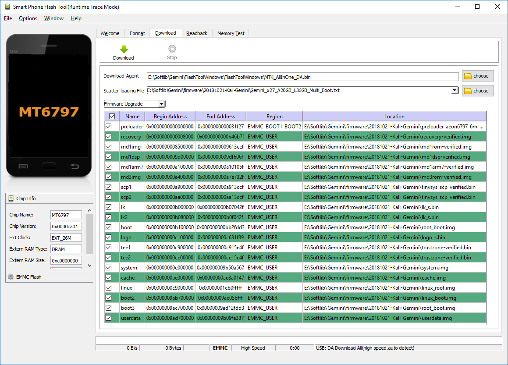
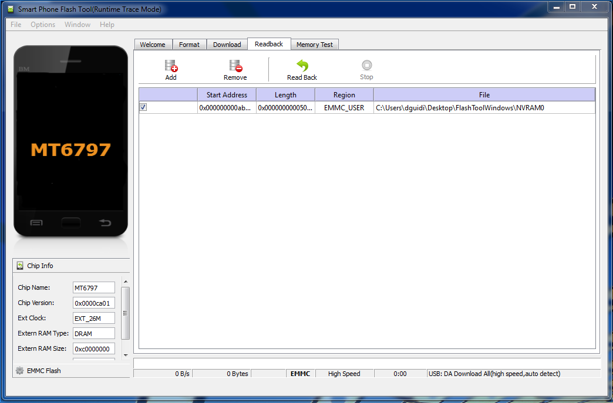
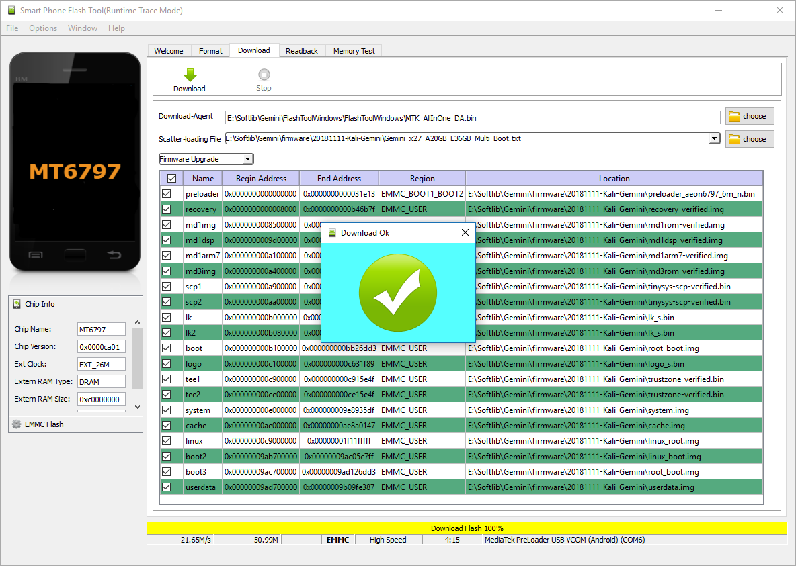
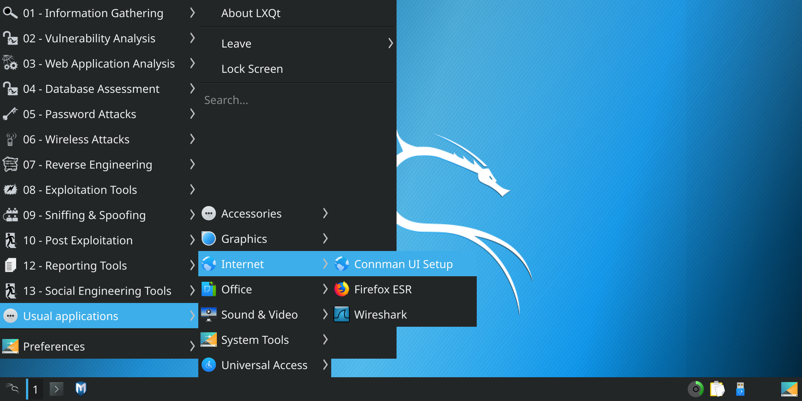
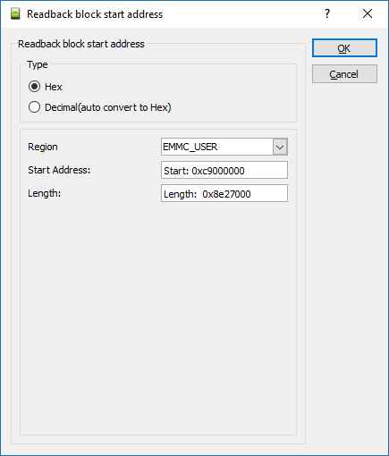

{}
Kali Linux is no longer providing pre-built images or a build-script to generate your own image.
This hardware is no longer supported.
The page is left for historical value.
{}

- - -


The [Gemini PDA](https://planetcom.squarespace.com/device/) is a multi-boot Android smartphone with a keyboard that supports the installation of up to three operating systems side-by-side (currently any three of the following: Android, Sailfish, Debian, Kali Linux).

By default, the Kali Linux Gemini PDA image **does not** contains the [**kali-linux-default** metapackage](/docs/general-use/metapackages/) which is often found in Kali platforms. If you wish to install extra tools please refer to our [metapackages page](/docs/general-use/metapackages/).

## Kali on the Gem PDA - User Instructions

Operating systems aren't installed but flashed using the Smart Phone Flash tool provided by Mediatek. To flash a new Gemini PDA with rooted Android and Kali Linux requires only four steps:

1. Download and extract the Kali-Gem firmware archive, which includes everything to setup the Gemini with the following partition table:
  - Android (rooted), 16GB
  - Kali Linux, 40GB
  - Empty
2. Download, install, and run the SP Flash tool
3. Backup the current NVRAM partition
4. Flash the Kali-Gem firmware

### 1. Download and Extract the Firmware

The Kali Linux Gemini image can be downloaded from the [ARM images](/get-kali/) page. The folder contains all files required for a complete re-flash of the Gemini PDA with bootloader, a rooted Android partition and Kali-Linux.

{}
If you would like a different partition layout, follow [the official flashing guide](https://support.planetcom.co.uk/index.php/Linux_Flashing_Guide). Make sure that the Linux partition is at least 6GB.<br />
<br />
With a linux partition created, you can write the image file **_linux_root.img_** straight into it. Don't forget to flash the corresponding Linux kernel image `linux_boot.img`.
{}

The rest of the steps in this guide detail a complete re-flash of a Gemini x27 with a Windows PC.

### 2. Download and Install the Drivers and Flash Tool

1. You can find the latest drivers here: [Windows Flash Tool Drivers](https://support.planetcom.co.uk/download/FlashToolDrivers.zip)
2. Once downloaded, unzip the archive
3. You will find a folder called **_FlashToolDrivers_**. Open the folder and double click on the Install (**_install.bat_**) file
4. Let the installation run and choose **Yes** when asked to make changes
5. Now that the drivers have been installed, you can download the latest Windows flash tool: [Windows Flash Tool](https://support.planetcom.co.uk/download/FlashToolWindows.zip)
6. Unzip the downloaded zip file containing the Windows FlashTool directory
7. Next, run 'flash_tool.exe' in the **_FlashToolWindows_** folder

### 3. Backup the Current NVRAM Partition

Before flashing the device with a different firmware, it is a good idea to backup the current NVRAM partition. This partition stores key information for your Gemini, including the IMEI number. If it gets lost or damaged, your Gemini will not be able to make or receive calls.

To create a backup of your NVRAM partition, first select the **Scatter-loading file** by pressing the **choose** button and select **_Gemini_x27_A20GB_L36GB_Multi_Boot.txt_** inside the downloaded and extracted firmware folder. You should now see a partition table similar to the following:



Next go to the **Readback** tab and click on the **Add** button. A row will appear in the table as in the following screenshot:



To back up the NVRAM partition, click the **Read Back** button, connect your Gemini to your PC, and power on the Gemini by pressing the **Esc** button for about a second or two. The flash tool will detect the unit and back up the partition.

### 4. Flash the Kali Linux Firmware

- Click on the **Download** tab
- Choose the **Scatter-loading file** by pressing the **choose** button as in the following screenshot and select **_Gemini_x27_A20GB_L36GB_Multi_Boot.txt_** inside the downloaded and extracted firmware folder. Ensure that the other settings match the following:
    - **Download-Agent** should be set to the file **_MTK_AllInOne_DA.bin_**, which is located in the **_FlashToolWindows_** or **_FlashToolLinux_** folder
    - **Scatter-loading file** should be set to the specific scatter file of the firmware that was customized for the Kali-Gem built, which is located in the firmware folder
- Select the **Firmware Upgrade** option from the drop down menu. This will automatically select all the partitions in the table
- Your screen should look like the following:


To start the flashing process, just click on the big **Download** button, connect your Gemini to your PC, and power on the Gemini by pressing the **Esc** button for about a second or two.

Once booting, the flash tool will detect the unit and will start flashing the device with the selected firmware. The following screenshot shows a successfully completed flashing process:



### 5. Boot Notes

The multi-boot mechanism works as follows. Starting from a switched off Gemini, press the **Esc** (On) key to start the unit until the Gemini vibrates. Once you feel the vibration, you can choose the boot mode by pressing the following key combination:

- Boot 1 (Android): Default booting option when no keys or buttons are pressed
- Recovery Mode: Esc (On) is pressed. This will always boot into recovery mode
- Boot 2 (Kali Linux): Silver button on the right hand side of the device is pressed
- Boot 3 (N/A): Both Esc(On) key and silver button on the right hand side of the device are pressed at the same time. Keep the keys/buttons pressed until the screen turns ON

### 6. Logging in for the First Time

The [default credentials](/docs/introduction/default-credentials/) for the device are:

{}
**`root`** / **`toor`**
**`kali`** / **`kali`**
{}

After logging in for the first time, we recommend the following steps:

- Open terminal, change passwords, and run `sudo dpkg-reconfigure locales` to adjust the settings according to your region
- LXQT Regionals: **Applications** -> **Preferences** -> **LXQT settings** -> **Locale**
- Default Applications: **Applications** -> **Preferences** -> **LXQT settings** -> **Session settings**
- Set "Turn off monitor(s) when lid is closed": **Applications** -> **Preferences** -> **LXQT settings** -> **Power Management**
- Wi-Fi Setup: **Applications** -> **Usual applications** -> **Internet** -> **Conman UI Setup**



- Run `bluetoothctl` on the command line to setup a mouse
- This image comes with the [**kali-tools-top10** metapackage](/docs/general-use/metapackages/) pre-installed by default. If you wish to install extra tools please refer to our [metapackages page](/docs/general-use/metapackages/) or by running:

```console
kali@kali:~$ sudo apt update
kali@kali:~$
kali@kali:~$ sudo apt install -y kali-linux-default
```

### 7. Finish Android Rooting Process

Run the pre-installed **Magisk Manager** to complete the rooting process.

### 8. Backing up the Kali Linux root Partition

To create a backup of your rootfs partition, click on the **Readback** tab in the flash tool and then on the **Add** button. A row will appear in the table as in the following screenshot:


Double-click on the file name and enter the name and location of the resulting image file. In the next screen, change the start address and length to the following values:

- Start Address: `0xc9000000`
- Length: `0x8e2700000`

It should look like this screenshot:



Click **OK** and then click **Readback**. Connect the Gemini and turn it on by pressing **OK**.

### 9. That's All

Please keep in touch by joining us in the [Kali Forums](https://forums.kali.org/).

- - -

### Information:

- Kali: [kali.org](https://github.com/Re4son/kali-gemini-multistrap-config/wiki/www.kali.org)
- Gemini: [geminiplanet.com](https://geminiplanet.com/)
- Planet Computers: [planetcom.co.uk](https://planetcom.co.uk/)
- Planet Computers Developers Forum: [developer.planetcom.co.uk/forumdisplay.php?fid=1](https://developer.planetcom.co.uk/forumdisplay.php?fid=1)
- Gemian: [gemian.thinkglobally.org](https://gemian.thinkglobally.org/)
- Gemian Wiki: [github.com/gemian/gemini-keyboard-apps/wiki](https://github.com/gemian/gemini-keyboard-apps/wiki)
- OESF Forum: [oesf.org/forum/](https://www.oesf.org/forum/index.php?showforum=192)
- IRC Logs: [logs.nslu2-linux.org/livelogs/gemini-pda/](http://logs.nslu2-linux.org/livelogs/gemini-pda/)
- Halium: [halium.org](https://halium.org/)

### Guides:

- [Linux Flashing Guide](https://support.planetcom.co.uk/index.php/Linux_Flashing_Guide)
- [Android Flashing Guide](https://support.planetcom.co.uk/index.php/Android_Flashing_Guide)

### Downloads:

- [Windows Flash Tool Drivers](https://support.planetcom.co.uk/download/FlashToolDrivers.zip)
- [SP-Flashing Tool for Windows](https://forum.hovatek.com/thread-13970.html)
