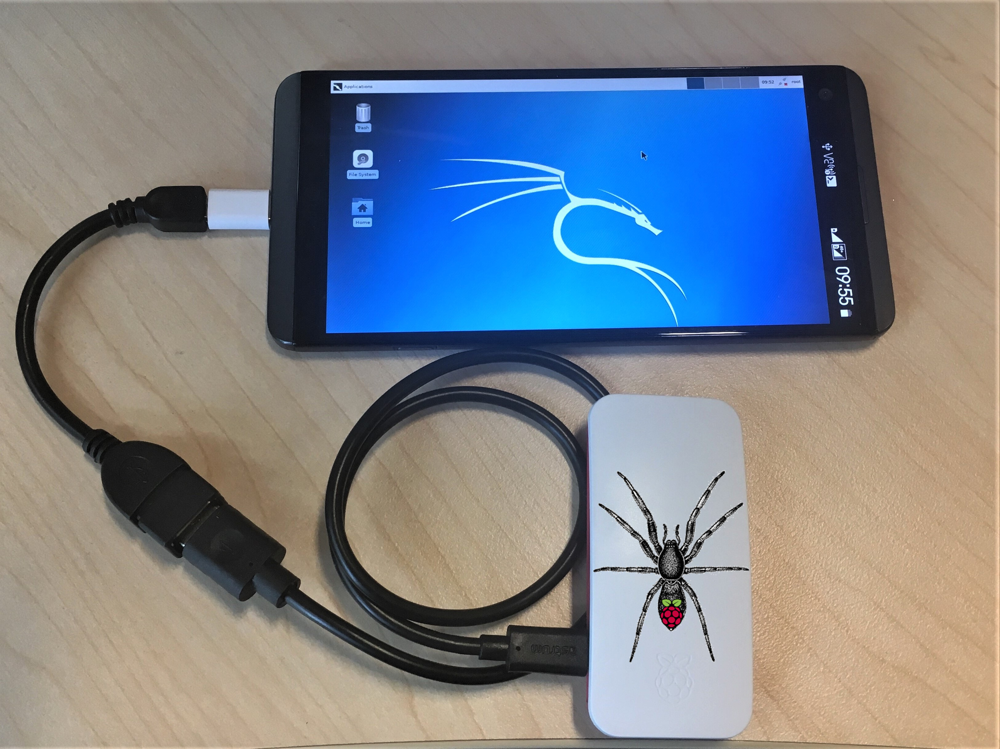

# Pi-Tail

- Kali for RaspberryPi 2 zero w optimised for tethering
- Simple, one cable solution for Bluetooth and Wi-Fi tether
- Image, configure, connect, boot up in two minutes from scratch
- Just install ConnectBot and VNC viewer on your smartphone
- Automatic switch between USB ethernet and mass storage

- - -

## Quick install and usage:

1. [Download image from here](/get-kali/#kali-arm) and write to micro-sd card
2. Insert card into Raspberry Pi Zero 2 W
3. Connect: OTG adapter in smartphone, standard cable in Pi-Tail (power) to power up Pi-Tail
4. On smartphone:
   1. Enable hotpot with ssid = "sepultura" and password = "R4t4m4h4tt4"
   2. Install Hacker’s Keyboard, ConnectBot & VNC viewer (if desired)
   3. Connect to 192.168.43.254, user root/toor
   4. run "mon0up" to set wifi interface into monitor mode (yes, while using it)
   5. run "airodump -i mon0", "kismet -c mon0", "wifite -i mon0" or anything you like
5. Go wild

Optional:
– Run "vncserver" in the Pi-Tail, fire up a vnc viewer on your phone and connect to
127.0.0.1:5901  
Note: Give it a few minutes when you connect for the first time. It’s going to be quicker next
time around. It’s still much faster to stick to the command line though.
For more info about how to tunnel a vnc connection through ssh, check out [this thread](https://whitedome.com.au/re4son/topic/vnc/).

Read /boot/Pi-Tail.README & /boot/Pi-Tail.HOWTO for more information and tethering options  

- - -

## How it works:

The Pi-Tail is running Kali Linux and your smartphone acts as the power supply, screen, keyboard and mouse. Awesome team work.

The network configuration can be prepared offline making it the perfect field companion.
Just write the image to a micro-sd card, adjust /boot/interfaces and /boot/wpa_supplicant.conf to fit your tether requirements, insert the card into your pi and hook it up to your mobile. For bluetooth tethering, just add your smartphone’s mac address into /boot/pi-tailbt.conf.

Pi-Tail checks during boot if ethernet gadget mode is enabled and if not, it will automatically switch to mass storage gadget mode. That means it appears to your mobile phone as a usb stick. You can now edit the network configuration with your phone.

During the boot process, Pi-Tail will pick up your network config and copy it across to the system partition. The effective config is copied back to /boot/interfaces.active and /boot/wpa_supplicant.active for offline troubleshooting.

Enable "wifi hostspot" or "usb tethering"on your phone and the Pi-Tail should connect automatically. Bluetooth works the other way: You have three minutes after boot up to pair with your Pi-Tail.

Open ConnectBot on your mobile and connect to the Pi-Tail. Configure port forwarding and fire up a vnc viewer of your choice and you can enjoy kali linux in all it’s glory on the go.

Passwords:  
ssh: `root` / `toor`
vnc: `toortoor`
  
Default Wi-Fi:
You can use the example config files. Just change your smartphone’s SSID to "sepultura" with the password "R4t4m4h4tt4" and your Pi-Tail will tether straight away.

More info in [/boot/Pi-Tail.README](https://github.com/Re4son/RPi-Tweaks/blob/master/pi-tail/Pi-Tail.README) and [/boot/Pi-Tail.HOWTO](https://github.com/Re4son/RPi-Tweaks/blob/master/pi-tail/Pi-Tail.HOWTO)  

- - -

Problems, questions, feedback? Join us in the forums:
https://forums.kali.org/

