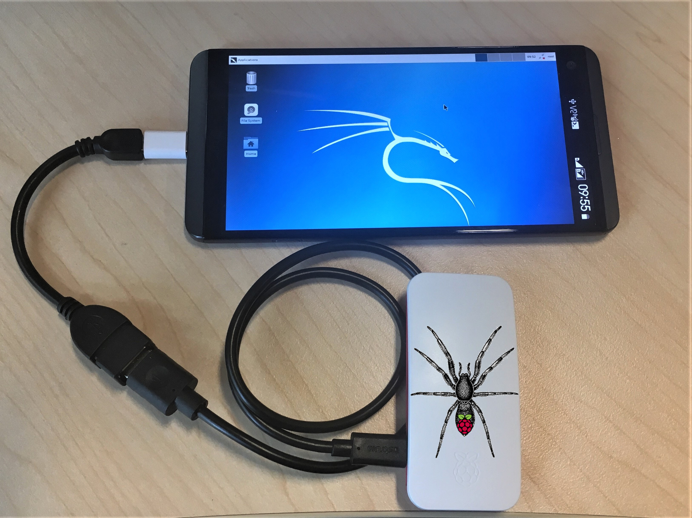

# Pi-Tail


- Kali-Pi0 optimised for tethering
- Simple, one cable solution for Bluetooth and Wi-Fi tether
- Image, configure, connect, boot up in two minutes from scratch
- Just install ConnectBot and VNC viewer on your smartphone
- Automatic switch between USB ethernet and mass storage



- - -

## Quick install and usage:

1. [Download image from here](/get-kali/#kali-arm) and write to micro-sd card
2. Insert card into Raspberry Pi Zero W
3. Connect: OTG adapter in smartphone, standard cable in Pi-Tail (power) to power up Pi-Tail
4. On smartphone:
   1. Enable hotpot with ssid = "`sepultura`" and password = "`R4t4m4h4tt4`"
   2. Install Hacker’s Keyboard, ConnectBot & VNC viewer (if desired)
   3. Connect to `192.168.43.254`, user `kali`/`kali`
   4. run "`sudo mon0up`" to set wifi interface into monitor mode (yes, while using it)
   5. run "`airodump -i mon0`", "`kismet -c mon0`", "`wifite -i mon0`" or anything you like
5. Go wild

Optional:
– Run "`vncserver`" in the Pi-Tail, fire up a vnc viewer on your phone and connect to 127.0.0.1:5901
Note: Give it a few minutes when you connect for the first time. It’s going to be quicker next time around. It’s still much faster to stick to the command line though.
For more info about how to tunnel a vnc connection through ssh, check out [this thread](https://whitedome.com.au/re4son/topic/vnc/).

Read `/boot/Pi-Tail.README` & `/boot/Pi-Tail.HOWTO` for more information and tethering options

- - -

## How it works:

The Pi-Tail is running Kali Linux and your smartphone acts as the power supply, screen, keyboard and mouse. Awesome team work.

The network configuration can be prepared offline making it the perfect field companion.
Just write the image to a micro-sd card, adjust `/boot/interfaces and /boot/wpa_supplicant.conf` to fit your tether requirements, insert the card into your pi and hook it up to your mobile. For bluetooth tethering, just add your smartphone’s mac address into `/boot/pi-tailbt.conf`.

Pi-Tail checks during boot if ethernet gadget mode is enabled and if not, it will automatically switch to mass storage gadget mode. That means it appears to your mobile phone as a usb stick. You can now edit the network configuration with your phone.

During the boot process, Pi-Tail will pick up your network config and copy it across to the system partition. The effective config is copied back to /boot/interfaces.active and /boot/wpa_supplicant.active for offline troubleshooting.

Enable "wifi hostspot" or "usb tethering"on your phone and the Pi-Tail should connect automatically. Bluetooth works the other way: You have three minutes after boot up to pair with your Pi-Tail.

Open ConnectBot on your mobile and connect to the Pi-Tail. Configure port forwarding and fire up a vnc viewer of your choice and you can enjoy kali linux in all it’s glory on the go.

Passwords:  
- ssh: `kali` / `kali`
- vnc: `toortoor`
  
Default Wi-Fi:
You can use the example config files. Just change your smartphone’s SSID to "`sepultura`" with the password "`R4t4m4h4tt4`" and your Pi-Tail will tether straight away.

More info in [/boot/Pi-Tail.README](https://github.com/Re4son/RPi-Tweaks/blob/master/pi-tail/Pi-Tail.README) and [/boot/Pi-Tail.HOWTO](https://github.com/Re4son/RPi-Tweaks/blob/master/pi-tail/Pi-Tail.HOWTO)  

## Troubleshooting

If you cannot connect to the Pi using SSH and you have the default setup using an android phone as the hotspot.
Connect to that hotspot from another device and check the received ip configuration.
You might see completely different ip assignment for example:

```
ip: 192.168.186.xxx
subnet mask: 255.255.255.0
gateway: 192.168.186.103
```

If this is the case then you will need to power down your PI, open the micro sd card's contents on your computer and edit the `interfaces` file.
Do a search and replace of `192.168.43.` and replace all with `192.168.186.` where `192.168.186.` will be based on the ip address you received by connecting to the mobile hotspot.
Remember you will most likely need to update the `gateway 192.168.186.1` entries with whatever gateway you got above. In my example I had to swap out `.1` with `.103`.

I also changed the ip address from `254` to `251` but that might not be necessary.
Once you saved the changes put your microsd card back to the Pi and boot it up. Note use the power port and not the one that allows data transfer.

### Alternatively you might want to add a script that will change the ip address for you

You can also change the `interfaces` file's `iface sepultura inet static` section by removing all the ip addresses and force them to get addresses using DHCP. Then use a post up script that then changes the last octet of the IP address to be 200 this way even if your android device changes the ip addressing after a reboot you will always know what IP your PiTail will have.

Steps:
Replave the section which refers to sepultura network:
from:

```sh
iface sepultura inet static
    address 192.168.186.251
    netmask 255.255.255.0
    gateway 192.168.186.103
```

**NOTE: Your IP address values might be different**

to:

```sh
iface sepultura inet dhcp
  post-up /boot/change_ip.sh
```

Create a `change_ip.sh` script in the same folder where `interfaces` file is with the following content:

```sh
#!/bin/bash

# Get the current DHCP-assigned IP address and gateway
IP_ADDRESS=$(ip -4 -o addr show wlan0 | awk '{print $4}')
GATEWAY=$(ip route | awk '/default via/ {print $3}')

# Extract the first three octets
BASE_IP=$(echo $IP_ADDRESS | cut -d'.' -f1-3)

# Assign the new IP address with the last octet set to 200
NEW_IP="$BASE_IP.200"

# Modify the IP address while preserving other DHCP configuration
ifconfig wlan0 $NEW_IP netmask 255.255.255.0 up
route add default gw $GATEWAY
```

Save the content make it executable and restart your PiTail.
Now in order to connect to it all you have to do is check what is the IP of your hotspot for example using `ipconfig`
Next you know that the PiTail's last octet is `200` so if your hotspot's IP was `192.168.67.123` you know that PiTail's IP will be `192.168.67.200`

- - -

Problems, questions, feedback? Join us in the forums: https://forums.kali.org/
