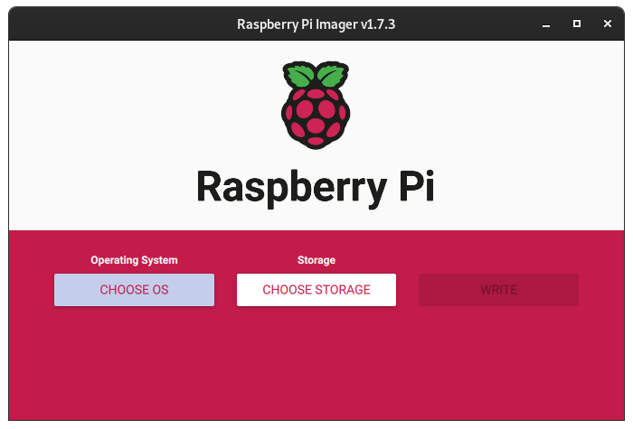
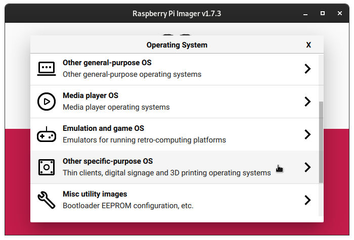
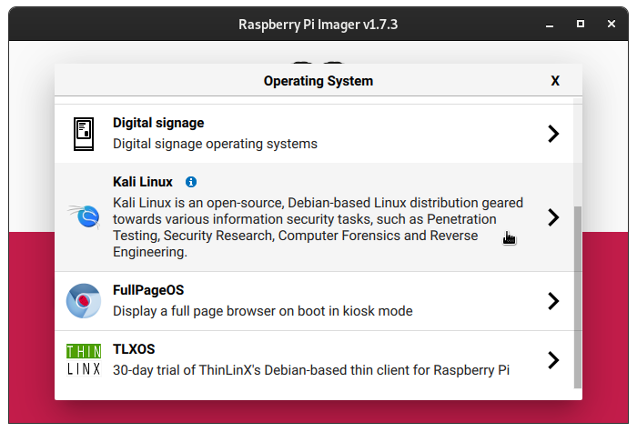
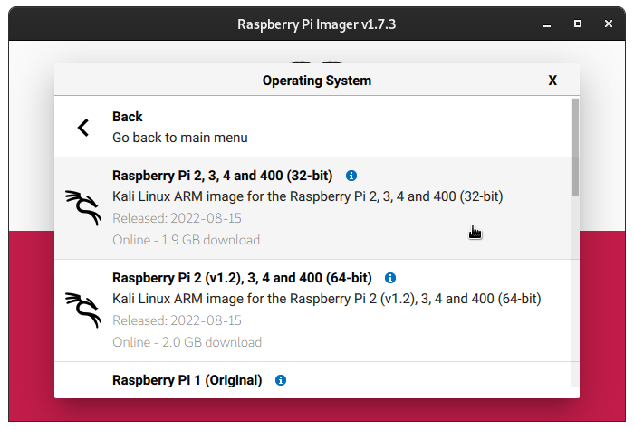
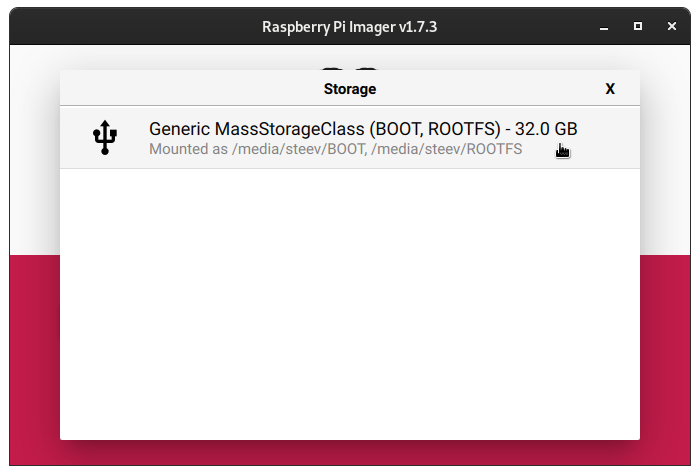
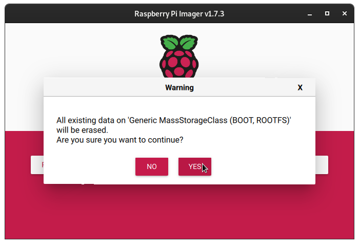

An additional option for writing Kali Raspberry Pi images to either a MicroSD card or USB device is to use the [Raspberry Pi Imager software](https://raspberrypi.com/software/) which is available for Windows, macOS, and Linux.

{}
At this time we do **NOT** support the "Advanced" menu for setting options for customizing your Raspberry Pi. Please consult the [documentation](/docs/arm/) for your specific Raspberry Pi device for setting up the Wi-Fi network.
{}

Once you have downloaded the software and installed it, simply run the software and you should be presented with the following screen:

- - -

From here we will click the button that says `Choose OS` and then scroll down and choose `Other specific-purpose OS`:

- - -

And then from this list choose `Kali Linux`:

- - -

From here you choose whichever Kali Raspberry Pi image you want to write, and it will take you back to the main screen of the application:

- - -

Now click on `Choose Storage` and the software should only let you choose from removable devices on your machine:

- - -

Once that is done, simply click the `Write` button:

- - -

Once you have clicked the `Write` button, the software will start downloading the image, then write it to the removable storage device that you have chosen. It will verify the SHA256 checksum, and then verify that they also match after writing. Once it tells you that it is complete, you can plug the storage device into your Raspberry Pi and boot up the Raspberry Pi.

You should be able to [log in to Kali](/docs/introduction/default-credentials/).
