{}
As of February 2023 the following is how to set up an AWS Kali instance. AWS's interface is constantly being updated, and in the future may not be 100% accurate. Should this be the case, please file an [issue on our GitLab](https://gitlab.com/kalilinux/documentation/kali-docs/-/issues) and follow [Amazon's tutorials](https://aws.amazon.com/ec2/getting-started/).
{}

## Creating our AWS instance

The first thing we do is create [AWS](https://portal.aws.amazon.com/billing/signup) account. Only once we see the following screen are we able to proceed with setting up our instance.

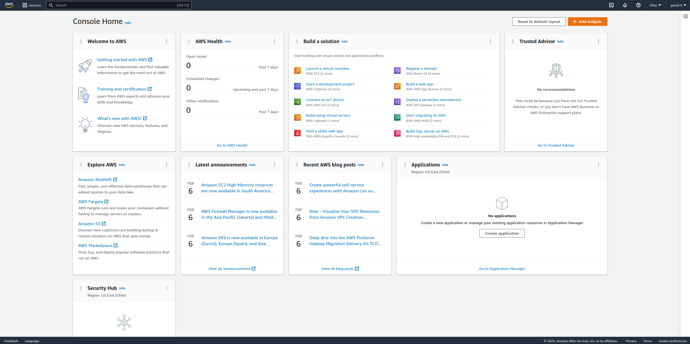

From here we want to click on "Services" in the top left, hover over "Compute," and click "EC2" like shown:

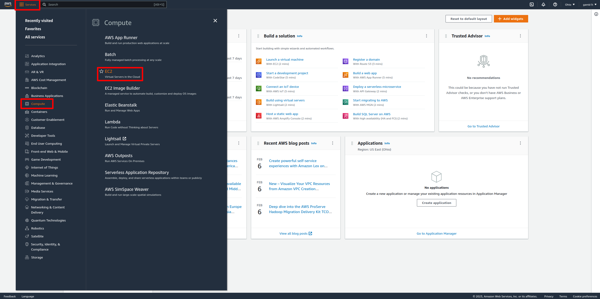

From here we will see the following screen. On this screen we want to look for "AMI Catalog" on the left side as shown:

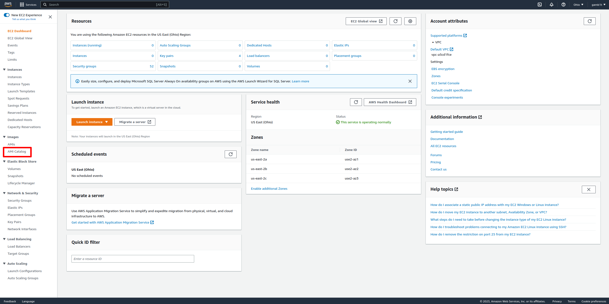

From here we will click on "AWS Marketplace AMIs":

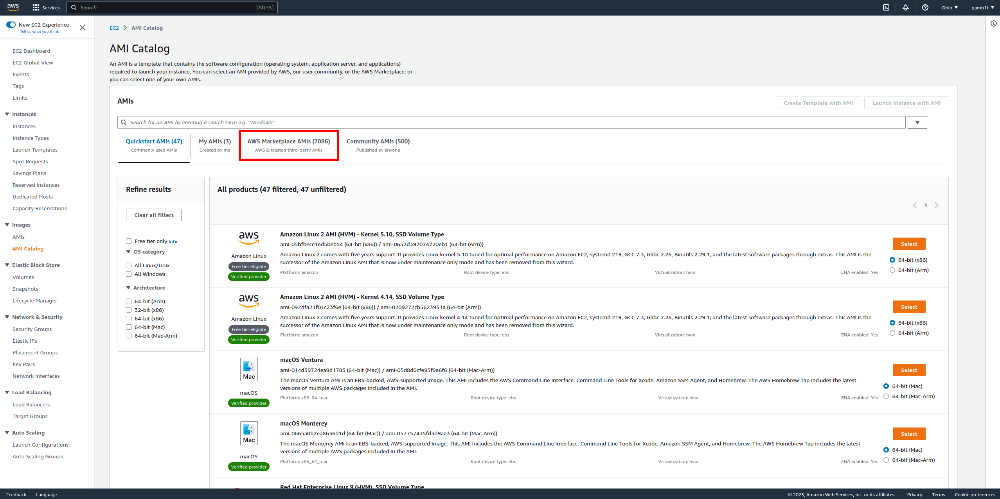

From here we will search for "kali":

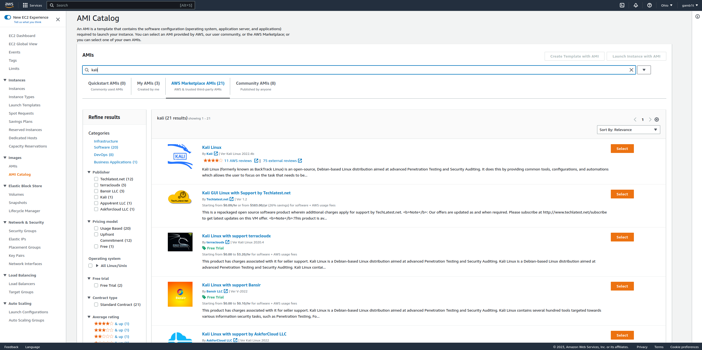

We should see the following:

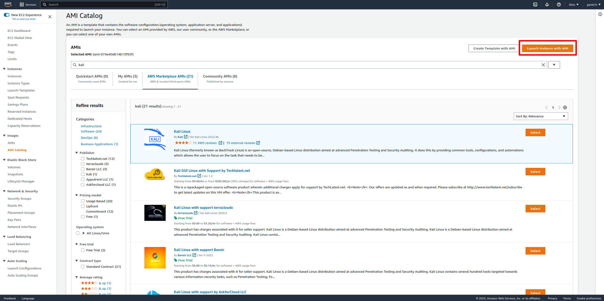

From here we will hit "Select" on the official Kali Linux image. We should then see the following:

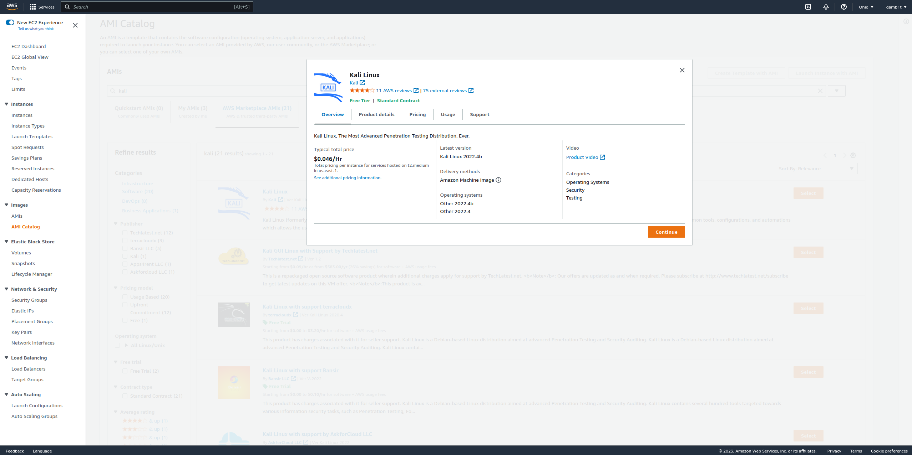

While here lets take note of what "Usage" says:

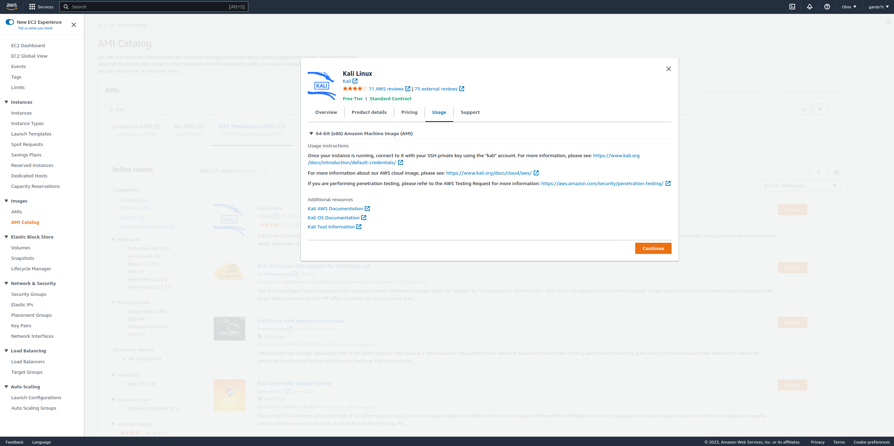

Looks like we will SSH into the `kali` account! That is good to remember. We now can select "Continue":

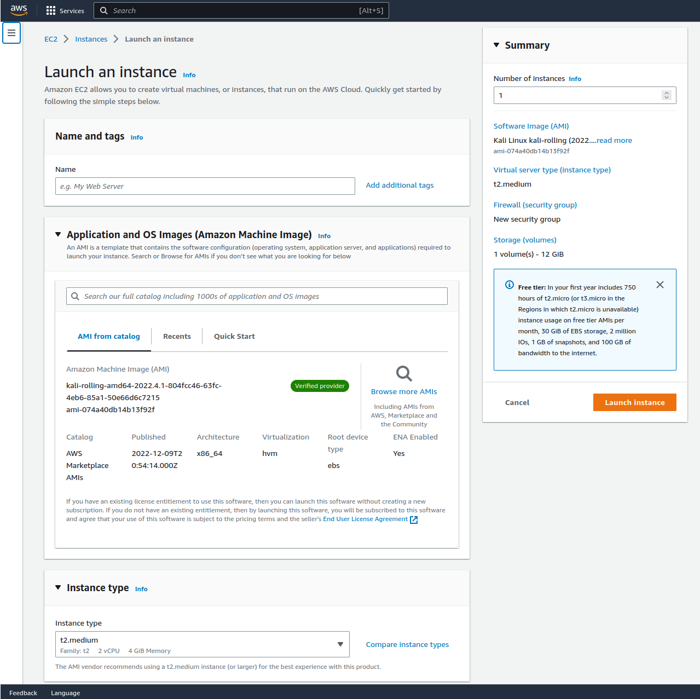

From here we scroll down a bit and see all of our options. We have already selected what we need for our purposes:

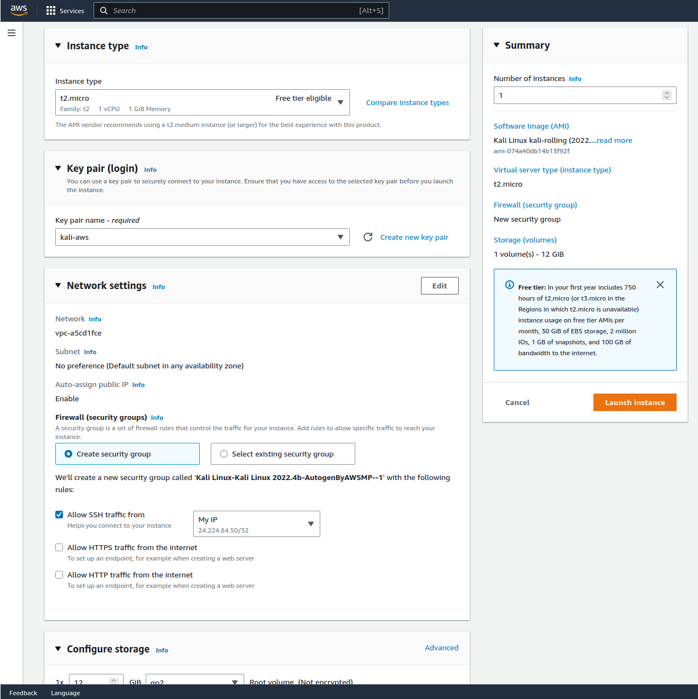

We were sure to select "Create new key pair" so we could access this instance:

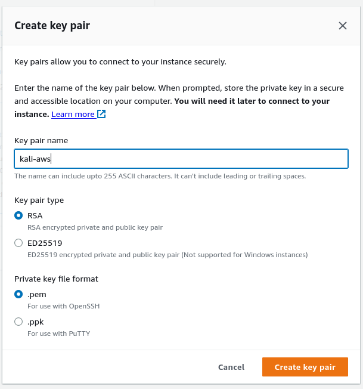

If we scroll down more, we will see even more options. Again, we have already selected what we need for our purposes:

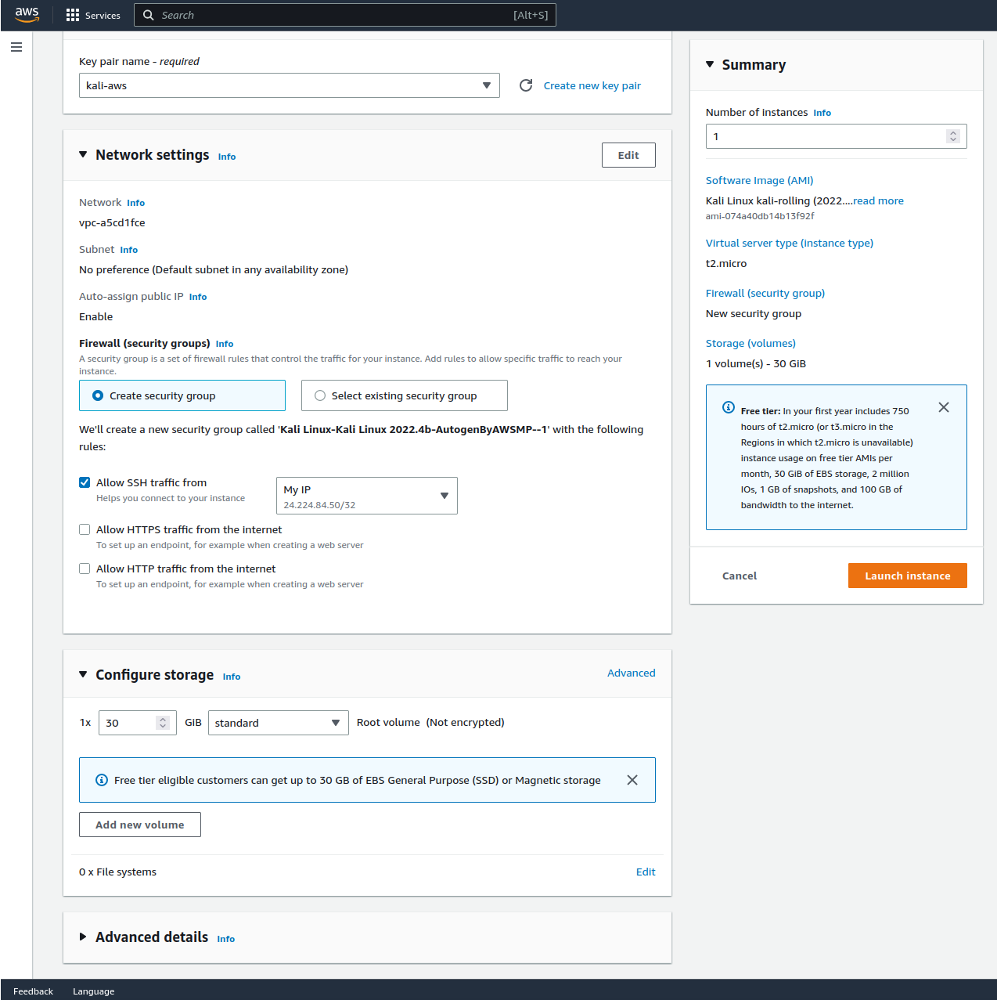

By default the storage selected does not use magnetic storage. This will result in some costs. We are sure to change this to "standard" to prevent extra costs.

Once complete, we will select "Launch instance" and we will be faced with the following screen:


From here we will select "Connect to instance" which will take us to the "Instances" tab. We can from here see information about our instance:

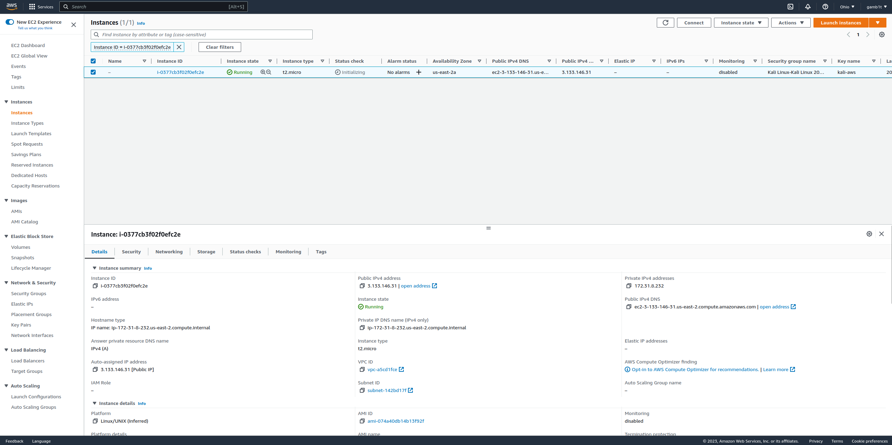

If we right-click we can see the option to "Connect":

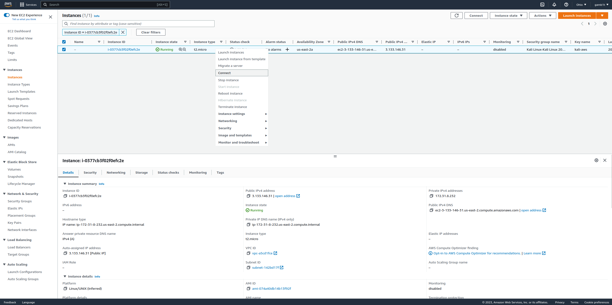

We select this and are faced with the following screen:

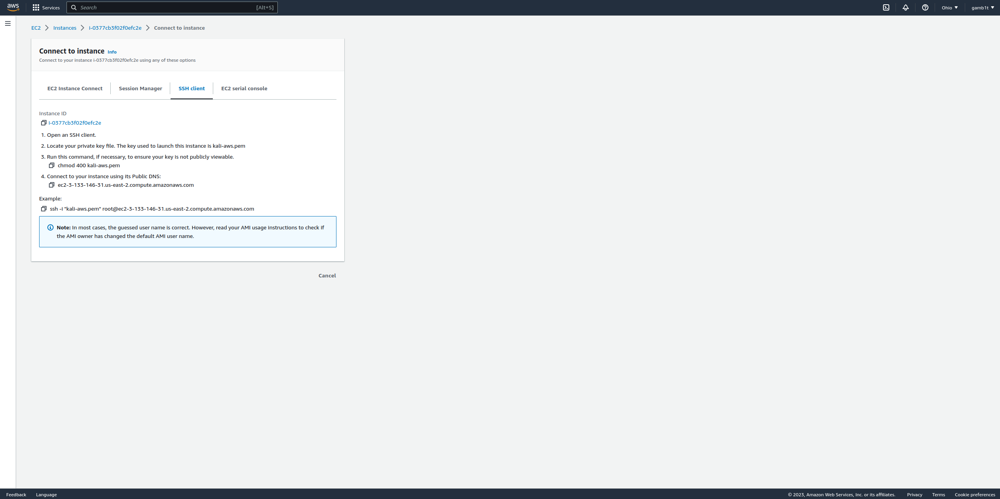

## Connecting to the AWS instance

After configuring the official Kali Linux image you can connect to the instance by using the `kali` user. After connecting, a password change through `sudo passwd kali` is possible if needed.

An example of the command used to connect:

```console
kali@kali:~$ ssh -i "keys.pem" kali@ip
```

## After connecting

### Metapackages

After connection a user may realize that the image is quite sparse. This is to allow for customization and reduced image size. To get the default Kali tool set we can utilize [Kali's metapackages](/docs/general-use/metapackages/). Alternatively, we can install specific tools as they are needed. The following command will utilize the `kali-linux-headless` metapackage and get us a nice and quick setup:

```console
kali@kali:~$ sudo apt update && sudo apt install -y kali-linux-headless
```

### Graphical User Interface (GUI)

If someone would like to use a GUI, they can do this through SSH forwarding. We have two options, the first is to use `ssh -X` to forward X11 and use GUI applications one at a time, or we can use RDP and forward the traffic over SSH. To set up RDP, we will run the [RDP with Xfce](/docs/general-use/xfce-with-rdp/) script used for WSL. After this, we can tunnel with `ssh -N -L 3390:127.0.0.1:3390` and connect using any remote desktop client to `127.0.0.1:3390`.

### NVIDIA drivers

Another common utility is to use GPUs for cracking. This can be done as well through the AWS instance, however we must be careful to install the NVIDIA packages after everything is [up-to-date](/docs/general-use/updating-kali/) and the proper Linux headers are installed:

```console
kali@kali:~$ sudo apt update
kali@kali:~$
kali@kali:~$ sudo apt full-upgrade -y
kali@kali:~$
kali@kali:~$ sudo apt install -y linux-headers-5.7.0-kali3-cloud-amd64
kali@kali:~$
kali@kali:~$ sudo reboot -f
```

Reconnect to the session:

```console
kali@kali:~$ sudo apt install -y nvidia-driver nvidia-cuda-toolkit
kali@kali:~$
kali@kali:~$ sudo reboot -f
```

Reconnect again.

For more information on [NVIDIA drivers, check here](https://www.kali.org/docs/general-use/install-nvidia-drivers-on-kali-linux/).
