As of release 2022.3 Kali is back on Azure. With this return we will discuss how to get Kali on Azure.

The very first thing to do is create an [Azure](https://portal.azure.com/#home) account. Only once we see the following screen are we able to proceed with setting up a Kali VM.

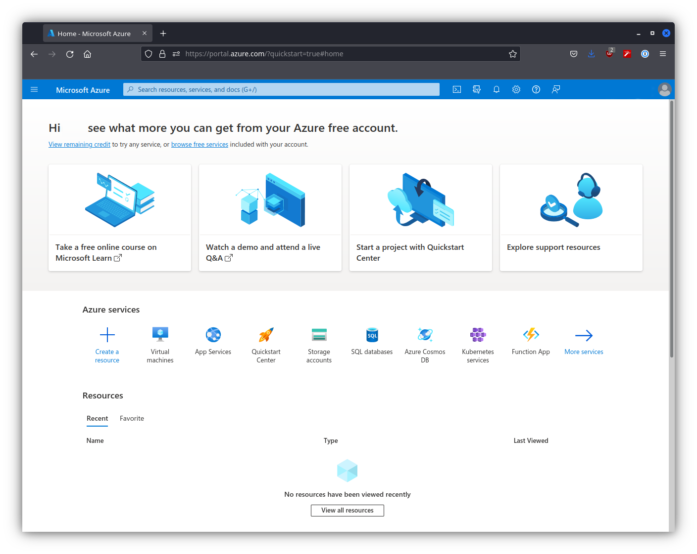

From this page we will want to click on "Virtual machines". After doing so we will be met with the following screen.

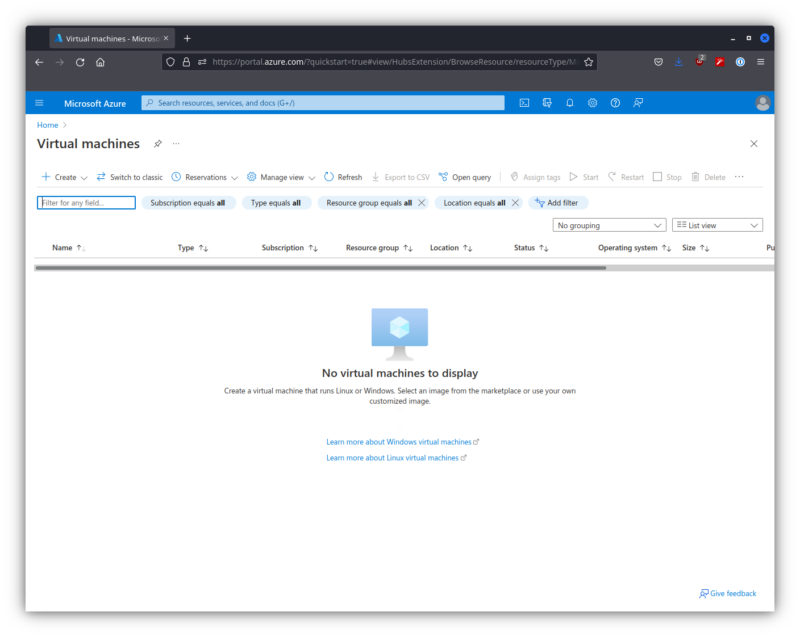

Now we can get started.

## Creating a Kali VM

We will select "Create" and then select "Azure virtual machine" in the drop down options. After which we will face the following screen.

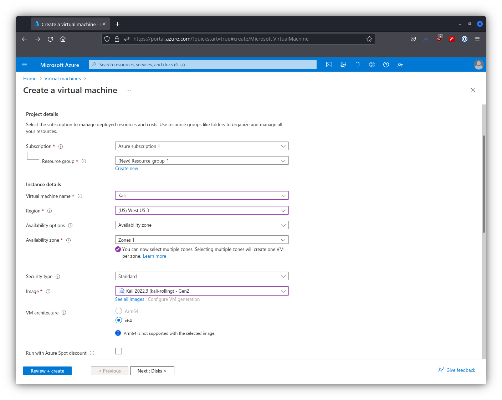

For this screen we have already input all of the necessary information, your screen won't look like this immediately. There are a couple of fields that we will need to do extra things to set properly, these being "Resource group" and "Image". For "Resource group" we will want to create a new group if we have no pre-existing group, otherwise we can select whatever group we wish. For "Image" we will want to select "See all images". From here we can search for "Kali"

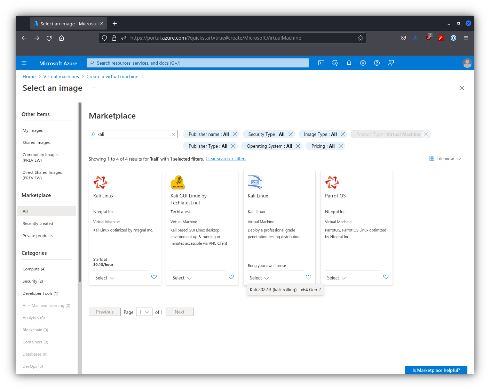

We can then click the drop down "Select" and choose the only option. From here we scroll down and fill in the rest of our information in the "Basics" section of the VM creation screen.

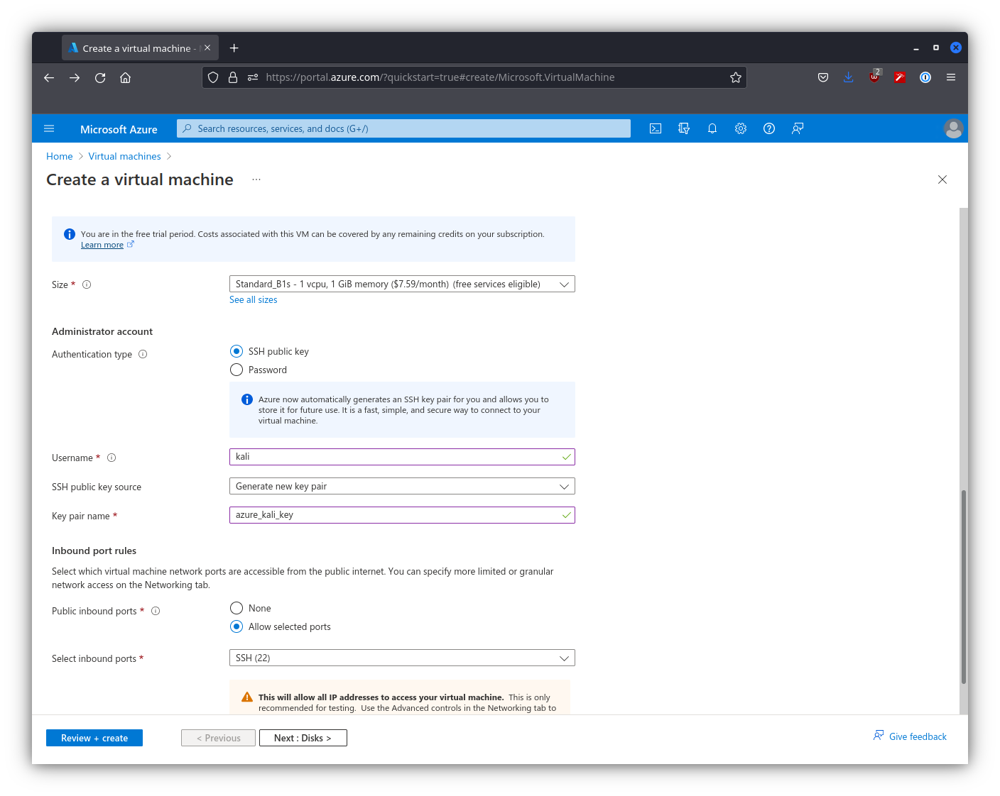

We have changed a couple fields in this area. We have input custom values for "Username" and "Key pair name" to be more familiar. From here we can then move onto "Disks"

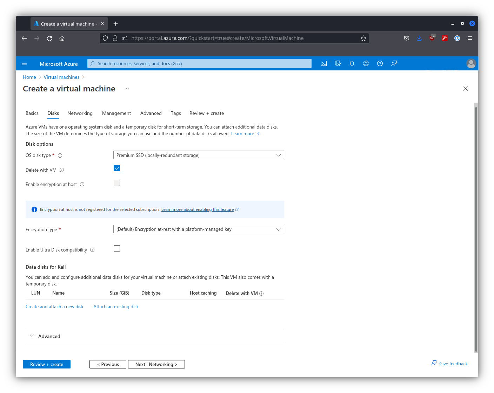

As we can see we have no disk attached to Kali currently, so we have to attach one. We select "Create an attach a new disk" as we have no pre-existing disks. Once clicked here is what we are met with.

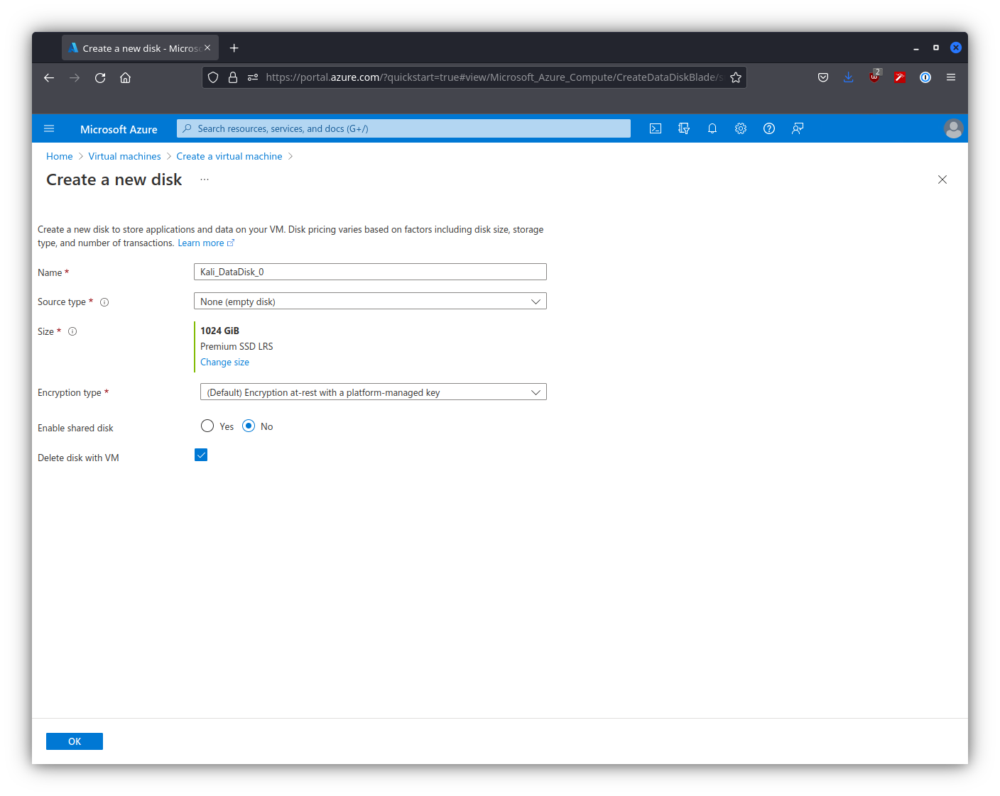

We keep the default values for this, and then continue forward. We check each section and make sure that there are no changes we want to make, but for this guide since there aren't we go all the way to "Review + create".

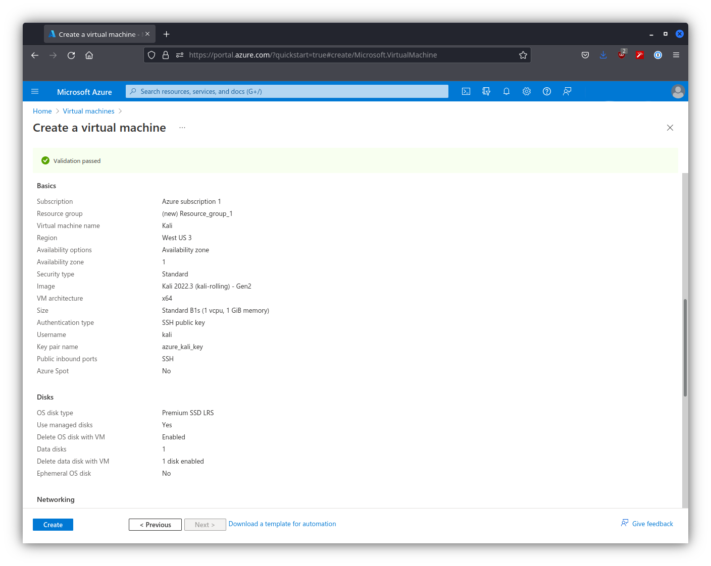

Once we are sure that our information is correct we press "Create", which takes us to a new page.

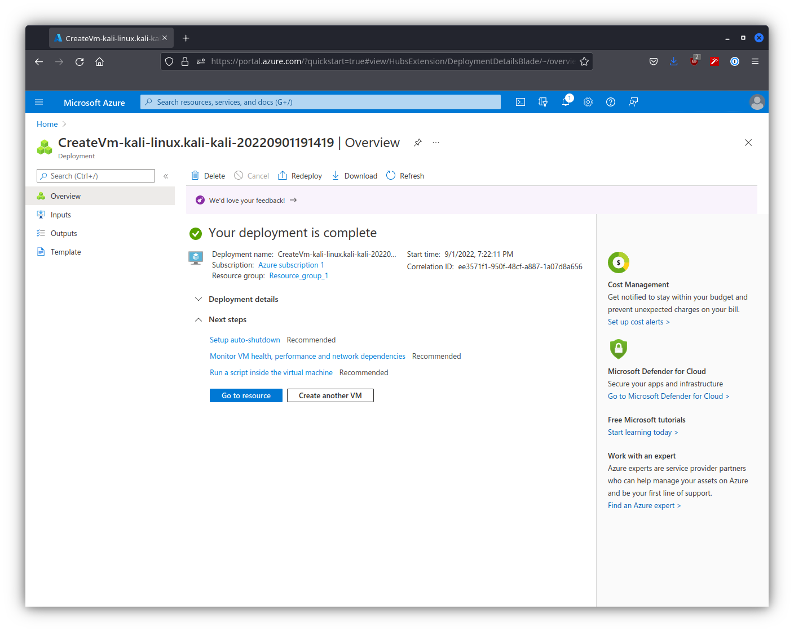

We simply wait for our deployment to be complete, and once it is we select "Go to resource".

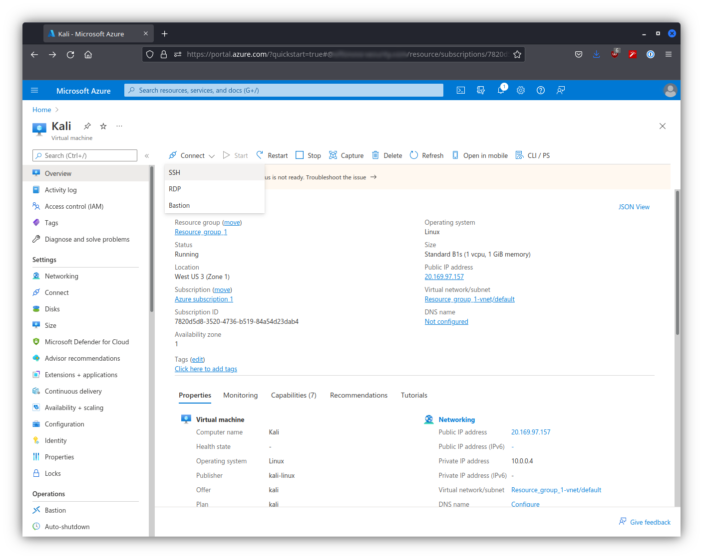

We from here are able to see our VM and interact with it. For our purposes we are going to select "Connect" and then "SSH".

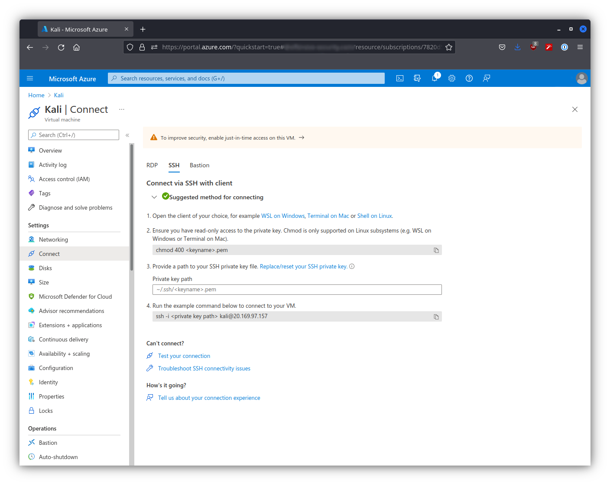

This brings us to a new page that tells us how to connect to our instance. We need to change the mode on the ssh key, and after we can connect to our freshly created Kali instance.
