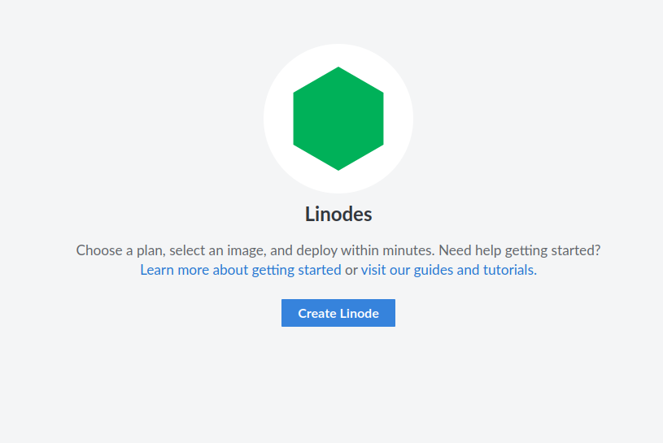
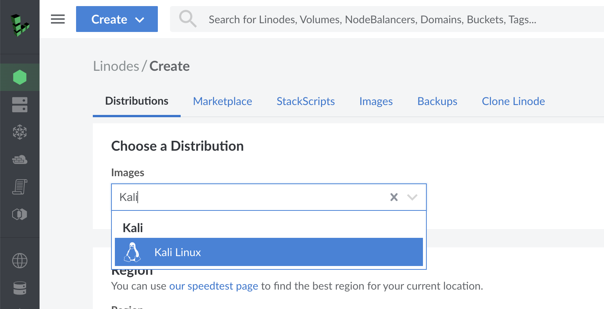
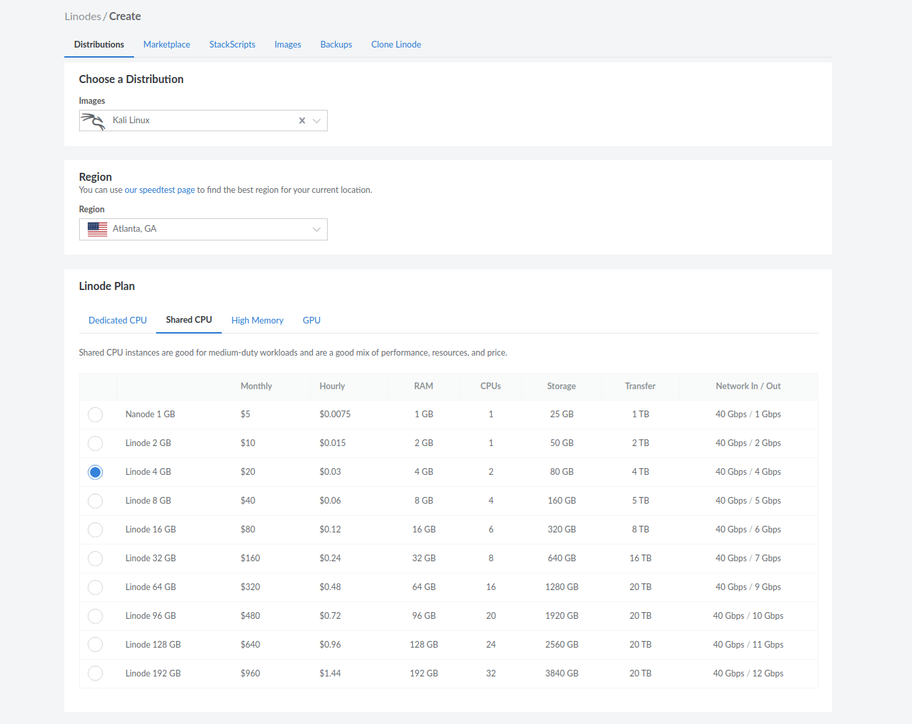
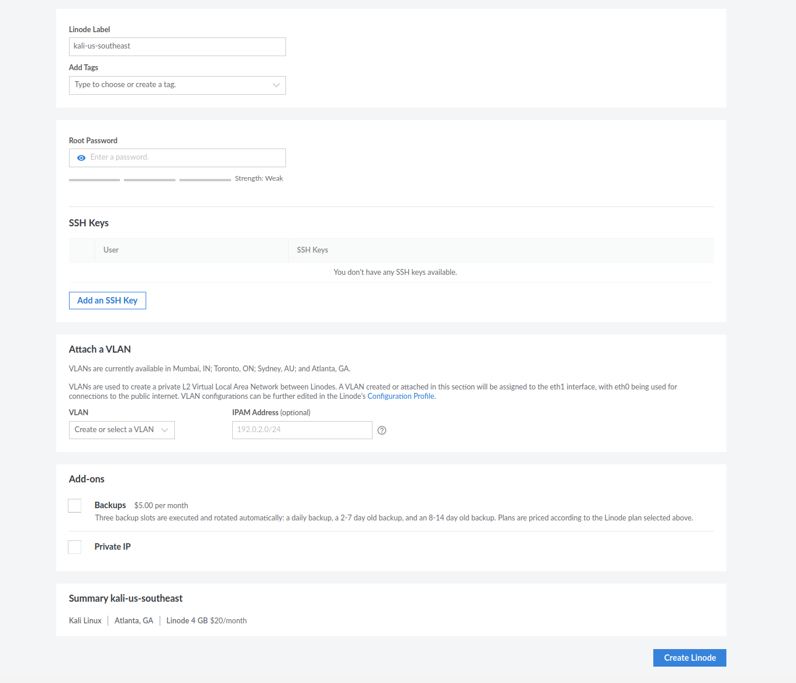
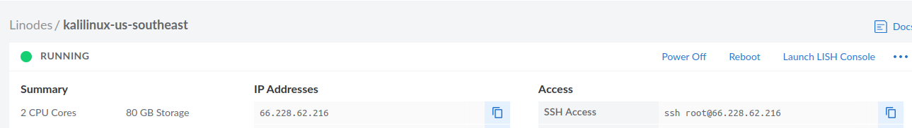
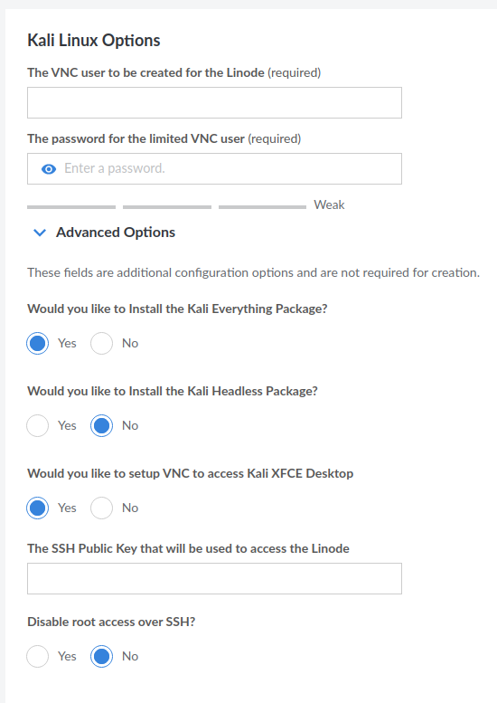
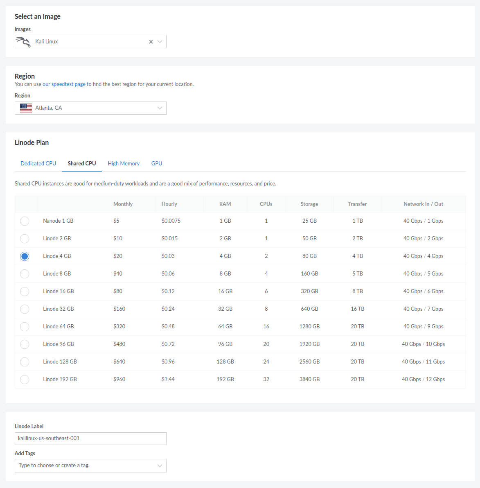
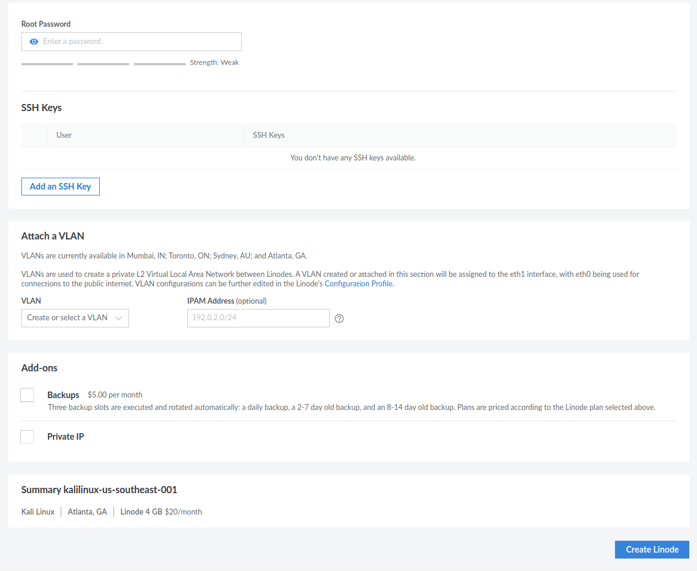

Before we begin we would like to call out a great video from Linode themselves! [Here you can find a video](https://www.youtube.com/watch?v=Oox2hF4SZLU) that talks about what Kali Linux is and how to get and use it with Linode. Thank you Linode!

There are two options when it comes to deploying a Kali Linux Linode instance. We will quickly cover both and then explain how to go about setting up them.

- [Kali as a Distribution](#kali-as-a-distribution)
- [Kali from the Marketplace](#kali-from-the-marketplace)

Keep in mind that both these options are free to create, with the only cost being the standard running cost of the instance. Now lets set up these systems!



## Kali as a Distribution

By creating a Linode instance and selecting Kali as the distribution, this will create a [bare-bones Kali](/docs/installation/barebone-kali/) install, with only [kali-linux-core](/docs/general-use/metapackages/) installed. This can be useful if there is only a selected amount of tools that are going to be used, so this allows finer control over the system. Plus this in turn also helps reduce operating cost!

### Kali as a Distribution Configuration

We want to first select Kali Linux in the drop down for "Image":



From there we customize based off of personal preference. Here is an example configuration:



One very important field is "Root Password". What we set here will determine the password we use during SSH _(unless you also select a public key)_. Once ready we can select "Create Linode" again and then wait for provisioning to complete.



Once complete we can use the SSH Access command to connect to our instance:



- - -

### Kali Default Tools In Linode

If you change your mind later and want the traditional set of tools which you commonly find with the desktop version of Kali Linux, they are always installable with our [metapackages](/docs/general-use/metapackages/). You just need to run the following:

```console
kali@kali:~$ sudo apt update && sudo apt install kali-linux-default -y
[...]
kali@kali:~$
```

## Kali from the Marketplace

The alternative option is to run ["Deploy This App"](https://www.linode.com/marketplace/apps/kali-linux/kali-linux/) from the Linode marketplace. This will create a Linode instance and, depending on the options selected during configuration, will install a Kali Linux instance with certain [metapackages](/docs/general-use/metapackages/) installed. Keep in mind this may take some time before Linode's scripts run and installs everything. This option is good if you may not know ahead of time what may be needed or just want to have the familiar Kali Linux environment.

### Kali from the Marketplace Configuration

When selecting "Create Linode" we will want to select "Marketplace" at the top of the webpage. From here, we can see Kali Linux listed as the third option (at the time of writing):


After selecting Kali Linux we will scroll down and notice some configuration options specific to Kali:



As mentioned previously, these will determine what [metapackages](/docs/general-use/metapackages/) are installed as well as will setup VNC access automatically. These options should be configured according to your needs to prevent too many resources being taken up:



From here we will have standard Linode configuration settings:



Lastly, select "Create Linode" and wait for provisioning to complete.
As stated before, please allow some time for Linode's scripts to run. When they have, you will be able to use the SSH Access command to connect to our instance.
