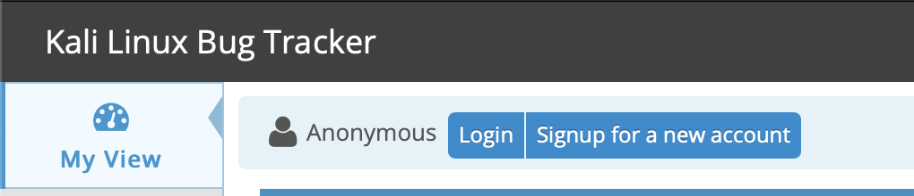
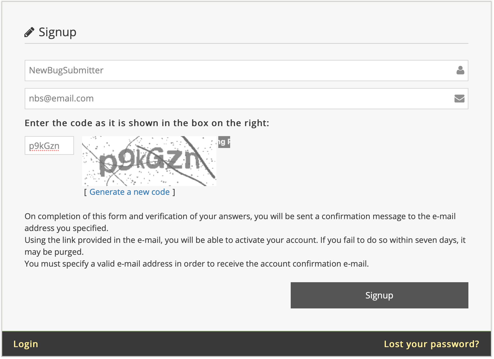
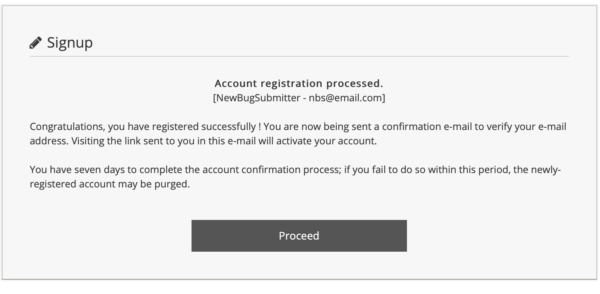

## Introduction

This article is a guide for putting together a bug report so that it gets addressed as quickly as possible.

First, Kali Linux is a labor of love, born out of a desire to give back to the community, a community that we're a part of. In our development roles, it's our goal to continually improve and evolve the project, making things better for the entire community of Kali Linux users. The developers who provide support to you are volunteers doing so out of altruism. Kali Linux is their gift to you. Please keep this in mind when making your comments.

Second, the goal of a successful bug report is to enable the Kali Linux developers to reproduce the issue and see the failure, if any. If the Kali development team can reproduce the reported failure, they can proceed to gather extra information until the root cause is determined. If the failure can't be reproduced, the development team will request additional information until they can reproduce the results reported by the submitter.

Please note, submissions are best read by our team in **English**.

Help us help you! To give us the best start in getting your issue resolved:

- Supply all the information you can. Try to stick to what's relevant, but if you're uncertain, too much is better than too little.
- Keep your bug report objective and try to stick to the facts at hand.
- Be very clear about what _is_ a fact - document these whenever possible, via logs, scrollback captures, etc. - and what is a hypothesis on your part.
- Do not quote Wikipedia and other non-primary resources as "facts" in your submission. What's happening on your system is what's at issue, not what Wikipedia claims
- Do not stack multiple issues into a single report; submit additional reports as needed. One person should submit one report, for one bug, on one particular hardware combination. Trying to stack multiple variations into a single report makes any specific issue in there very difficult to tease out. What seem like similar bugs to you may in fact turn out to be unrelated.
- If one of the developers asks for additional information, please do your best to understand what's being asked for and provide it in a reasonable time. If you're not sure you understand what you're being asked for, ask for clarification, we'll do our best to provide more guidance. Do not post comments that are unhelpful such as "Me too!" or "+1".
- Do not complain about how long it takes to fix a bug. Remember: the developers are volunteers with day jobs, which are not fixing your bugs for you.

## How to Report a Bug

The Kali Linux Bug Tracker can be found at [bugs.kali.org](https://bugs.kali.org/). This section will guide you through signing up for a new account, creating a system profile, and creating a detailed bug report for submission to the Bug Tracker.

### Signing Up For a Bug Tracker Account

You'll have to create an account before the Bug Tracker will allow you to submit reports or comment on existing ones.
On the bug tracker website, click **Signup for new account**.



Provide a username, e-mail address, and respond to the CAPTCHA challenge. Click the **Signup** button to proceed.



If successful, the next page will notify you that the account registration has been processed and the bug tracker system will send a confirmation email to the address you provided. You will need to visit the link in the email in order to activate your account.

Once your account has been activated, click **Proceed** to continue to the Bug Tracker login page.



### Be Sure You Are Not Duplicating a Previous Report

Before starting your report, search the site for keywords related to your issue. If there is already an existing bug not related to hardware, please do not duplicate the request or add notes that provide no new information or are otherwise unnecessary (e.g. "Me Too" or "+1"). If the bug has already been reported, you can view the status of any progress toward resolving the issue by clicking the ID link.

However, if you believe the issue to be hardware related, please submit a new report with your _specific_ information, even if it appears similar. There is a strong chance that your hardware does not exactly match that of another reporter. Do not assume that just because you have the same desktop or laptop model that your issue is not unique.

### Creating the Report

To begin your report, log into your account and click the **Report Issue** link on the landing page. You will need to provide as much information as you possibly can. If unsure, review the pointers at the beginning of this document.

The following fields are _mandatory_ within the report:

- Category
- Summary
- Description

Even though the other fields are not mandatory, we recommend you try to include as much information as possible within each option while paying special attention to the following fields:

- Reproducibility - How reproducible is this bug? Always? Only sometimes? Only under specific circumstances?
- Select Profile - We need to know what you're running, and what you're running it _on._
- Steps to Reproduce - Be very clear here, and provide as much concrete detail as you can.
- Additional Information
- Upload File (error logs, screenshot)

#### Decide the Proper Category

There are currently eight (8) categories available in the Kali bug tracker. Before you begin your request, ensure it is properly designated for one of the following:

- Feature Requests
- General Bug
- Kali Package Bug
- Kali Package Improvement
- Kali Websites & Docs
- New Tool Requests
- Queued Tool Addition
- Tool Upgrade

Do not request support or ask questions within the bug tracker. Kali Linux offers several options for support including [Kali Docs](/docs/), [Kali forums](https://forums.kali.org/), and [our IRC chat room](/docs/community/kali-linux-irc-channel/) (**_#kali-linux_** on OFTC).

#### Providing a Descriptive Summary

The summary field is essentially the 'title' of the bug report and it will be the first thing Kali developers and other visitors see. Provide a short, yet descriptive, summary that describes the issue or request.

A good summary: Chromium Package installed from repo will not run as root user

A bad summary: Chromium doesn't work

The summary does not need to include everything, but it should convey your reason for submitting the report.

#### Using dpkg to Find the Package and Version for the Report

You can find which package is installed using a combination of dpkg flags. It is important to include relevant information from the output of these commands in your report. The output can also be placed in a text file and uploaded. (Discussed later within this document.)

- dpkg --search
- dpkg --list
- dpkg --status

Sample Output

```console
kali@kali:~$ which chromium
/usr/bin/chromium
kali@kali:~$
kali@kali:~$ type chromium
chromium is /usr/bin/chromium
kali@kali:~$
kali@kali:~$ dpkg --search /usr/bin/chromium
chromium: /usr/bin/chromium
kali@kali:~$
kali@kali:~$ dpkg --list chromium
Desired=Unknown/Install/Remove/Purge/Hold
| Status=Not/Inst/Conf-files/Unpacked/halF-conf/Half-inst/trig-aWait/Trig-pend
|/ Err?=(none)/Reinst-required (Status,Err: uppercase=bad)
||/ Name           Version      Architecture Description
+++-==============-============-============-=================================
ii  chromium       76.0.3809.100-1 amd64       web browser
kali@kali:~$
kali@kali:~$ dpkg --status chromium
Package: chromium
Status: install ok installed
Priority: optional
Section: web
Installed-Size: 188290
Maintainer: Debian Chromium Team <chromium@packages.debian.org>
Architecture: amd64
Source: chromium-browser
Version: 76.0.3809.100-1
[...]
kali@kali:~$
```

### Building the Description Scenario

This is your opportunity to to help us out and provide a well thought-out description of the problem you're experiencing. Please provide as many details and facts as possible.

Please ensure you include the following where applicable:

- _Exact and complete text_ of any error messages (screen output or log files)
- _Exactly_ what you typed or what actions you took to produce the issue
- A suggested fix, workaround, or patch if you are able to produce one
- The version of the package having the problem, and any information relating to dependent packages
- The kernel version, shared C library, and any other details that seem appropriate
- The output of the command `uname -a`
- The output of the command` dpkg -s libc6 | grep ^Version`
- If applicable, software version - ( i.e. `python -V`, etc.)
- Details of your hardware
- If you are reporting an issue with a device driver, please provide full details on all hardware in your system - for a complete report on your system install lshw from the repos.
- Add any other details that seems relevant
- Do not worry about the report being "too long" - as long as the information is relevant, include it.

Here's an example of a good bug report, providing information that the development team can immediately use to reproduce and try to understand the bug:

- - -

> **Package**: Chromium
>
> **Architecture**: amd64
>
> **Maintainer**: Debian Chromium Maintainers
>
> **Source**: chromium-browser
>
> **Version**: 76.0.3809.100-1
>
> I installed the chromium web browser from the Kali Linux repos, using the command 'apt install chromium'. I launched the program from the Kali menu by selecting Applications/Internet/Chromium Web Browser. Chromium did not launch as expected, instead it provided an error pop-up window.
>
> The error message stated, "Chromium cannot be run as root. Please start Chromium as a normal user. To run as root, you must specify an alternate --user-data-dir for storage of profile information".
>
> I clicked the Close button to close the pop up window.
>
> **uname -a output**: Linux kali 5.2.0-kali1-amd64 #1 SMP Debian 5.2.9-2kali1 (2019-08-22) x86_64 GNU/Linux
>
> **C Library Version**: 2.29-2

- - -

### The Importance of Reproducibility

The Kali Linux bug tracker allows you to provide the frequency of the issue being reported. If you are submitting a request for a new tool or an upgrade to an existing tool, simply select **N/A** from the drop down options. If submitting a bug, please provide the appropriate response.

Continuing the example above, by design, Chromium will not launch as root, so you would select 'always' from the drop-down menu.

It is extremely important you provide an accurate response. If the Kali developers attempt to reproduce the issue, they need to know the frequency. If the issue happens occasionally but you have marked 'always', the issue may be closed prematurely as the developer doing the testing may not experience the issue.

### Providing Steps to Reproduce the Issue

Although this may seem redundant when compared with the description section, this section should _only_ include the steps taken to reproduce the issue. Some steps may seem unnecessary, but it is important to ensure you document the process as well as you can. The missing step may be the one that's key to reproducing the issue.

Here's an example of a good set of steps for reproducing our example Chromium bug.

- - -

1. Opened a terminal window by selecting Applications/Accessories/Terminal
2. Typed 'apt install chromium' in the terminal and hit enter to run the command
3. Attempted to run Chromium web browser by selecting Applications/Internet/Chromium Web Browser

- - -

### Providing Additional Information

In this section, you can provide any additional information you believe is relevant to the issue. If you have a fix or workaround for the issue, please provide it in this section. Again, it is important to stick to the facts and document the steps clearly so the developers can reproduce the issue.

An example of some useful "Additional Information":

- - -

There is a simple fix that is well documented on several forums. I tried it and it fixed the issue for me.

- Using a text editor open /etc/chromium/default
- Add --user-data-dir flag
- i.e. CHROMIUM_FLAGS="--user-data-dir"

Can this be patched within the repo version of Chromium so adding this flag is not required for future releases?

- - -

#### Uploading Relevant Files

Sometimes it is important to provide information to the development team that can't easily be typed in as text. This section of the report allows you to add screenshots and log files. Be mindful of the size limitation in place.

You can add a file by clicking the 'Choose File' button. This will open the file manager for your system and allow you to select the file you want to attach to your report. Once you have selected the file, click the 'Open' button to return to your report and click the 'Upload File' button.

#### Submitting the Report

At this point, you are ready to submit the report. All that is left to do is click the 'Submit Report' button. Your report will be submitted and assigned a tracking ID. The report will show up on your 'My View' page under 'Reported by Me'. This will allow you to track the issue to resolution.

#### Summary

Bug reports help the Kali Linux development team see the failure with their own eyes. Since they cannot be with you to experience the problem you're having, you must provide instructions detailed enough that they can make their own systems fail themselves.

Describe everything in detail, stating the steps taken, what you saw, what you did, as well as the expected outcome.

Attempt to find an issue or fix through research, if at all possible - remember, open source development is a participatory process! If you are able to provide a solution to fix the issue for your system, provide the developers with the same level of detail as you did when reporting the bug. It is important that the developers know _exactly_ what you did, so they can successfully repeat the process. This should not stop you from filing a full explanation of the symptom that caused the unexpected behaviour.

Write accurately, be clear, precise, and concise to ensure the developers cannot misinterpret what you are trying to convey.

Be prepared to provide additional information; the developers will not ask if they don't need the information.

Please be patient with your request, the developers want to fix your issue as much as you do. We love what we do and are proud to continue making Kali Linux the most advanced penetration testing distribution ever, and grateful for the assistance we get from you, our community of users, in doing so.
