## Content:

- [Overview](#overview)
- [Command line Kali LXD container on Ubuntu host](#command-line-kali-lxd-container-on-ubuntu-host)
- [Gui Kali LXD container on Ubuntu host](#gui-kali-lxd-container-on-ubuntu-host)
- [Privileged Kali LXC container on Kali host](#privileged-kali-lxc-container-on-kali-host)
- [Unprivileged Kali LXC container on Kali host](#unprivileged-kali-lxc-container-on-kali-host)
- [References](#references)

- - -

## Overview

**Kali Linux containers are the ideal solution to**

- **run Kali Linux within other Linux distributions**
- **provide isolated environments for development or testing activities**

**without the overhead of virtual machines**.
**Docker is the preferred solution for applications whilst LXC/LXD are preferred for entire systems**.

Linux containers provide features like snapshots and freezing which comes in very handy when developing or testing software.

Kali images are available on the [image server for LXC and LXD](https://images.linuxcontainers.org/) and can easily be launched either in LXD using the "images:" image server or in LXC using the "lxc-download" template.

LXC is a userspace interface for the Linux kernel containment features. Through a powerful API and simple tools, it lets Linux users easily create and manage system or application containers.

LXD is a next generation system container manager. It offers a user experience similar to virtual machines but using Linux containers instead.
It's image based with pre-made images available for a wide number of Linux distributions and is built around a very powerful, yet pretty simple, REST API.

<u>LXD vs LXC:</u>

LXD is the more convenient of the two but is only available in Ubuntu or other distributions (such as Kali) as snap package.

LXC is available in more distributions and preferred in Kali as it is supported natively and does not required snapd to be running.

- - -

### Command line Kali LXD container on Ubuntu host

Installing a Kali Linux container in Ubuntu only requires a few steps:

1. Install LXD
2. Launch a Kali container
3. Install additional packages inside the container
4. Create non-root user
5. Login

- - -

1 - Install lxd via snap and perform initial setup:

```console
kali@kali:~$ sudo snap install lxd
kali@kali:~$ lxd init
```

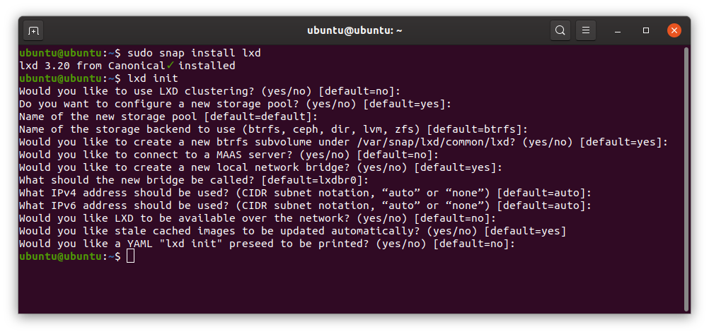
2 - Launch your first Kali Linux container with

```console
kali@kali:~$ lxc launch images:kali/current/amd64 my-kali
```

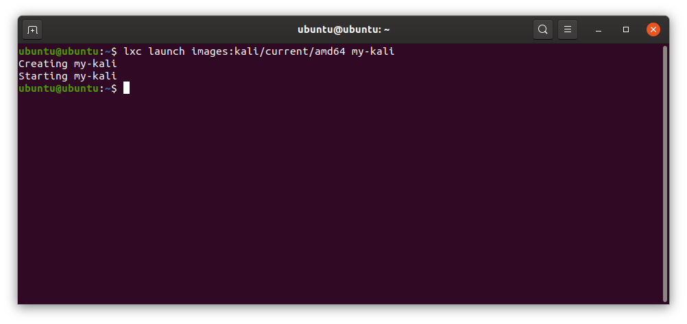
3 - Install additional packages inside the container via

```console
kali@kali:~$ lxc exec my-kali -- apt update
kali@kali:~$ lxc exec my-kali -- apt install -y kali-linux-default kali-desktop-xfce
```

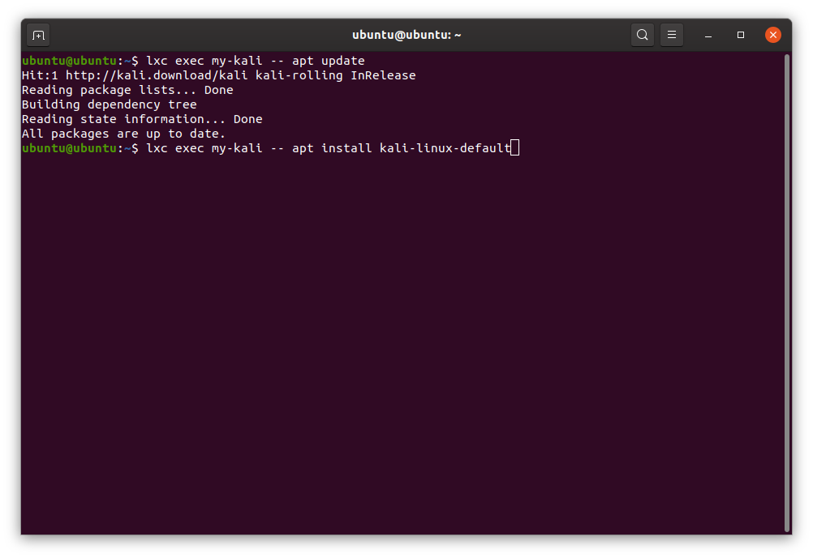
4 - Create non-root user - "kali" in this example:

```console
kali@kali:~$ lxc exec my-kali -- adduser kali
kali@kali:~$ lxc exec my-kali -- usermod -aG sudo kali
kali@kali:~$ lxc exec my-kali -- sed -i '1 i\TERM=xterm-256color' /home/kali/.bashrc
kali@kali:~$ lxc exec my-kali -- sh -c "echo 'Set disable_coredump false' > /etc/sudo.conf"
```

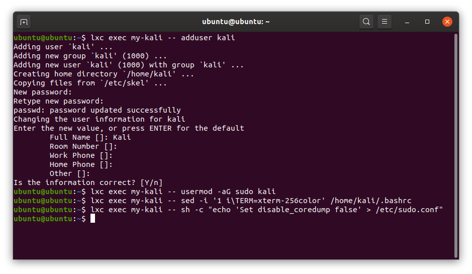
5 - Login to the new container as user "kali" via

```console
kali@kali:~$ lxc console my-kali
```

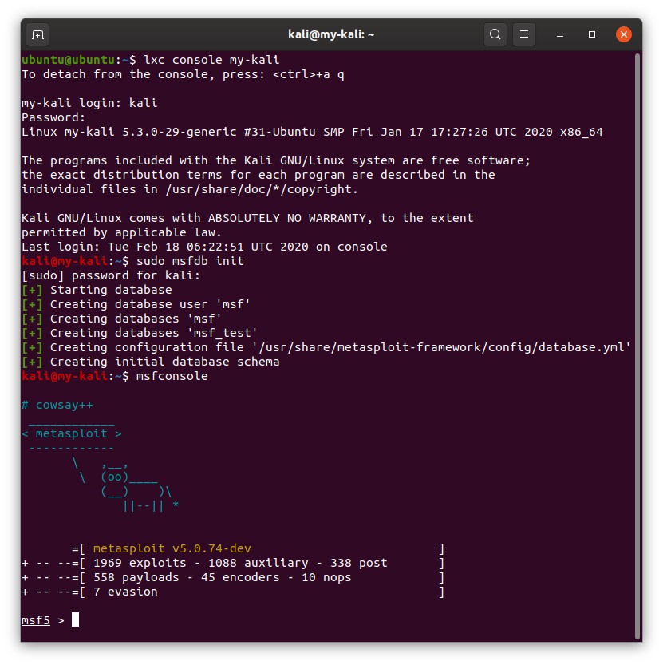

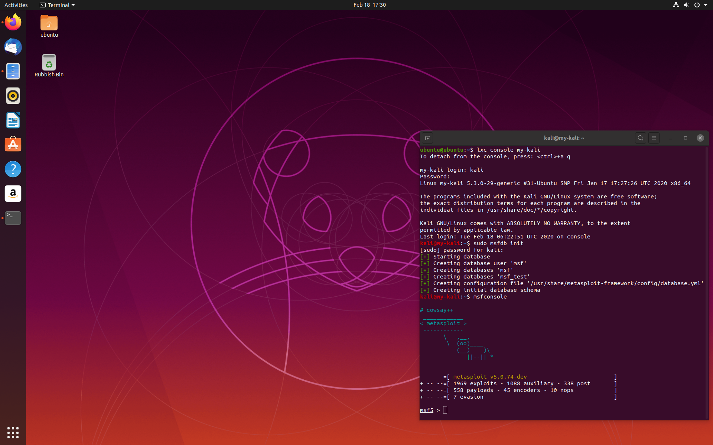

Voila!

##### Container management:

- Start: `lxc start my-kali`
- Stop: `lxc stop my-kali`
- Remove: `lxc destroy my-kali`

- - -

### GUI Kali LXD container on Ubuntu host

Installing a Kali container to run GUI applications is similar to the previous example with a few additional steps:

1. Install LXD
2. Create GUI profile and launch a Kali GUI container
3. Install additional packages inside the container
4. Create non-root user
5. Start Kali Xfce panel
6. Customise Kali Xfce panel

- - -

1 - Install lxd via snap and perform initial setup (if not already done):

```console
kali@kali:~$ sudo snap install lxd
kali@kali:~$ lxd init
```

2 - Launch your first Kali Linux container with

```console
kali@kali:~$ wget https://blog.simos.info/wp-content/uploads/2018/06/lxdguiprofile.txt
kali@kali:~$ lxc profile create gui
kali@kali:~$ cat lxdguiprofile.txt | lxc profile edit gui
kali@kali:~$ lxc profile list
kali@kali:~$ lxc launch --profile default --profile gui images:kali/current/amd64    gui-kali
```

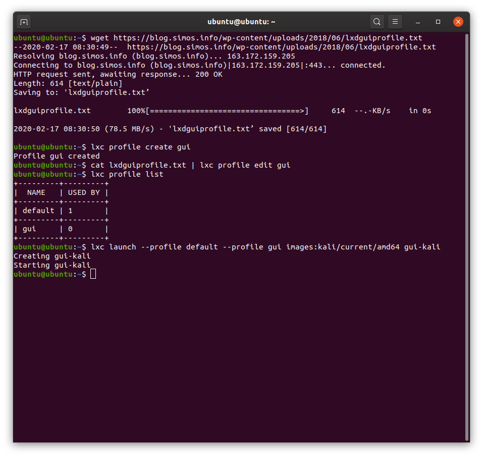
3 - Install additional packages inside the container via

```console
kali@kali:~$ lxc exec gui-kali -- apt update
kali@kali:~$ lxc exec gui-kali -- apt install -y kali-linux-default
kali@kali:~$ lxc exec gui-kali -- apt install -y kali-desktop-xfce
```

4 - Create non-root user - "kali" in this example:

```console
kali@kali:~$ lxc exec gui-kali -- adduser kali
kali@kali:~$ lxc exec gui-kali -- usermod -aG sudo kali
kali@kali:~$ lxc exec gui-kali -- sed -i '1 i\TERM=xterm-256color' /home/kali/.bashrc
kali@kali:~$ lxc exec gui-kali -- echo "export DISPLAY=:0" >> /home/kali/.bashrc
kali@kali:~$ lxc exec gui-kali -- sh -c "echo 'Set disable_coredump false' > /etc/sudo.conf"
```
5 - Fix audio in container for user KALI and ROOT. 

```console
kali@kali:~$ lxc exec my-kali -- sh -c "echo 'export PULSE_SERVER=unix:/tmp/.pulse-native' | tee --append /root/.profile"
kali@kali:~$ lxc exec my-kali -- sh -c "echo 'export PULSE_SERVER=unix:/tmp/.pulse-native' | tee --append /home/kali/.profile"
kali@kali:~$ lxc exec my-kali -- sh -c "echo 'default-server = unix:/tmp/.pulse-native' | tee --append /etc/pulse/client.conf"
kali@kali:~$ lxc restart my-kali
```

6 - Start Kali Xfce panel via

```console
kali@kali:~$ lxc exec gui-kali -- sudo -u kali xfce4-panel
```

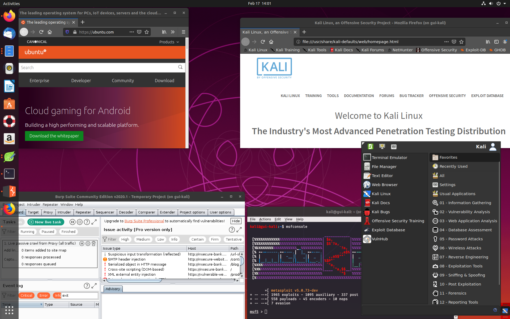

Customise the panel as desired.

##### Container management:

- Start: `lxc start gui-kali`
- Stop: `lxc stop gui-kali`
- Remove: `lxc destroy gui-kali`

- - -

### Privileged Kali LXC container on Kali host

Privileged containers are containers created by root and running as root. They are quicker to setup than unprivileged  containers but are inherently unsafe.
Installing a privileged Kali Linux container on a Kali host only requires to:

1. Install and setup lxc
2. Download the kali image from the image server
3. Start the container
4. Attach to the container

- - -

1 - Install lxc and setup the network:

```console
kali@kali:~$ sudo apt install -y lxc libvirt0 libpam-cgfs bridge-utils libvirt-clients libvirt-daemon-system iptables ebtables dnsmasq-base
kali@kali:~$
kali@kali:~$ sudo cat <<EOF > /etc/lxc/default.conf
lxc.net.0.type = veth
lxc.net.0.link = virbr0
lxc.net.0.flags = up
lxc.apparmor.profile = generated
lxc.apparmor.allow_nesting = 1
EOF
kali@kali:~$
kali@kali:~$ sudo virsh net-start default
kali@kali:~$ sudo virsh net-autostart default
```

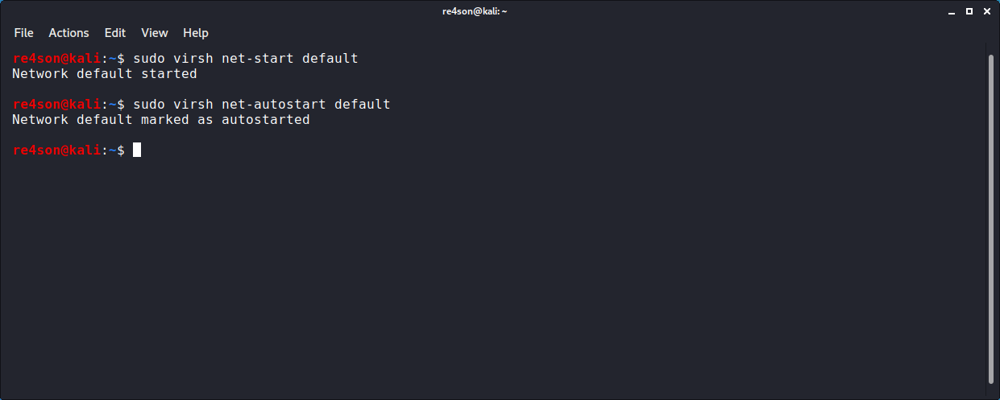
2 - Download the Kali Linux image from the image server via

```console
kali@kali:~$ lxc-create -t download -n my-kali
```

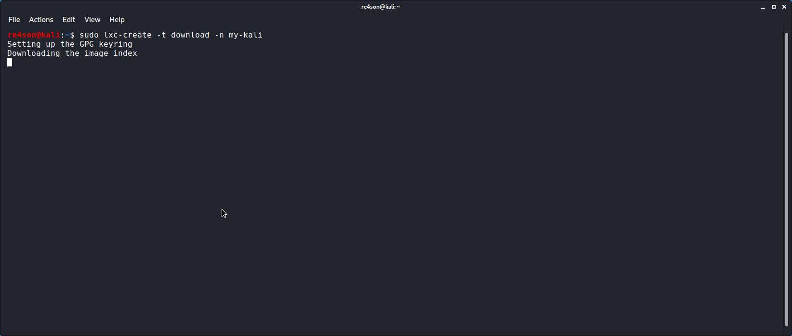

This will list all available images.

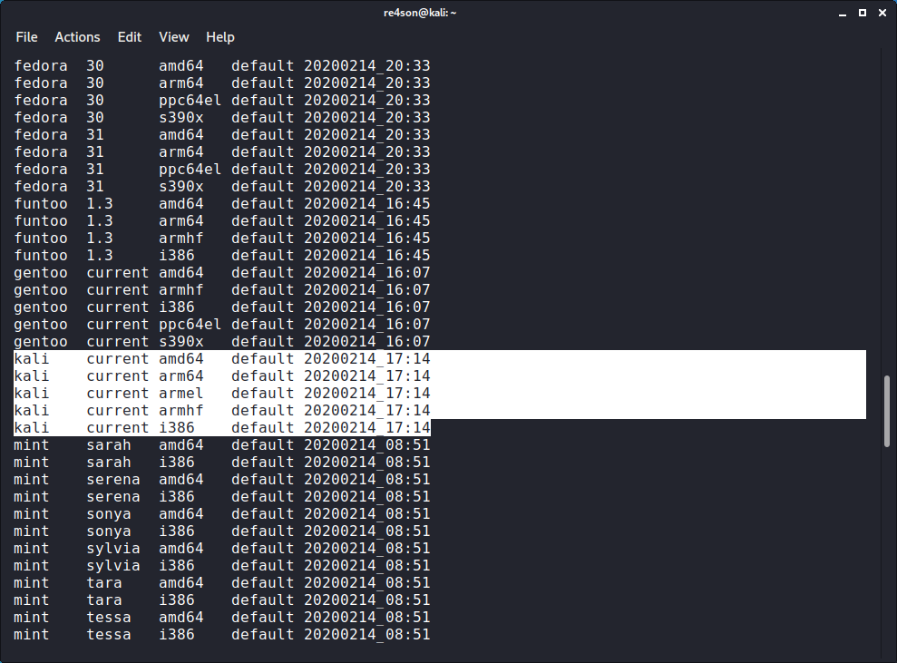

When prompted, enter:

- Distribution: *kali*
- Release: *current*
- Architecture: *amd64* (or other as applicable)

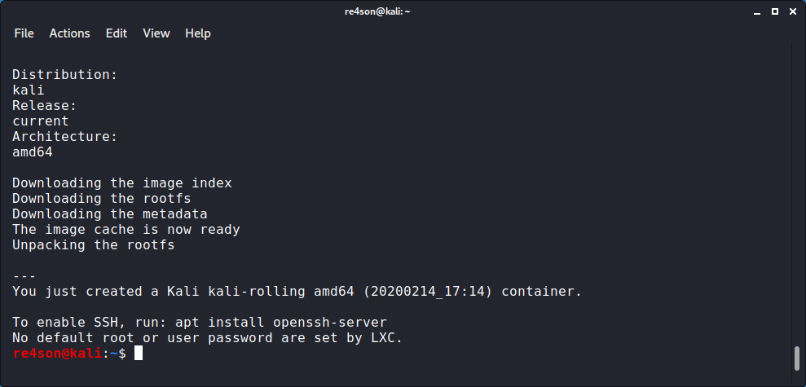
3 - Start the container with

```console
kali@kali:~$ sudo lxc-start -n my-kali -d
```

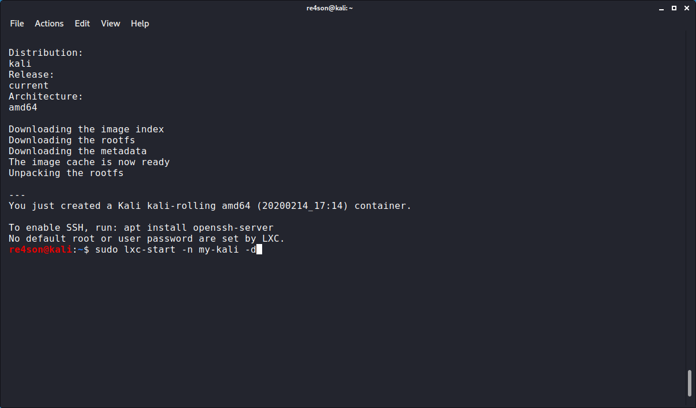
4 - Attach to the container via

```console
kali@kali:~$ sudo lxc-attach -n my-kali
```

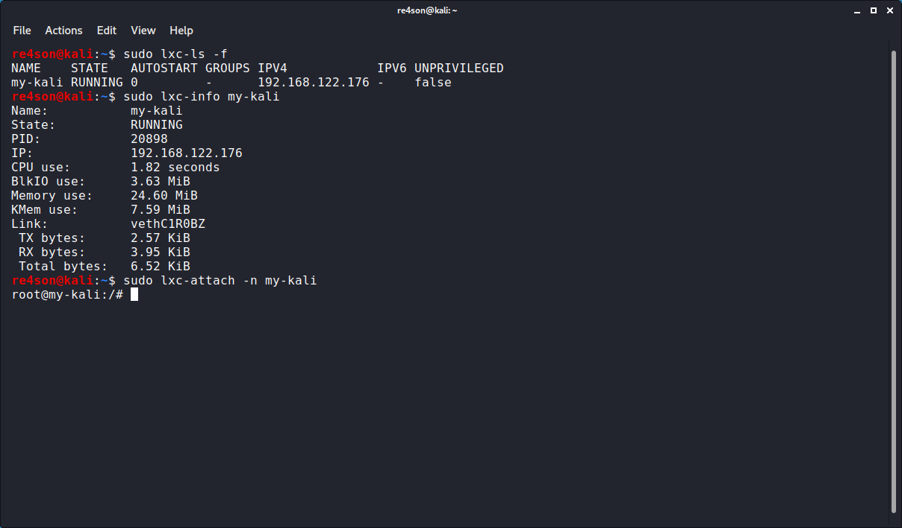

There you have it. Next you should set a root password and install the "kali-linux-default" metapackage.

##### Container management:

- Start: `sudo lxc-start -n my-kali -d`
- Stop: `sudo lxc-stop -n my-kali`
- List: `sudo lxc-ls -f`
- Info: `sudo lxc-info -n my-kali`
- Remove: `sudo lxc-destroy -n my-kali`

- - -

### Unprivileged Kali LXC container on Kali host

Unprivileged containers run in a user context and are considered safer and are preferred over using privileged container.
The setup it slightly more involved:

1. Install and setup lxc
2. Setup LXC for unprivileged containers
3. Download the kali image from the image server
4. Start the container
5. Install some additional packages
6. Create non-root user
7. Login

- - -

1 - Install lxc (if required):

```console
kali@kali:~$ sudo apt install -y lxc libvirt0 libpam-cgfs bridge-utils libvirt-clients libvirt-daemon-system iptables ebtables dnsmasq-base
```
2 - Setup LXC for unprivileged containers

```console
kali@kali:~$ echo "$USER veth virbr0 10" | sudo tee -i /etc/lxc/lxc-usernet
kali@kali:~$ sudo sh -c 'echo "kernel.unprivileged_userns_clone=1" > /etc/sysctl.d/80-lxc-userns.conf'
kali@kali:~$ sudo sysctl kernel.unprivileged_userns_clone=1
kali@kali:~$ sudo chmod u+s /usr/libexec/lxc/lxc-user-nic
kali@kali:~$
kali@kali:~$ mkdir -p ~/.config/lxc
kali@kali:~$ cp /etc/lxc/default.conf ~/.config/lxc/default.conf
kali@kali:~$ sed -i 's/lxc.apparmor.profile = generated/lxc.apparmor.profile = unconfined/g' ~/.config/lxc/default.conf
```

Next we have to add two lines into `~/.config/lxc/default.conf` whose subuid & subguid match those listed in `/etc/subuid` and `/etc/subgid`.
First let's get the id's via `cat /etc/s*i d grep $USER`
The result should look like this:

```plaintext
kali:100000:65536
kali:100000:65536
```

Substitute the ID's in the following commands with the ones in the previous output:

```console
kali@kali:~$ echo lxc.idmap = u 0 100000 65536 >> ~/.config/lxc/default.conf
kali@kali:~$ echo lxc.idmap = g 0 100000 65536 >> ~/.config/lxc/default.conf
```

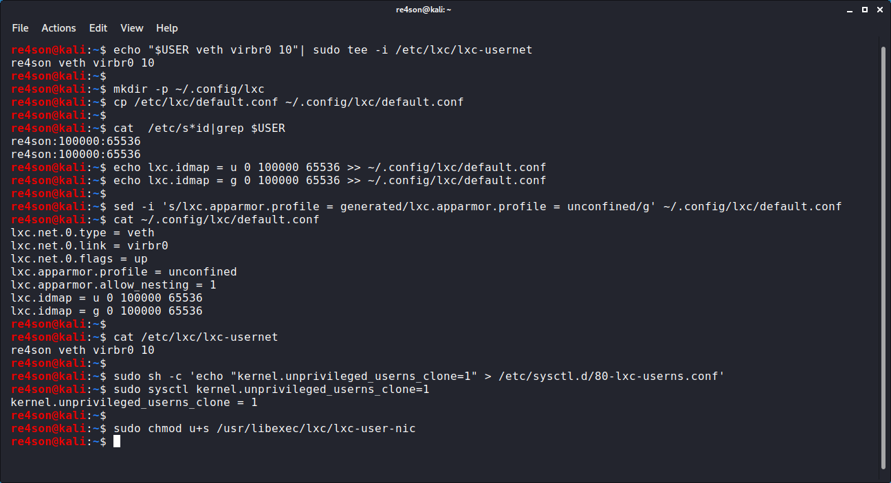
3 - Download the Kali Linux image from the image server via

```console
kali@kali:~$ lxc-create -t download -n my-kali
```

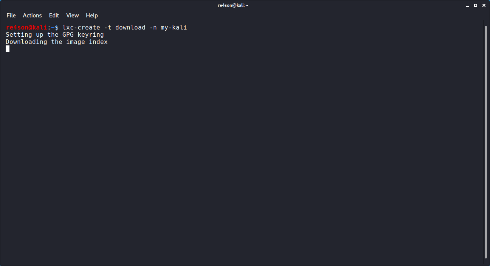

This will list all available images.

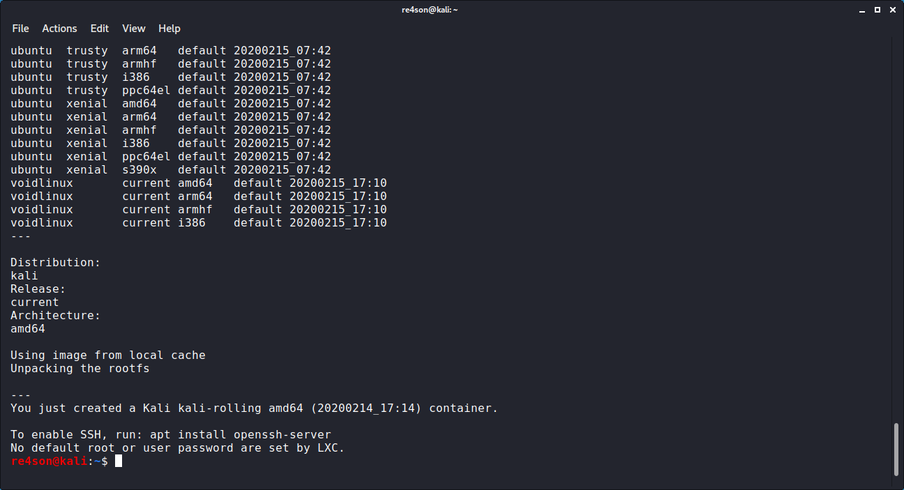

When prompted, enter:

- Distribution: *kali*
- Release: *current*
- Architecture: *amd64* (or other as applicable)

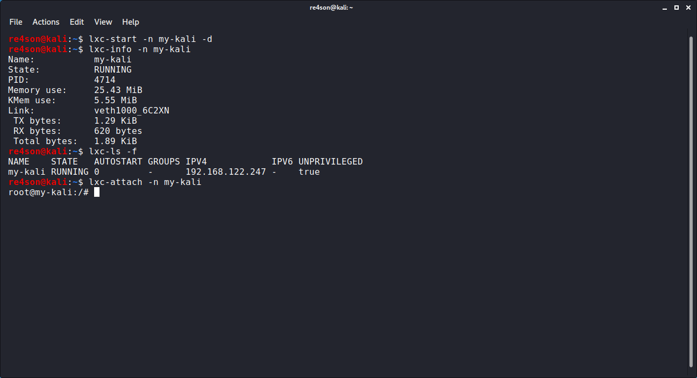
4 - Start the container with

```console
kali@kali:~$ lxc-start -n my-kali -d
```

But before we login, we perform some post-installation setup tasks

5 - Install default packages:
```console
kali@kali:~$ lxc-attach -n my-kali apt update
kali@kali:~$ lxc-attach -n my-kali apt install -y kali-linux-default
```

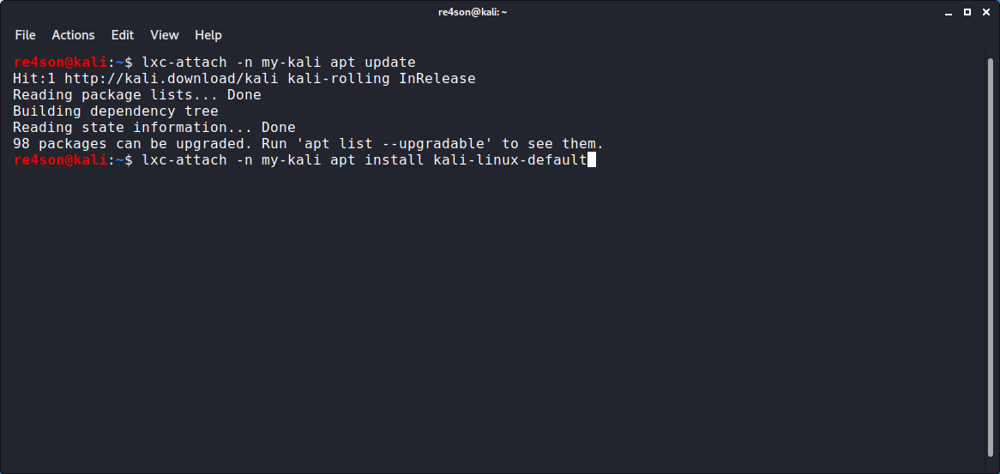
6 - Create a non-root user:

```console
kali@kali:~$ lxc-attach -n my-kali --clear-env adduser <username>
kali@kali:~$ lxc-attach -n my-kali --clear-env adduser <username> sudo
```

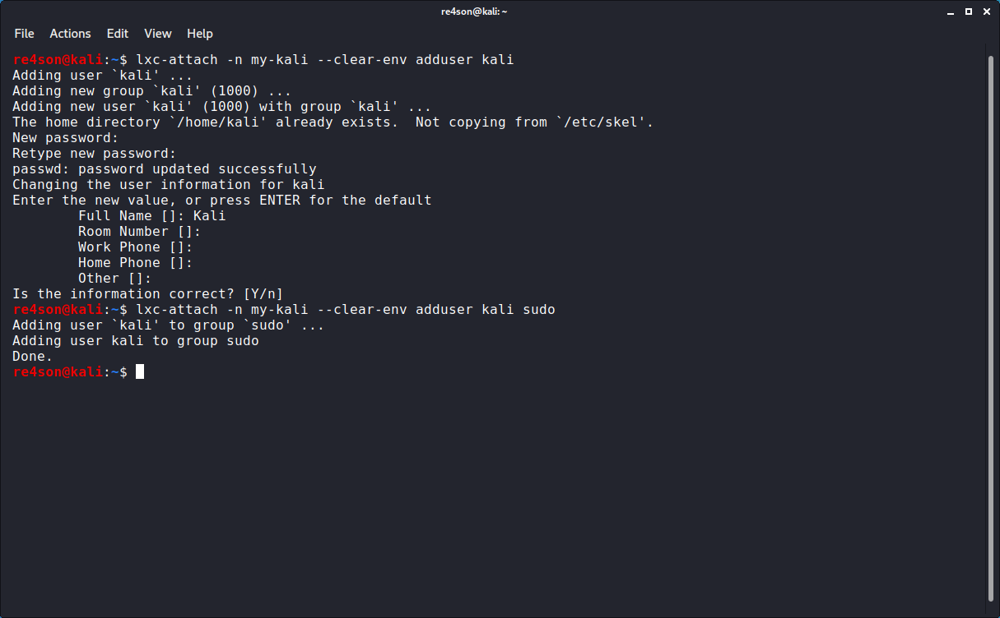
7 - Login as non-root user via

```console
kali@kali:~$ lxc-console
```

And perform the following on initial login to get some colors in the console:

```console
kali@kali:~$ sed -i '1 i\TERM=xterm-256color' ~/.bashrc
kali@kali:~$ . ~/.bashrc
```


##### Container management:

- Start: `sudo lxc-start -n my-kali -d`
- Stop: `sudo lxc-stop -n my-kali`
- List: `sudo lxc-ls -f`
- Info: `sudo lxc-info -n my-kali`
- Remove: `sudo lxc-destroy -n my-kali`

- - -

## References:

- [Linux Containers](https://linuxcontainers.org/)
- [How to run GUI apps in LXD containers on your Ubuntu desktop](https://blog.simos.info/how-to-easily-run-graphics-accelerated-gui-apps-in-lxd-containers-on-your-ubuntu-desktop/)
