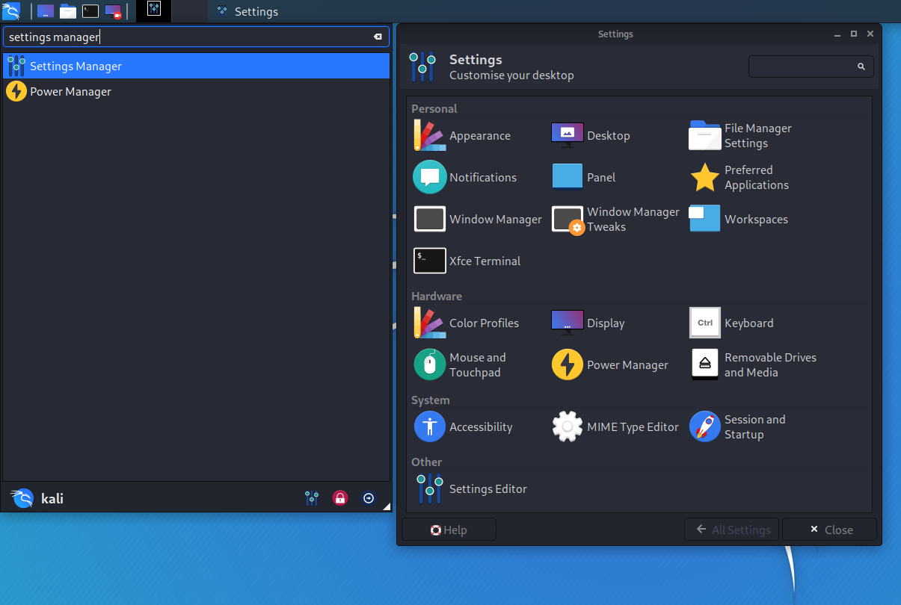

Upon starting Kali Linux up, certain things may appear larger than expected. This could be because of **DPI** (**Dots Per Inch**) / **PPI** (**Pixels Per Inch**) being incorrect. If things are looking smaller than expected, you may wish to look at our [HiDPI guide](/docs/general-use/hidpi/).

This could be happening for various reasons, such as the graphic card drivers and/or the monitor profile causing issues.

This guide will cover single screen setups. **We do not have the hardware in order to test multiple display outputs to write up the guide. So we are looking for [community contribution](/docs/community/contribute/) to help out. If you have the hardware, and expertise, please [edit this guide](https://gitlab.com/kalilinux/documentation/kali-docs/edit/master/general-use/hidpi/index.md)!**

- - -

## Issue

Upon opening some applications, the font may appear larger than expected, like in the example below. Here you can see two different terminal software, the one on the left is using **Qt** (`QTerminal`) and the one on the right is using **GTK** (`xfce4-terminal`).


**Qt** is too large, and needs to be altered. First we need to find what value to alter it to, then we need to apply the change.

## Locating the Problem

We first use [xrdb](https://packages.debian.org/buster/x11-xserver-utils), which looks up in the database of X server _(X is what is sponsorable for the graphical display output)_, to see what values are there:

```console
kali@kali:~$ xrdb -q
*customization:	-color
Xft.antialias:	1
Xft.hinting:	1
Xft.hintstyle:	hintslight
Xft.rgba:	rgb
Xcursor.theme_core:	1
kali@kali:~$
```

There is no sign of DPI being pre-defined. Time to move onto the next tool.

Using [xdpyinfo](https://manpages.debian.org/buster/x11-utils/xdpyinfo.1.en.html), we can look at the display information about X, which is currently in use _(as things will get defined dynamically at various points. e.g. startup, new screen attached etc)_:

```console
kali@kali:~$ xdpyinfo | grep 'dimensions\|resolution'
  dimensions:    1680x1050 pixels (160x90 millimeters)
  resolution:    267x296 dots per inch
kali@kali:~$
```

We only get the values back once, which means there is only one monitor. Great! What isn't so great, is the size of the physical screen, `160x90mm`, being detected, which may start to explain why the font is very large (as the DPI is huge). We can also see the **screen resolution** is set to `1680 x 1050` and the DPI is `~267`.

Next we can use [xrandr](https://packages.debian.org/buster/x11-xserver-utils) as this handles the **extension RandR** _(resize and rotate)_ to see if what that is reporting matches up:

```console
kali@kali:~$ xrandr -q | grep -iw 'screen\|connected'
Screen 0: minimum 8 x 8, current 1680 x 1050, maximum 32767 x 32767
HDMI-0 connected 1680x1050+0+0 (normal left inverted right x axis y axis) 160mm x 90mm
kali@kali:~$
```

Again, one screen. ALso, its resolution matches up with what `xdpyinfo` told us. We can see its using a **HDMI** cable and also same the same resolution & size.

Checking the logs of X, we can see:

```console
kali@kali:~$ grep DPI /var/log/Xorg.0.log
[     7.324] (--) NVIDIA(0): DPI set to (266, 296); computed from "UseEdidDpi" X config
kali@kali:~$
```

Which is very close to the DPI value which `xrandr` reported _(but off by one)_. We can see the graphic drive in question is **NVIDIA**, and its trying to get the DPI value from `EDID` _(The GPU is trying to read the data from the monitor)_

If we wanted to, we can look at the value of **EDID** by using [edid-decode](https://manpages.debian.org/buster/edid-decode/edid-decode.1.en.html):

```console
kali@kali:~$ sudo apt install -y edid-decode
kali@kali:~$
kali@kali:~$ xrandr --props | edid-decode -c -s
EDID version: 1.3
[...]
Maximum image size: 16 cm x 9 cm
[...]
Warnings:

Block 0 (Base Block):
  Basic Display Parameters & Features: Dubious maximum image size (160x90 is smaller than 10x10 cm)

Failures:

All Blocks:
  One or more of the timings is out of range of the Monitor Ranges:
    Vertical Freq: 24 - 75 Hz (Monitor: 23 - 75 Hz)
    Horizontal Freq: 27.000 - 79.976 kHz (Monitor: 26.000 - 68.000 kHz)
    Maximum Clock: 148.500 MHz (Monitor: 150.000 MHz)

EDID conformity: FAIL
kali@kali:~$
```

So it looks like the values from **EDID are incorrect**, so we shouldn't listen to the monitor! We are going to need to manually define the values to use.

The easiest way to do this would be to look at the make/model of the screen _(is there a a sticker on the back/under of the device?)_. Otherwise we can use the old fashion method of getting out a tape measure.

## Why is it wrong?

So what does the OS think our screen size is?

Using a bit of math (`1cm` is `10mm` & `25.4mm` is `1 inch`), we can convert the millimeters (mm) to inches (in):

_Remember that the output was `dimensions: 1680x1050 pixels (160x90 millimeters)`, so we are taking "width" as `160` and "height²" as `90`_

```console
kali@kali:~$ echo 'print(160/25.4)' | python3
6.299212598425197   # 6.3 in
kali@kali:~$
kali@kali:~$ echo 'print(90/25.4)' | python3
3.543307086614173   # 3.5 in
kali@kali:~$
```

Now, we can find the diagonal screen size by doing `√(width² + height²) = diagonal`:

```console
kali@kali:~$ echo 'print( ( ((160/25.4) ** 2)+((90/25.4) ** 2) ) ** (0.5) )' | python3
7.227385728616465  # 7.2 in
kali@kali:~$
```

The sticker on the back of the screen says its **20 inches**, yet only **7.2 inches** is detected!

## Finding the correct value

Using the formula `√(width² + height²) / diagonal = DPI`, we get:

_Remember that the output was `dimensions: 1680x1050 pixels (160x90 millimeters)`, so we are taking "width" as `1680` and "height" as `1050`, and correct diagonal is `20`_

```console
kali@kali:~$ # e.g. (((width ** 2)+(height² ** 2) ) ** (0.5) ) / diagonal )
kali@kali:~$
kali@kali:~$ echo 'print( (((1680 ** 2)+(1050 ** 2) ) ** (0.5) ) / 20 )' | python3
99.05680188659434  # 99 DPI
kali@kali:~$
```

**So we need to set our DPI to be `99x99` rather than 267x296**.

## Fixing

There are various ways we can do to fix this, each with their pros and cons:

- Editing `~/.Xresources` _(X configuration **Recommended method**)_
- Editing `~/.xsessionrc` _(X startup script)_
- NVIDIA driver settings
- Xfce GUI settings _(desktop environment configuration)_

#### Xresources

We can configure X (per user). In a terminal window, run the following commands:

```console
kali@kali:~$ echo "Xft.dpi: 99" >> ~/.Xresources
kali@kali:~$
kali@kali:~$ cat ~/.Xresources
Xft.dpi: 99
kali@kali:~$
kali@kali:~$ xrdb -merge ~/.Xresources
kali@kali:~$
```

After running `xrdb -merge`, a logout shouldn't be required, so the next time you open a problematic program back up, the font should now be "normal".

#### xsessionrc

This is a shell script, which will automatically get executed upon a graphical login. In a terminal window, run the following commands:

```console
kali@kali:~$ echo "xrandr --dpi 99" >> ~/.xsessionrc
kali@kali:~$
kali@kali:~$ cat ~/.xsessionrc
xrandr --dpi 99
kali@kali:~$
kali@kali:~$ xfce4-session-logout --logout
kali@kali:~$
```

After logging out and in again, the next time you open a problematic program back up, the font should now be "normal".

#### NVIDIA driver settings

Another approach would be to get the NVIDIA drivers to handle the DPI.

If there isn't a configuration file for X, we are going to generate one and then move it:

```console
kali@kali:~$ sudo apt install -y nvidia-xconfig
kali@kali:~$
kali@kali:~$ sudo nvidia-xconfig
kali@kali:~$
kali@kali:~$ sudo mv /etc/X11/xorg.conf /usr/share/X11/xorg.conf.d/20-nvidia.conf
kali@kali:~$
```

We can now edit the configuration file, to include the following two lines in the `Section "Device"` section:

- `Option "UseEdidDpi" "False"`
- `Option "DPI" "99 x 99"`

```console
kali@kali:~$ sudo vim /usr/share/X11/xorg.conf.d/20-nvidia.conf
kali@kali:~$
kali@kali:~$ cat /usr/share/X11/xorg.conf.d/20-nvidia.conf
[...]
Section "Device"
    Identifier     "Device0"
    Driver         "nvidia"
    VendorName     "NVIDIA Corporation"
    Option         "UseEdidDpi" "False"
    Option         "DPI" "99 x 99"
EndSection
[...]
kali@kali:~$
kali@kali:~$ xfce4-session-logout --logout
kali@kali:~$
```

After logging out and in again, the next time you open a problematic program back up, the font should now be "normal".

#### Xfce Settings

We can configure Xfce by doing:

- Kali -> Settings -> Appearance -> Fonts -> DPI
  - Enable: `Custom DPI Settings`
  - Value: `99`




{}
Due to a bug, you will need to either toggle `Custom DPI Settings` or increase/decrease the value then restore it back to the value previously.
{}

A logout shouldn't be required, so the next time you open a problematic program back up, the font should now be "normal".

- - -

## References

For additional reading material, you may wish to reference:

- [http.download.nvidia.com/XFree86/Linux-x86/390.132/README/dpi.html](https://http.download.nvidia.com/XFree86/Linux-x86/390.132/README/dpi.html)
- [wiki.ubuntu.com/X/Troubleshooting/HugeFonts](https://wiki.ubuntu.com/X/Troubleshooting/HugeFonts)
- [wiki.archlinux.org/index.php/HiDPI](https://wiki.archlinux.org/index.php/HiDPI)
- [wiki.archlinux.org/index.php/Xrandr](https://wiki.archlinux.org/index.php/Xrandr)
