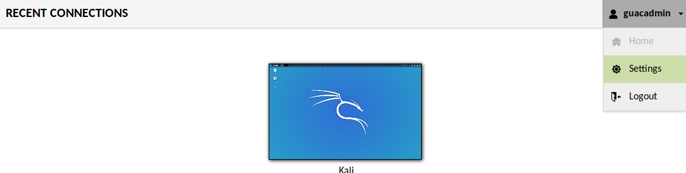
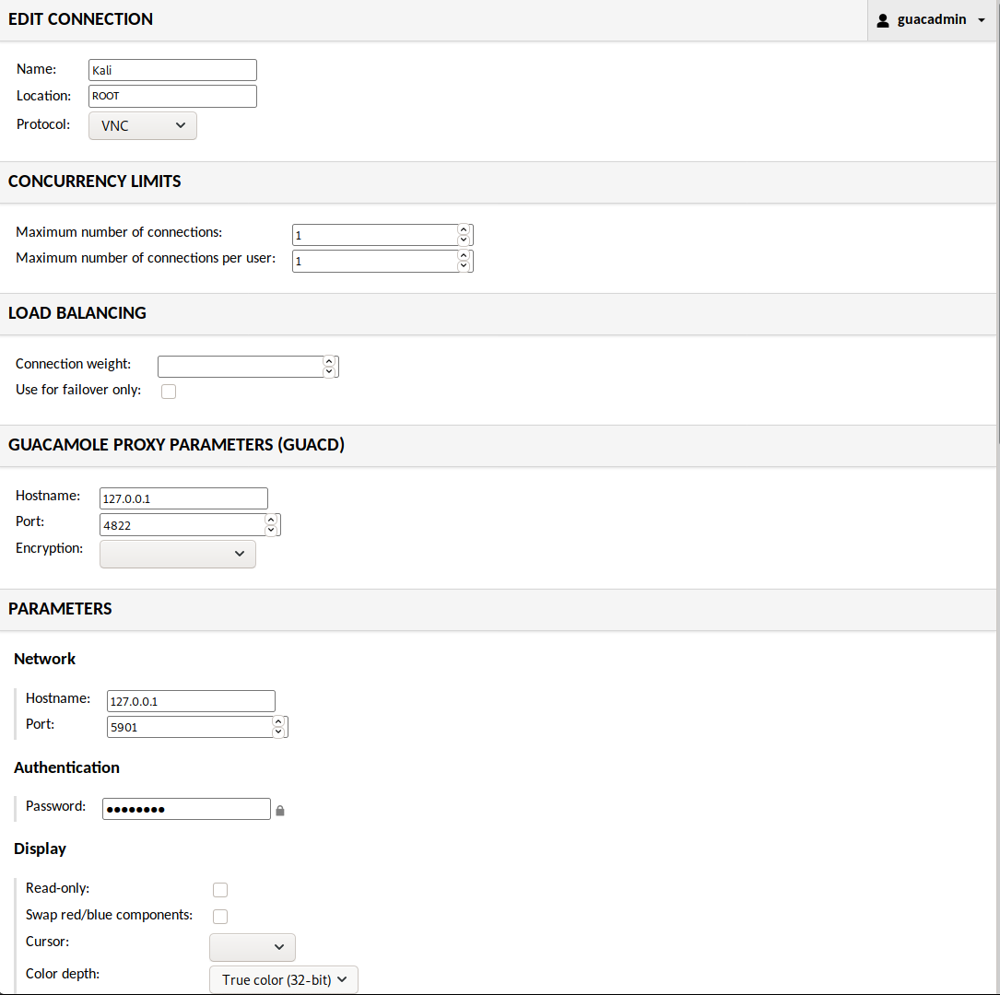

There are various ways you can interact with Kali, such as sitting down and being direct at the console (more often than not, for a graphic experience), alternatively using Kali remotely via SSH (which gives you command line access). Alternatively, you may have setup VNC which will allow for remote graphical access (please make sure to do this securely by having VNC listen on loopback and port forward via SSH). Another approach would be to interact with Kali in a browser, rather than having to install necessary VNC clients.

This guide covers Apache Guacamole, but we also have another guide [noVNC](/docs/general-use/novnc-kali-in-browser/). Each have their pros and cons. Guacamole is a more complete solution, it supports multiple protocols and allows clients to connect to it from a central page with user authentication.

Apache Guacamole is [not packaged with Debian](https://wiki.debian.org/Guacamole), and has [various steps to complete](https://guacamole.apache.org/doc/gug/installing-guacamole.html) its setup (or you can use a [docker image](https://guacamole.apache.org/doc/gug/guacamole-docker.html)). There is a automated script to help the installation process.

The first stage is to download the script:

```console
kali@kali:~$ sudo apt update
kali@kali:~$
kali@kali:~$ sudo apt install -y git
kali@kali:~$
kali@kali:~$ git clone https://github.com/MysticRyuujin/guac-install.git /tmp/guac-install
kali@kali:~$
```

{}
IMPORTANT! If you are in the Eastern time zone, you will have to change to a different one. There is a bug with Apache that does not see EDT as a valid time zone.
{}

To fix this issue, we will change our time zone to be Central time:

```console
kali@kali:~$ sudo rm /etc/localtime
kali@kali:~$
kali@kali:~$ sudo ln -s /usr/share/zoneinfo/US/Central /etc/localtime
```

We are going to do a "standalone" installation, where there isn't a separate MySQL database host as well as not enabling any MFA _(as we are going to hide this behind a SSH tunnel)_:

```console
kali@kali:~$ cd /tmp/guac-install/
kali@kali:/tmp/guac-install$ sudo ./guac-install.sh --nomfa --installmysql --mysqlpwd S3cur3Pa$$w0rd --guacpwd P@s$W0rD
[...]
Cleanup install files...

Installation Complete
- Visit: http://localhost:8080/guacamole/
- Default login (username/password): guacadmin/guacadmin
***Be sure to change the password***.

kali@kali:/tmp/guac-install$
```

We can quickly check all the services are happy:

```console
kali@kali:/tmp/guac-install$ systemctl status tomcat9 guacd mysql
● tomcat9.service - Apache Tomcat 9 Web Application Server
     Loaded: loaded (/lib/systemd/system/tomcat9.service; enabled; vendor preset: disabled)
     Active: active (running) since Thu 2020-03-05 17:39:38 GMT; 1min 14s ago
       Docs: https://tomcat.apache.org/tomcat-9.0-doc/index.html
   Main PID: 33192 (java)
      Tasks: 47 (limit: 19107)
     Memory: 454.8M
     CGroup: /system.slice/tomcat9.service
             └─33192 /usr/lib/jvm/default-java/bin/java -Djava.util.logging.config.file=/var/lib/tomcat9/conf/logging.properties -Djava.util.logging.manager=org.apache.juli.ClassLoaderLogManager -Djava.a>

● guacd.service - LSB: Guacamole proxy daemon
     Loaded: loaded (/etc/init.d/guacd; generated)
     Active: active (running) since Thu 2020-03-05 14:04:34 GMT; 3h 36min ago
       Docs: man:systemd-sysv-generator(8)
      Tasks: 1 (limit: 19107)
     Memory: 11.5M
     CGroup: /system.slice/guacd.service
             └─991 /usr/local/sbin/guacd -p /var/run/guacd.pid

Warning: Journal has been rotated since unit was started. Log output is incomplete or unavailable.

● mysql.service - LSB: Start and stop the mysql database server daemon
     Loaded: loaded (/etc/init.d/mysql; generated)
     Active: active (running) since Thu 2020-03-05 17:39:46 GMT; 1min 6s ago
       Docs: man:systemd-sysv-generator(8)
      Tasks: 34 (limit: 19107)
     Memory: 88.9M
     CGroup: /system.slice/mysql.service
             ├─33670 /bin/sh /usr/bin/mysqld_safe
             ├─33787 /usr/sbin/mysqld --basedir=/usr --datadir=/var/lib/mysql --plugin-dir=/usr/lib/x86_64-linux-gnu/mariadb19/plugin --user=mysql --skip-log-error --pid-file=/run/mysqld/mysqld.pid --soc>
             └─33788 logger -t mysqld -p daemon error
kali@kali:/tmp/guac-install$
kali@kali:/tmp/guac-install$ sudo ss -antup | grep "mysqld\|guacd\|java"
tcp    LISTEN  0       80                 127.0.0.1:3306         0.0.0.0:*       users:(("mysqld",pid=33787,fd=21))
tcp    LISTEN  0       5                  127.0.0.1:4822         0.0.0.0:*       users:(("guacd",pid=991,fd=4))
tcp    LISTEN  0       100                        *:8080               *:*       users:(("java",pid=33192,fd=36))
kali@kali:/tmp/guac-install$
```

All the services are up and running correctly.

Next is to enable VNC service on Kali.

We are going to use TigerVNC:

```console
kali@kali:~$ sudo apt install -y tigervnc-standalone-server
kali@kali:~$
kali@kali:~$ mkdir -p ~/.vnc/
kali@kali:~$
kali@kali:~$ wget https://gitlab.com/kalilinux/nethunter/build-scripts/kali-nethunter-project/-/raw/master/nethunter-fs/profiles/xstartup -O ~/.vnc/xstartup
kali@kali:~$
kali@kali:~$ vncserver :1
```

Next we are going to go to the guacamole admin panel and create a new connection.

First we click "Settings" in the upper right drop-down menu



Next we will click on the "Connections" tab and click "New connection". We will populate these the fields below:



We make sure to set "Color depth" as we do so the colors come through properly. If set wrongly, some of the greys can turn purple or other colors.

With all that done, you can go "Home" from the upper right drop-down and click on the new connection.
