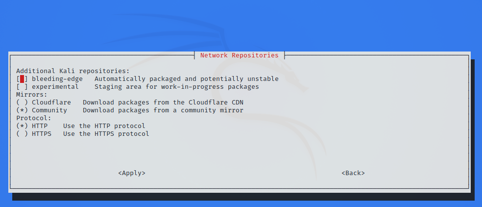

The topic of repositories is always a large one, and comes up frequently. It is an item which people often get wrong and confused with. Please take the time to read the information below and any references which is linked to before acting on anything.

## Default Network Repository Value

On a standard, clean install of Kali Linux, with network access, you should have the following entry present in `/etc/apt/sources.list`:

```console
kali@kali:~$ grep -v '#' /etc/apt/sources.list | sort -u
deb http://http.kali.org/kali kali-rolling main contrib non-free non-free-firmware

kali@kali:~$
```

If the output doesn't exactly match up to the above output, you may not be able to install any new additional packages or receive updates.
This may happen for any number of reasons, such as:

- You have switched your [branch](/docs/general-use/kali-branches/).
- Using a different hardcoded [mirror](/docs/community/kali-linux-mirrors/).

You will probably want to read the "switching branches" section to alter this.

Since [Kali 2020.3](/blog/kali-linux-2020-3-release/), after Kali's setup is complete, network repositories will be enabled by default, even if there was no network access during installation.

## Switching Kali Main Branch

Kali has two [main branches](/docs/general-use/kali-branches/) to choose from (please take the time to read which one would be the best option for your setup):

- **kali-rolling** - default & frequently updated
- **kali-last-snapshot** - point release so more "stable" & the "safest"

Enabling the `kali-rolling` branch is done with the command:

```console
kali@kali:~$ echo "deb http://http.kali.org/kali kali-rolling main contrib non-free non-free-firmware" | sudo tee /etc/apt/sources.list
```

Enabling the `kali-last-snapshot` branch is done with the command:

```console
kali@kali:~$ echo "deb http://http.kali.org/kali kali-last-snapshot main contrib non-free non-free-firmware" | sudo tee /etc/apt/sources.list
```

Note that such a change is effective only after running `sudo apt update`.

## Enabling Kali Additional Branches

Kali also proposes [additional branches](/docs/general-use/kali-branches/) for special cases. In theory, it's possible to enable those regardless of the main branch you use. In practice though, they are meant to be used in addition to `kali-rolling`. We discourage using it in addition to `kali-last-snapshot` unless you know exactly what you're doing. Those additional branches are:

- **kali-experimental** - packages which are under testing or work in progress
- **kali-bleeding-edge** - packages automatically updated from upstream git repositories

Enabling or disabling those branches is best done using the command-line tool `kali-tweaks`, under the *Network Repositories* section:



If you prefer, you can also enable those branches manually from the command-line. For example, enabling `kali-experimental` is done with the command:

```console
kali@kali:~$ echo "deb http://http.kali.org/kali kali-experimental main contrib non-free non-free-firmware" | sudo tee /etc/apt/sources.list.d/kali-experimental.list
```

Note that in the command above, we don't modify the file `/etc/apt/sources.list`, but instead we create a new file `/etc/apt/sources.list.d/kali-experimental.list`. This is a convention: the file `/etc/apt/sources.list` should only contain the main branch, while additional branches should go in `/etc/apt/sources.list.d/`, one branch per file.

If you follow this convention, then disabling the `kali-experimental` branch is straightforward:

```console
kali@kali:~$ sudo rm /etc/apt/sources.list.d/kali-experimental.list
```

The branch `kali-bleeding-edge` can be enabled with a similar command, we just need to change the name of the branch:

```console
kali@kali:~$ echo "deb http://http.kali.org/kali kali-bleeding-edge main contrib non-free non-free-firmware" | sudo tee /etc/apt/sources.list.d/kali-bleeding-edge.list
```

To disable `kali-bleeding-edge`:

```console
kali@kali:~$ sudo rm /etc/apt/sources.list.d/kali-bleeding-edge.list
```

## Sources.list Format

```plaintext
deb   http://http.kali.org/kali   kali-rolling   main contrib non-free non-free-firmware
<Archive>   <Mirror>                <Branch>                <Components>
```

- **Archive** is going to be `deb` (Regular Binary) or `deb-src` (Source), depending if you want a package or the source of the package.
- **Mirror** should be `http://http.kali.org/kali` as this is our load balancer, which will direct you to best [mirror](/docs/community/kali-linux-mirrors/).
- **Branch** is what [version of Kali](/docs/general-use/kali-branches/) you wish to use.
- **Components** are what packages you wish to use, based on the [Debian Free Software Guidelines (DFSG)](https://www.debian.org/social_contract#guidelines). Kali defaults to everything.

## Default Offline Install Values

During the Kali setup process, if you don't have access to a network connection to reach a repository, you will perform an offline installation of Kali Linux. You will be limited to the packages & the version which is on the medium you installed Kali from. This will then configure Kali to continue to use this medium to install packages from, even after Kali has been installed.

This means you will not get any updates to packages, or any new additional tools, which can be frustrating. You can see if you the offline media enabled if your values match up with what's below (or if you want to enable this option):

```console
kali@kali:~$ cat /etc/apt/sources.list
#

# deb cdrom:[Kali GNU/Linux 2020.1a _Kali-last-snapshot_ - Official amd64 DVD Binary-1 with firmware 20200213-14:56]/ kali-rolling main non-free

#deb cdrom:[Kali GNU/Linux 2020.1a _Kali-last-snapshot_ - Official amd64 DVD Binary-1 with firmware 20200213-14:56]/ kali-rolling main non-free

# This system was installed using small removable media
# (e.g. netinst, live or single CD). The matching "deb cdrom"
# entries were disabled at the end of the installation process.
# For information about how to configure apt package sources,
# see the sources.list(5) manual.
kali@kali:~$
kali@kali:~$ sudo apt-cdrom add
Using CD-ROM mount point /media/cdrom/
Identifying... [ea19ff4bedaa6c8f4662c0e8c58ed44c-2]
Scanning disc for index files...
Found 2 package indexes, 0 source indexes, 0 translation indexes and 0 signatures
This disc is called:
'Kali GNU/Linux 2020.1a _Kali-last-snapshot_ - Official amd64 DVD Binary-1 with firmware 20200213-14:56'
Reading Package Indexes... Done
Writing new source list
Source list entries for this disc are:
deb cdrom:[Kali GNU/Linux 2020.1a _Kali-last-snapshot_ - Official amd64 DVD Binary-1 with firmware 20200213-14:56]/ kali-rolling main non-free
Repeat this process for the rest of the CDs in your set.
kali@kali:~$
```

If your output matches what's above, please see the switching branch section, if you wish to receive updates.

However, if you do have network connection, which has access to network repositories, it will be enabled for you. You don't need to do anything.

## Non-Kali Repositories

If you want to install additional tools and software (such as [signal](https://signal.org/)) outside of what Kali has to offer, you may need to include an extra repository for this to happen. Please do not alter `/etc/apt/sources.list`, as this is used for the Kali Linux Operating System. Any extra tools and software needs to be placed into their own file in the directory `/etc/apt/sources.list.d/` (such as `/etc/apt/sources.list.d/repo-name.list`, replacing `repo-name` with the mirror name). It is highly recommended that each mirror should be in its own file.

By adding Kali's repository to a non-Kali OS (such as trying to add Kali to Ubuntu), this will highly increase the chance of your system not working. It may not happen straight away, but without any warning, it may break. We will not be able to offer support (and based on what we have seen over the years, most other OS will not help too).

Likewise, adding other operating system's repositories into Kali (such as trying to put Ubuntu on Kali), will break your installation. This is the single most common reason why Kali Linux systems break.

If any guides are telling you to do anything else than the above, this is unofficial advice, and completely not supported by Kali Linux. More often than not, users in this case end up doing a reinstall after learning this lesson.

## Mirrors

We have a list of [official Kali Linux mirrors](/docs/community/kali-linux-mirrors/), as well as a [guide on how to setup your own](/docs/community/setting-up-a-kali-linux-mirror/). This may be kept as a local repository which is only accessible on a LAN, or a remote private one, or if you have the ability to, you may wish to [share back to the community](/docs/community/contribute/) and make it public allowing for anyone else in your geographical area to benefit from it.

## Source Repositories

By using a `deb` in the repositories, it will allow for binary packages to be downloaded. However, should you require the source to a package (so you can compile the package yourself if you so wish, or look into debugging a problem with a package), you can add `deb-src` as a extra line in the repositories:

```console
kali@kali:~$ echo "deb-src http://http.kali.org/kali kali-rolling main contrib non-free non-free-firmware" | sudo tee -a /etc/apt/sources.list
```

We used `kali-rolling` for the [branch](/docs/general-use/kali-branches/) above, but you can select any value you wish.
