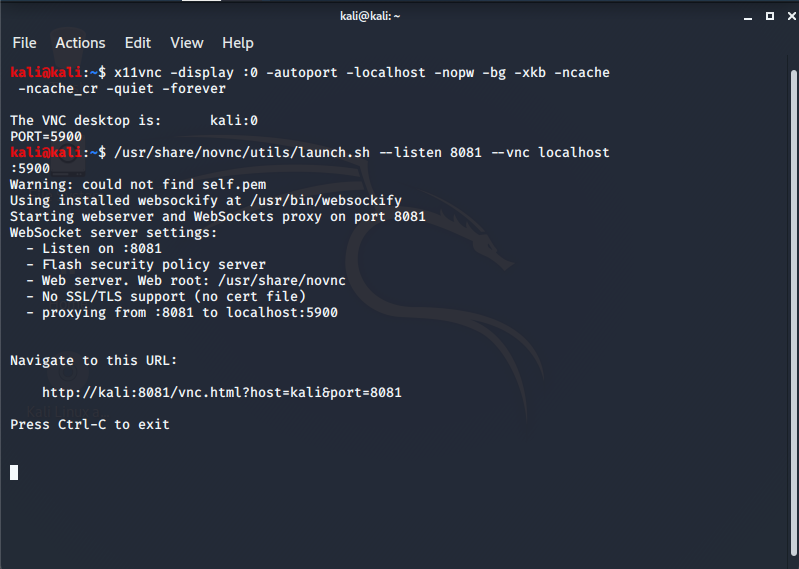
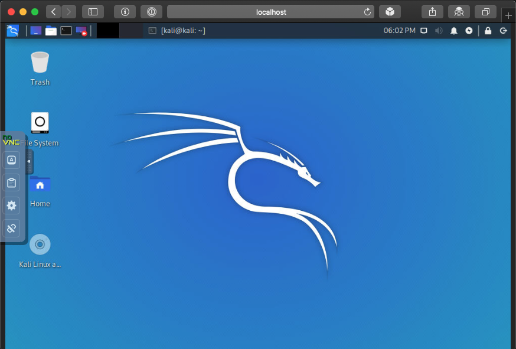

There are various ways you can interact with Kali, such as sitting down and being direct at the console (more often than not, for a graphic experience), alternatively using Kali remotely via SSH (which gives you command line access). Alternatively, you may have setup VNC which will allow for remote graphical access (please make sure to do this securely by having VNC listen on loopback and port forward via SSH). Another approach would be to interact with Kali in a browser, rather than having to install necessary VNC clients.

This guide covers noVNC, but we also have another guide for [Apache Guacamole](/docs/general-use/guacamole-kali-in-browser/). Each have their pros and cons. NoVNC is a lighter approach, as it has less services required (less overhead), which allows for a quick "one off connection" solution.

First we update, then install the necessary packages _(we have chosen [x11vnc](https://packages.debian.org/testing/x11vnc) as our VNC solution. You can switch it for any VNC servicer you wish. Support may vary however.)_:

```console
kali@kali:~$ sudo apt update
kali@kali:~$
kali@kali:~$ sudo apt install -y novnc x11vnc
kali@kali:~$
```

Next we start up a VNC session. We have chosen to do this only on loopback, making it more secure _(We are skipping `x11vnc`'s in-built HTTP function. That requires Java, and we don't want to install it on any of our clients as noVNC gives a HTML5 experience)_:

```console
kali@kali:~$ x11vnc -display :0 -autoport -localhost -nopw -bg -xkb -ncache -ncache_cr -quiet -forever

The VNC desktop is:      localhost:0
PORT=5900
kali@kali:~$
```

NOTE: We are using `display :0` which is our current desktop.

We can double check which port is being used for VNC:

```console
kali@kali:~$ ss -antp | grep vnc
LISTEN    0         32                127.0.0.1:5900            0.0.0.0:*        users:(("x11vnc",pid=8056,fd=8))
LISTEN    0         32                    [::1]:5900               [::]:*        users:(("x11vnc",pid=8056,fd=9))
kali@kali:~$
```

We can see it is using port 5900.

Afterwards we get noVNC running (this will open `8081/TCP`):

```console
kali@kali:~$ /usr/share/novnc/utils/novnc_proxy --listen 8081 --vnc localhost:5900
```



Better yet, enable SSH:

```console
kali@kali:~$ sudo systemctl enable ssh --now
kali@kali:~$
```

Then on the remote box, SSH into your Kali setup _(you may need to enable port forwarding first)_

```console
$ ssh kali@192.168.13.37 -L 8081:localhost:8081
```


