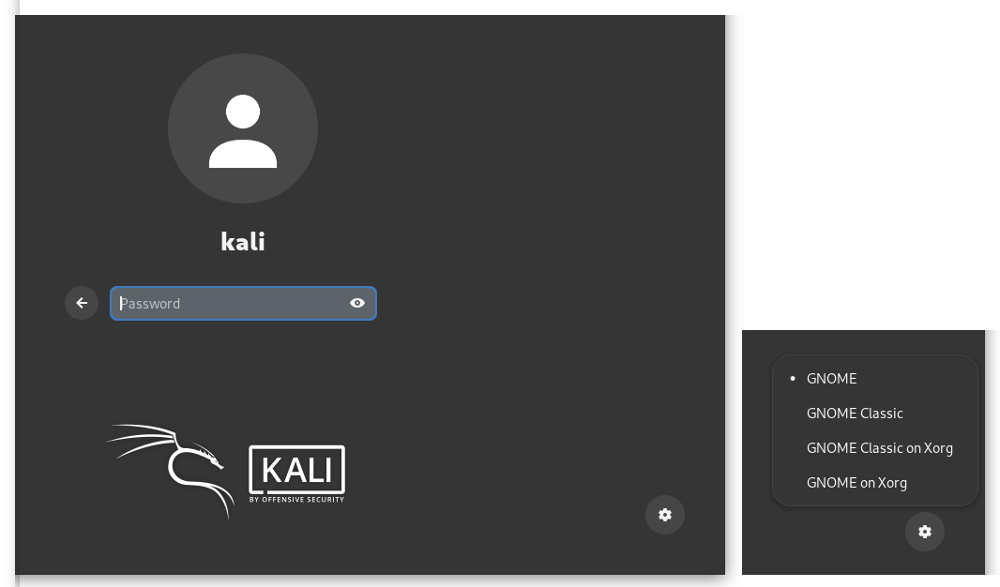
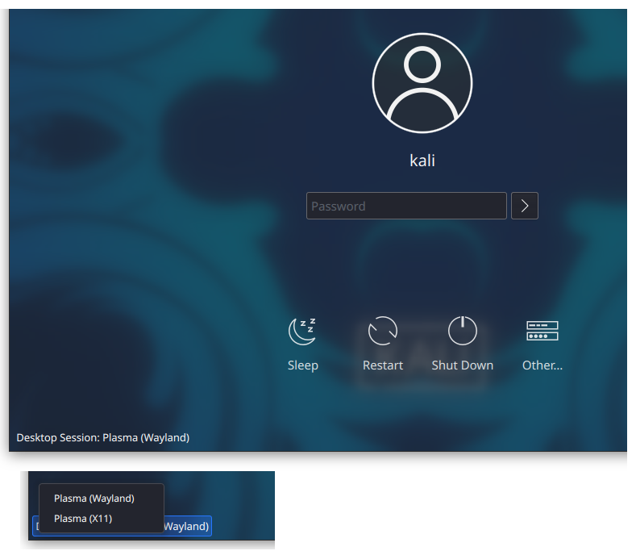

## What is Wayland? Or X11?

On Linux systems, the display server is a central part of the graphics stack, it's involved in displaying everything you see on the screen, and it also deals with user input (mouse, keyboard, touchscreen and so on).

[X11](https://www.x.org/), also called the X Window System, or X.Org, or simply X, was the traditional display server for Linux, first released in 1984, and still widely in use today. [Wayland](https://wayland.freedesktop.org/) is a replacement for X11. Initially released in 2008, it has been actively developed since then, and it is indeed replacing X11.

At the time of this writing, some Linux desktop environments (or DE for short) use Wayland natively, others still use X11. Some DE will never be ported to Wayland, as it represents a lot of work.

To finish this brief presentation: XWayland is a compatibility layer, it allows X11 applications to run on Wayland desktop environments.


## Wayland in Kali Linux

### Am I using Wayland in Kali Linux?

Open a terminal and type:

```console
kali@kali:~$ echo $XDG_SESSION_TYPE
```

If the output is `wayland`, then yes, your desktop is running under Wayland. If the output is `x11`, then your desktop is running under X11.

### Xfce

The Xfce desktop uses X11, and this won't change in the near future. One can check the [Xfce Wayland Development Roadmap](https://wiki.xfce.org/releng/wayland_roadmap) for more details.

### GNOME

In Kali Linux, the GNOME desktop uses the X11 display server by default.

In this regard, Kali Linux is more conservative than other Linux distributions: Wayland became the default in Fedora 25 (released in November 2016), Debian 10 (July 2019), Ubuntu 21.04 (April 2021).

Looking at the timeline above, you can expect Kali Linux to also switch to Wayland for its GNOME desktop at some point. But at the moment, this is not on the roadmap.

#### Switch to Wayland

{}
This part is for experienced users only. If you follow those steps, we expect you to be able to fix issues that might arise by yourself.
{}

If you want to use Wayland instead of X11, open a terminal and type the following commands:

```console
kali@kali:~$ sudo mkdir -p /etc/systemd/system/gdm.service.d
kali@kali:~$ sudo ln -sf /dev/null /etc/systemd/system/gdm.service.d/disable-wayland.conf
```

Then reboot and login: you're now using Wayland. If ever you want to switch back to X11, just remove the file `disable-wayland.conf` and reboot:

```console
kali@kali:~$ sudo rm /etc/systemd/system/gdm.service.d/disable-wayland.conf
```

Note that, after switching to Wayland, there is now an option to choose between Wayland or X11 from the login screen: at the bottom-right corner, click the _Settings_ icon, and choose _GNOME on Xorg_ if you prefer to use X11.



### KDE

Since Kali Linux 2023.1<!-- ie. plasma-desktop 4:5.27.0-1 -->, Wayland is the default display server for the KDE desktop.

If this is causing issues for you (ie. if some applications are not displayed nicely, or if you notice any graphical issues that were not there before), you can try to use the legacy X11 server instead. This is something you can choose from the login screen: at the bottom-left corner of the screen, click on _Desktop Session_ and choose _Plasma (X11)_.


