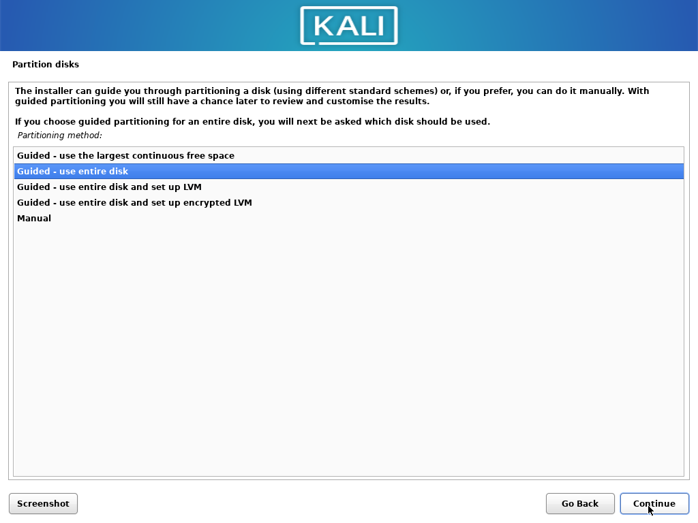
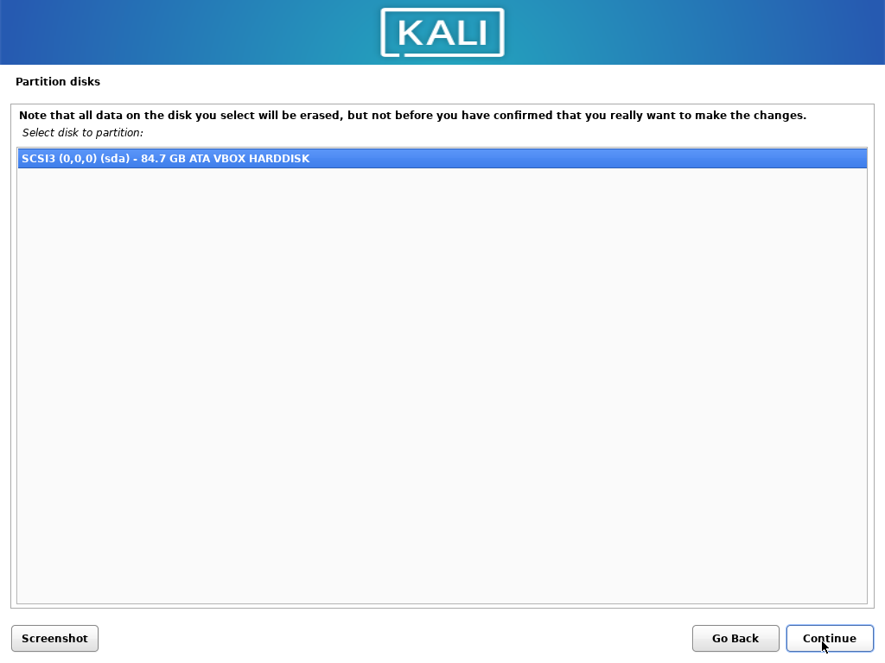
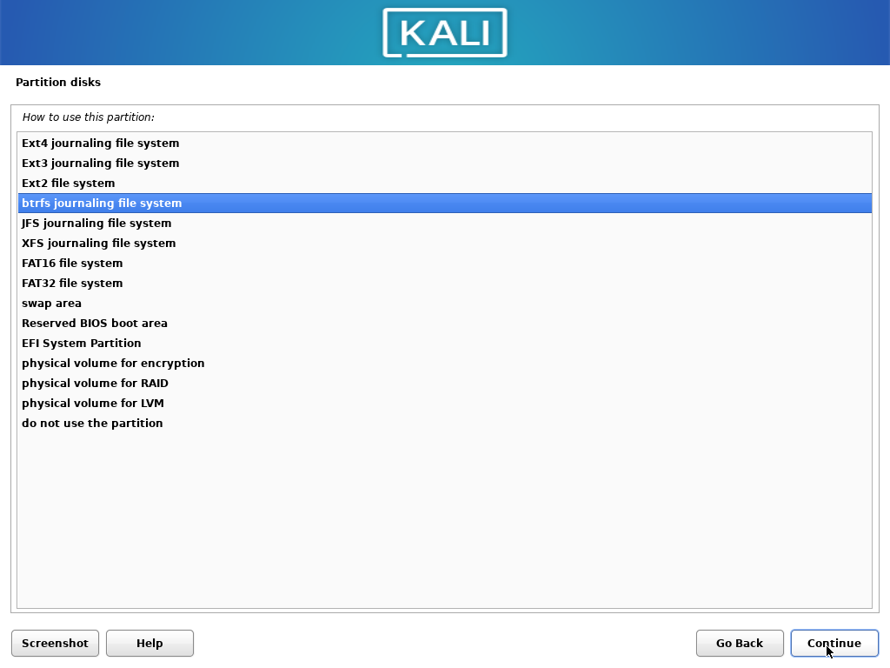
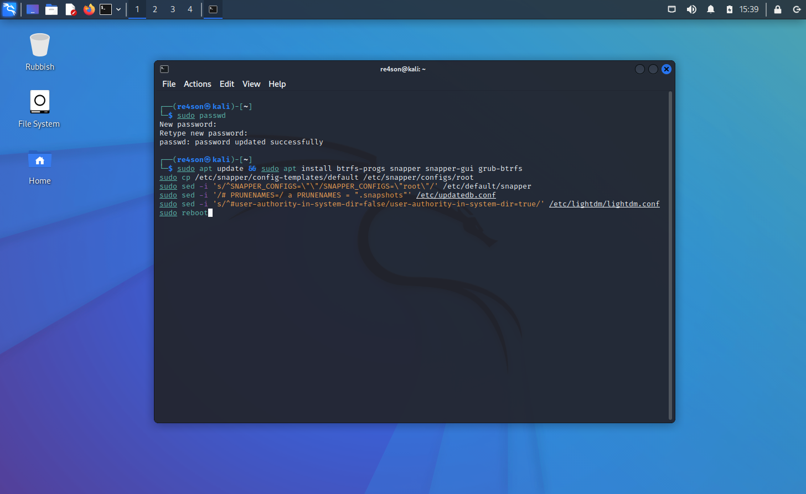
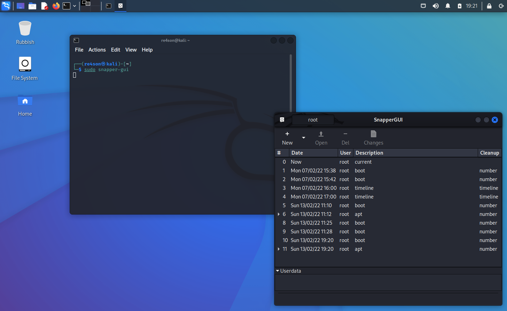
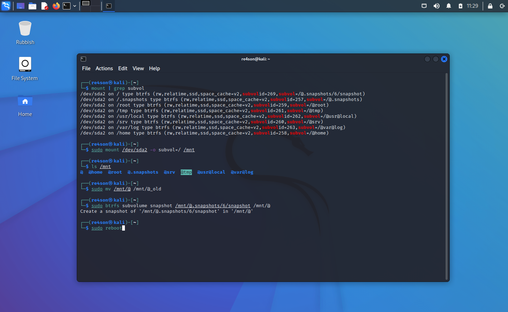
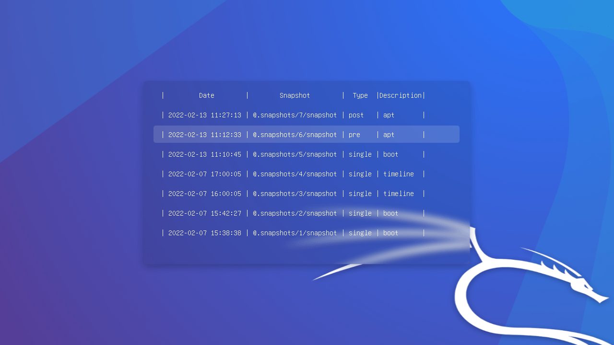
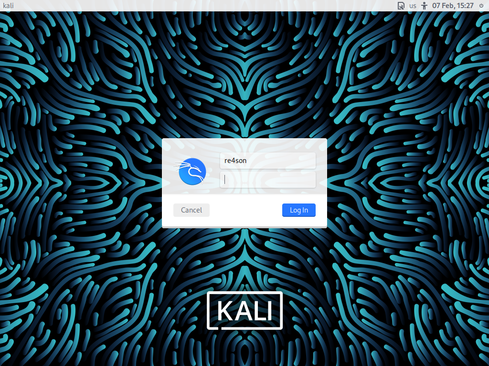
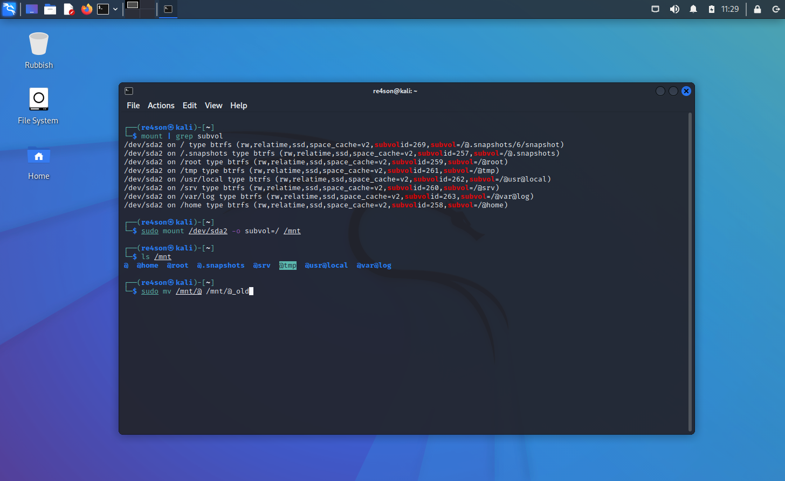

Have you ever wished you could travel back in time after deleting that all important customer report or installing a broken driver just before heading into the board meeting?

Well, you better read on, because now you can!

All it takes is to install Kali Linux version 2022.1 or newer with btrfs as file system and to enable snapshotting  after installation.

You can even boot into any of your saved snapshots via the boot menu and easily rollback to a previous system state:


#### Content

- [Content](#content)
- [Overview](#overview)
  - [Installation Overview](#installation-overview)
  - [Partitioning Scheme](#partitioning-scheme)
- [Kali Linux BTRFS Installation Steps](#kali-linux-btrfs-installation-steps)
  - [Kali Linux Installation Procedure](#kali-linux-installation-procedure)
- [Usage](#usage)
  - [Modify configurations](#modify-configurations)
  - [Create additional configurations](#create-additional-configurations)
  - [Create a snapshot](#create-a-snapshot)
  - [List snapshots](#list-snapshots)
  - [Delete snapshots](#delete-snapshots)
  - [Rollback](#rollback)
  - [Diff](#diff)
  - [Browse snapshots](#browse-snapshots)
- [Full recovery from an unbootable system](#full-recovery-from-an-unbootable-system)
  - [Boot into a last known good snapshot](#boot-into-a-last-known-good-snapshot)
  - [Rollback](#rollback-1)
- [References](#references)

#### Overview

[btrfs](https://btrfs.wiki.kernel.org/index.php/Main_Page) is a modern Copy on Write (CoW) filesystem for Linux aimed at implementing advanced features such as pooling, snapshots, checksums, and integrated multi-device spanning. In particular, the [snapshot](https://btrfs.wiki.kernel.org/index.php/UseCases#Snapshots_and_subvolumes) support is what makes btrfs attractive for Kali installations on bare metal. Virtualization solutions such as VMware and VirtualBox provide their own snapshotting functionality and using btrfs in those environments is not really required.

The snapshotting strategy of this walk-through centres around a tool called "snapper" from our friends over at SUSE. Snapper transparently hooks into the apt workflow and automatically creates snapshots before and after any apt operation. This neat little feature allows to easily rollback a system after a botched upgrade.

To top things off, we added [grub-btrfs](https://github.com/Antynea/grub-btrfs) by [Antynea](https://github.com/Antynea) to automatically add a list of snapshots to the grub boot menu.

[Snapper-gui](https://github.com/ricardomv/snapper-gui) by [Ricardo Vieira](https://github.com/ricardomv) is another great tool we use to make our lifes easier.

##### Installation Overview

Installing Kali Linux with snapshotting functionality is very similar to a standard installation except that we install it with btrfs as file system.

After the installation, we will install some tools and create a default configuration for snapper.

##### Partitioning Scheme

When selecting "btrfs" as file system, the installer will automatically create the following subvolume layout:

```plaintext
Mount Point         | Subvolume         | Description
-------------------------------------------------------------------------
/                   | @                 | The root filesystem incl. /boot
/.snapshots         | @.snapshots       | Snapper's snapshot directory
/home               | @home             | User home directories
/root               | @root             | The root user's home directory
/var/log            | @var@log          | Log files
/srv                | @srv              | Site-specific data served by this system
/tmp                | @tmp              | Temporary files
/usr/local          | @usr@local        | Tertiary hierarchy for local data
```

#### Kali Linux BTRFS Installation Steps

##### Kali Linux Installation Procedure

1. To start your installation, boot with your chosen installation medium. You should be greeted with the Kali Boot screen. Choose _Graphical Install_.
2. The installation steps are identical to a default Kali installation except changing "ext4" to "btrfs" as file system:

At the "Partition Disk" screen, choose "Guided - use entire disk":



Click "Continue":



Double-click on the `/` partition:


Choose "btrfs":



Select "Done setting up the partition" and continue:


Select "Finish partitioning and write changes to disk" and continue with the installation.


---

3. Login after installation and run the following commands in a terminal:

```console
# Set a secure root password or you'll struggle to log into a recovery shell
$ sudo passwd

# Install some essential tools
$ sudo apt update && sudo apt install btrfs-progs snapper snapper-gui grub-btrfs

# Create the snapper configuration for the root filesystem "/"
$ sudo cp /usr/share/snapper/config-templates/default /etc/snapper/configs/root
$ sudo sed -i 's/^SNAPPER_CONFIGS=\"\"/SNAPPER_CONFIGS=\"root\"/' /etc/default/snapper

# Prevent "updatedb" from indexing the snapshots, which would slow down the system
$ sudo sed -i '/# PRUNENAMES=/ a PRUNENAMES = ".snapshots"' /etc/updatedb.conf
```

4. We need to tweak the desktop managers to work in read only snapshots. Pick your DE from the following:

GNOME:

```console
# Reconfigure gdm to allow booting into read-only snapshots
# GDM needs to have write access to "/var/lib/gdm3" and "/var/lib/AccountService" during login.
# We have to create additional subvolumes for them:

$ mount # Pick your main partition, </dev/sda1> in our example, replace </dev/sda1> it with yours
$ sudo mount </dev/sda1> /mnt
$ sudo btrfs subvolume create /mnt/@var@lib@gdm3
$ sudo btrfs subvolume create /mnt/@var@lib@AccountsService

$ sudo mv /var/lib/gdm3/* /var/lib/gdm3/.* /mnt/@var@lib@gdm3
$ sudo mv /var/lib/AccountsService/* /var/lib/AccountsService/.* /mnt/@var@lib@AccountsService/

$ sudo vi /etc/fstab # Add the following (substitute the <UUID> with yours)

# /var/lib/gdm3 was on /dev/sda1 during installation
UUID=<dc1ca012-9349-4fcf-b761-ca323379b019> /var/lib/gdm3   btrfs   defaults,subvol=@var@lib@gdm3 0       0

# /var/lib/AccountsService was on /dev/sda1 during installation
UUID=<dc1ca012-9349-4fcf-b761-ca323379b019> /var/lib/AccountsService   btrfs   defaults,subvol=@var@lib@AccountsService 0       0

# Reboot for the changes to take effect
$ sudo reboot
```

KDE:

```console
# KDE works out of the box, just reboot and enjoy
$ sudo reboot
```

XFCE:

```console
# Reconfigure lightdm to allow booting into read-only snapshots
$ sudo sed -i 's/^#user-authority-in-system-dir=false/user-authority-in-system-dir=true/' /etc/lightdm/lightdm.conf
$
$ sudo reboot
```

   

---

5. The first reboot will create the first automatic snapshot. Reboot again to find the new boot menu entry for this snapshot:


Congratulations, you have just installed a Kali system with automatic snapshotting functionality! Next, we will cover some basic usage examples.

---

#### Usage

##### Modify configurations

Out of the box Kali creates snapshots of the root directory to allow system rollbacks.
Snapshots are automatically created during apt operations, at specified time intervals, and on every boot. The configuration can be changed via the "snapper-gui" tool. Just click on the little icon in the top left hand corner and select "Properties":


---

##### Create additional configurations

To create snapshots of your home directory, you can create a new configuration using snapper-gui.

Click on "New" -> "Create Configuration"


---

##### Create a snapshot

To manually create a snapshot using snapper-gui, select the appropriate configuration tab (home in this case) and click "New" -> "Create Snapshot"


---

##### List snapshots

Snapshots are listed in the snapper-gui:



Alternatively, snapshots on all configurations can be viewed using the `snapper` command line tool:

```console
$ sudo snapper list -a
```

---

##### Delete snapshots

The easiest way to delete a snapshot is by using the snapper command line tool:

`sudo snapper delete <number-or-number-range>`


Voilà, easy.

Now is probably the right time to flick through the snapper command line options via:

`snapper --help`

---

##### Rollback
To roll back to a previous snapshot we have to remember two things:
- The root `/` of the file system has been installed in a subvolume `/@"` and not the root of the btrfs partition `/`
- A snapshot is treated like just another subvolume except that they are **read-only**
- You can easily boot into your read-only snapshots to find the one you want to roll-back to.

Thus all we have to do is mount the btrfs partition and replace the current root subvolume `@` with the last snapshot. To be safe we'll backup the current root (`@`) subvolume.

E.g.:

```console
# get the device that contains your "/" subvolume and remember it for the next step:
mount | grep 'subvol=/@)'

# mount your root partition (replace "/dev/sda2" with yours from above):
sudo mount /dev/sda2 -o subvol=/ /mnt

# Move the old root away:
sudo mv /mnt/@ /mnt/@_badroot

# Roll back to a previous snapshot by creating a read-write copy of it as "@"":
sudo btrfs subvolume snapshot /mnt/@.snapshots/XXXXX/snapshot /mnt/@

# That's it, reboot:
sudo reboot -f
```



---

##### Diff

Snapper is chock-a-block with powerful features like diffs between snapshots:


---

##### Browse snapshots
You can even browse the content of snapshots:


---

#### Full recovery from an unbootable system

##### Boot into a last known good snapshot

Let's assume that the last upgrade broke our machine. Every run of "apt install" creates to snapshots, one "pre" snapshot is created before the installation and one "post" snapshot is created after the installation.

To undo the last "apt upgrade", we would boot into the last "pre" snapshot and check if everything is working again:



Now you can login to the snapshot.



Please note that the snapshot is read only and you might receive an error message from an applet or two after logging in. Just ignore that.

Have a look around ensure that this is what you would like to roll-back to.

##### Rollback

Remember that "/" itself is the subvolume "@". To rollback to a snapshot, all we have to do is replace "@" with the snapshot we want.

1. First we have to mount the physical partition that holds all our subvolumes. Let's find it first

`mount | grep 'subvol='`


and then mount it (/dev/sda2 in this example:

`sudo mount /dev/sda2 -o subvol=/ /mnt`

If we list the content of that partition we can see all the subvolumes, including the one containing our snapshots:


---

2. Before we replace the current root with our snapshot, let's move "@" away just to be safe:

`sudo mv /mnt/@ /mnt/@_old`



---

1. Now we can create a read-write snapshot of the current read-only snapshot (in this example we booted into the read-only snapshot "6" according to the query above):

`sudo btrfs subvolume snapshot /mnt/@.snapshots/6/snapshot /mnt/@`


And that's all there is to it, now we can reboot as if nothing ever happened to our beautiful machine:


---

#### References
- [Btrfs Wiki](https://btrfs.wiki.kernel.org/index.php/Main_Page)
- [Btrfs Debian site](https://wiki.debian.org/Btrfs)
- [Snapper](http://snapper.io/)
- [Snapper-GUI](https://github.com/ricardomv/snapper-gui)
- [grub-btrfs](https://github.com/Antynea/grub-btrfs)
