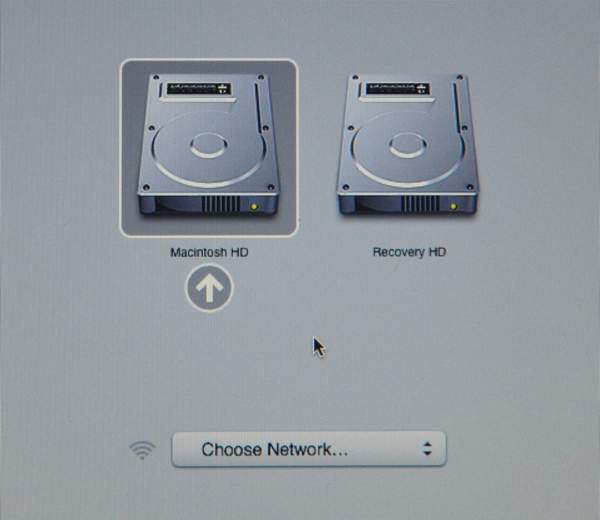
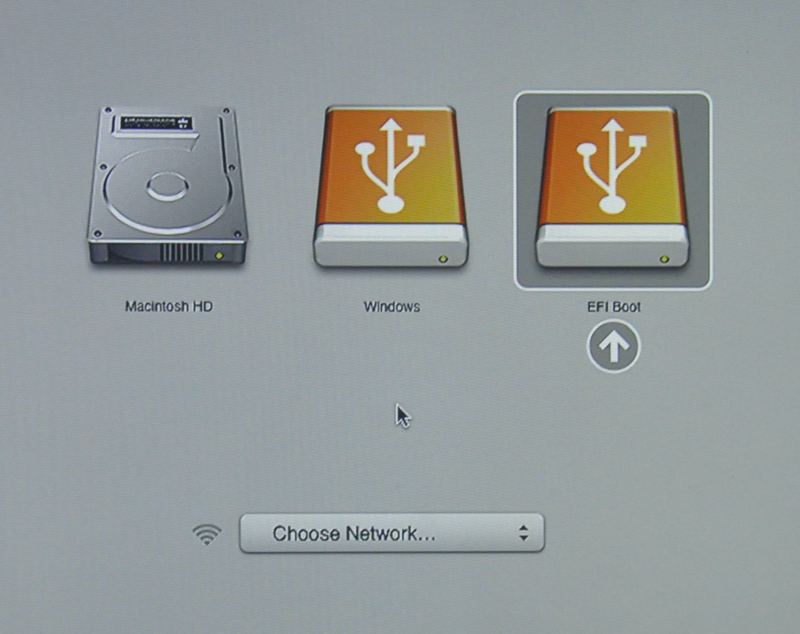
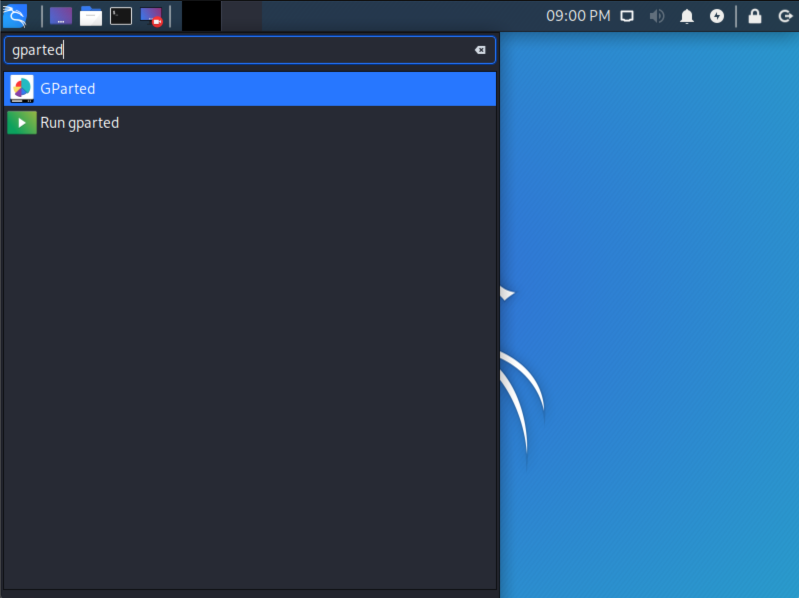
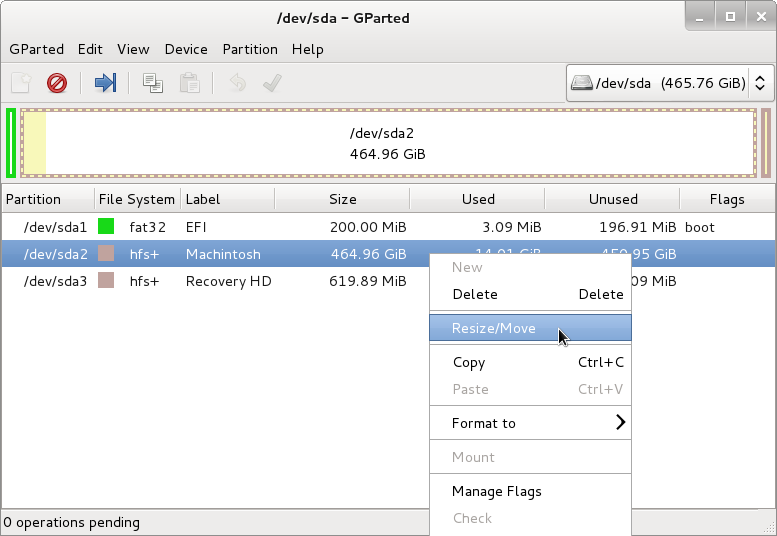
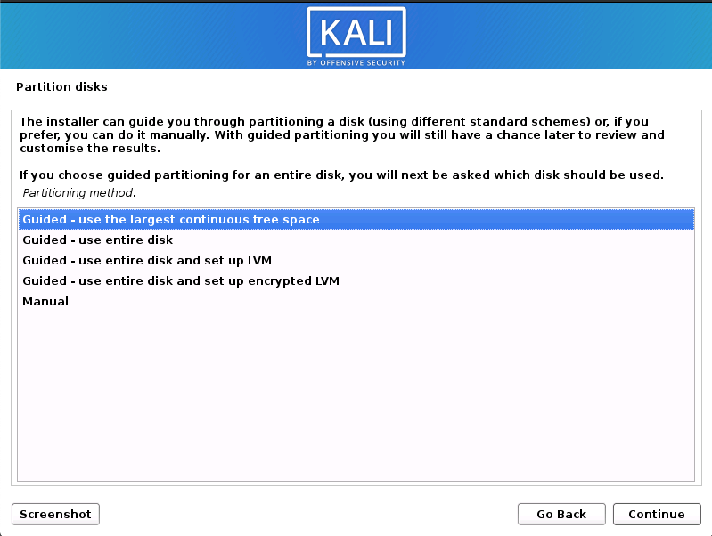
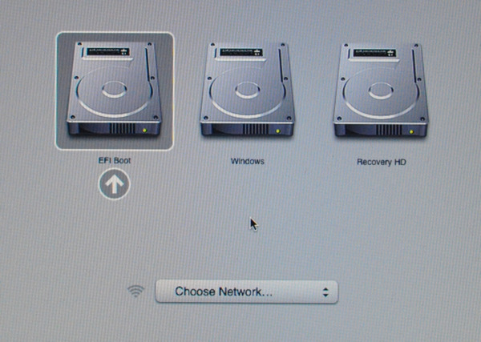
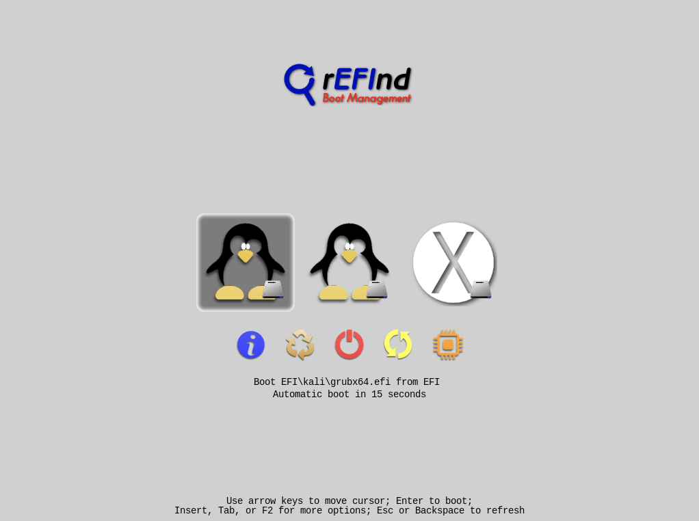
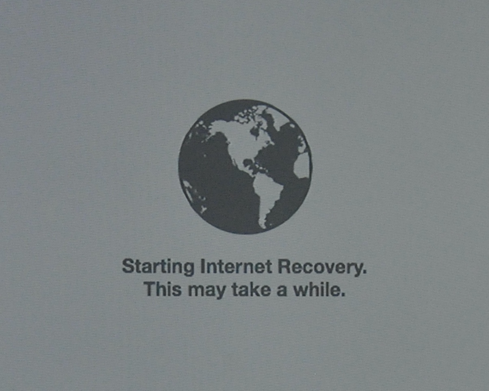
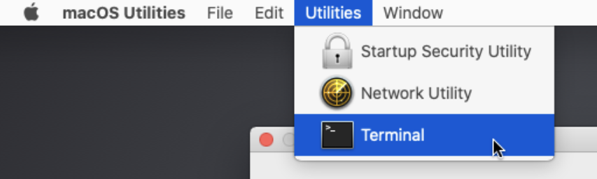
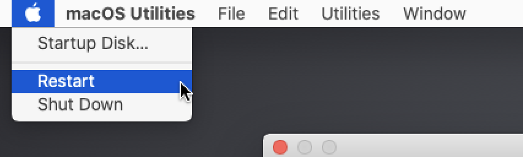

{}
IMPORTANT! Newer Mac hardware (e.g. T2/Apple Silicon) do not run Linux well, or at all. This is true for [Linux in general](https://github.com/Dunedan/mbp-2016-linux/), not just Kali Linux.<br />
The model & year of the device will determine how successful your experience will be.<br />
{}

This guide will show you to dual-boot macOS/OS X with Kali Linux using [rEFInd](http://www.rodsbooks.com/refind/) boot manager. If you wish to replace macOS/OS X completely, please refer to our [single boot Kali on Mac hardware](/docs/installation/hard-disk-install-on-mac/) guide.

By using using the 3rd party boot manager **rEFInd** _(a fork of [rEFIt](http://refit.sourceforge.net/))_ we are able to increase our control when booting over macOS/OS X OS's default option. This makes it perfect for dual booting, as a keyboard shortcut does not need to be used every time the device is powered on to boot Kali Linux. rEFInd also has the advantage of helping older hardware to boot from USB devices that would not be able to otherwise (e.g. non-EFI). Once Kali Linux has been installed, rEFInd can be customized to be hidden during boot or removed completely.

In our example, we will be installing Kali Linux on a Mac Mini (Mid 2011) using macOS High Sierra (10.13). The same procedure has also been tested on a Mac Book Air (Early 2014) using macOS Catalina (10.15).

### Installation Prerequisites

This guide will make the following assumptions:

- You have read our [single boot Kali Linux install guide](/docs/installation/hard-disk-install/), as this has the same Installation Prerequisites (System requirements & setup assumptions).
- When [downloading Kali Linux](/docs/introduction/download-official-kali-linux-images/), [pick the **live** image](/docs/introduction/what-image-to-download/#which-image-to-choose), rather than the installer option.
- A single disk to install to _(rather than a dedicated disk per operating system)_.
- Currently running macOS/OS X 10.7 or higher _(later versions are more preferred)_ as this means the hardware is Intel (and not a PowerPC CPU).
- Depending on the Mac hardware model & year, you may find:
  - **Different results** when trying to boot by using either a CD/DVD **or** a USB drive.
    - You may be able to increase the chances of booting _(especially older hardware and non-EFI)_ from a **USB drive** by having **rEFInd** pre-installed.
  - When using the graphical installer, you may notice the tracepad does not function (but will after Kali Linux is installed).
  - In-built wireless may not work, as `firmware-b43-installer` is [not included in the default images](https://gitlab.com/kalilinux/packages/kali-meta/-/commit/bdd4daa7be16e5114e21ade252638211e7d54813).

- - -

We need to use a different image from the [single boot Kali Linux install guide](/docs/installation/hard-disk-install/), as we need the **live** image. This is because we need to edit the disk structure without mounting any partitions (otherwise they would be in-use). After we have finished altering the disk layout, we can still install Kali Linux using the live image, but there will be a few differences such as:

- Changing or removing the [desktop environment](/docs/general-use/switching-desktop-environments/).
- Installing or removing any [metapackages](/docs/general-use/metapackages/).

Both of these can be addressed post installation, as it saves swapping to the installer image (as you will need either multiple CD/DVD/USBs or to re-image half way though).

{}
This installation has the potential to go wrong very easily as it involves editing existing partitions. Be aware of what partitions you are modifying and where you are installing Kali Linux to.<br />
Having a backup of your macOS/OS X files available is a good idea in the event something goes wrong.
{}

### Resize macOS/OS X Procedure

Before we can install Kali Linux, there needs to be room on the hard disk. Depending on the format of the macOS/OS X partition, will depend on what method you need todo.

- If macOS/OS X Sierra (10.12) and earlier, it will be Mac OS Extended (HFS+).
  - You can resize using GParted in from a Kali Linux live session
- Since macOS/OS X High Sierra (10.13) and later, the default will be Apple File System (APFS).
  - You can resize in a normal macOS/OS X session, or in recovery mode (recommended).

#### HFS+/GParted

1. To start resizing, make sure you **insert your Kali Linux installation medium** and **power on the device**. Immediately press and hold the [**Option (or Alt) ⌥** key until you see the boot menu](https://support.apple.com/en-us/HT201255) (rEFInd if installed, else the default macOS/OS X).
You may or may not have a **Recovery HD** depending on your macOS/OS X setup.



- - -

2. When the boot menu appears, if everything works as expected, you should see **two** volumes:

- **EFI Boot** - **Newer hardware** which support **UEFI**. It is common for **GUID Partition Table (GPT)** partitions to be used.
- **Windows** - "Non-EFI" boot. This use on **older hardware** which uses **BIOS**. You often see **Master Boot Record (MBR)** partition tables here.

{}
If you only see **one volume** (EFI Boot), then the installation media **is not supported** for this device. This could be because the age of the firmware on the device.<br />
You may wish to install **rEFInd**, as it is a boot manager, and try again.
{}

Even though Kali Linux is [based on Debian](/docs/policy/kali-linux-relationship-with-debian/), macOS/OS X always detects non-EFI boot media as Windows. We suggest that you select the **EFI Boot** volume to continue. However, if the installation hangs at this point, power cycle and select Windows (Being Kali Linux non-EFI/BIOS). The success depends on the Mac hardware's model & year.



- - -

3. You should be greeted with the Kali Linux **boot screen**. Select **Live**, and you should be booted into the Kali Linux default desktop.


- - -

4. Now launch **[GParted](https://packages.debian.org/testing/gparted)**, which we'll use to shrink the existing macOS/OS X partition to give us enough room to install Kali Linux in the free space.



- - -

5. Once GParted has opened, **select your macOS/OS X partition** & **resize it** leaving enough space (we recommend at least 20 GB) for the Kali Linux installation.

Depending on your setup, it is often the second option (the largest partition). In our example, there are three partitions:

- The EFI upgrade partition (`/dev/sda1`)
- macOS/OS X's main operating system (`/dev/sda2`)
- System Recovery (`/dev/sda3`)

{}
If you are moving past into any non-white in the partition then you are editing a section that is in use.<br />
Only remove from the area of the partition that is not in use.<br />
It is alright to leave the third partition (`/dev/sda3`), and only shrink the actual install (`/dev/sda2`).
{}

{}
If you wish to organize the partition to group all the macOS/OS X partitions together, placing the free space at the end, you may do so.
{}



- - -

6. Once you have resized your macOS/OS X partition, ensure you "**Apply All Operations**" on the hard disk. Exit gparted and **reboot**.

#### APFS/Recovery

This can be doing using either the command line, or graphical (using Disk Utility). Both option support resizing in a "normal" session, or booting into recovery mode. Using recovery mode, means the drive is not in use, so would reduce of the chances of issues. We would also recommend using the command line method, as it allows for a empty partition to be created which simplifies the setup process later on.

1. To get to command line access: **Spotlight->Terminal**

2. By using `diskutil list`, we can see our disk we want to resize is `disk0s2`, and it is \~500GB:

```console
$ diskutil list
/dev/disk0 (internal, physical):
   #:                       TYPE NAME                    SIZE       IDENTIFIER
   0:      GUID_partition_scheme                        *500.1 GB   disk0
   1:                        EFI EFI                     209.7 MB   disk0s1
   2:                 Apple_APFS Container disk1         499.9 GB   disk0s2

/dev/disk1 (synthesized):
   #:                       TYPE NAME                    SIZE       IDENTIFIER
   0:      APFS Container Scheme -                      +499.9 GB   disk1
                                 Physical Store disk0s2
   1:                APFS Volume Macintosh HD            16.6 GB    disk1s1
   2:                APFS Volume Preboot                 21.4 MB    disk1s2
   3:                APFS Volume Recovery                516.2 MB   disk1s3
   4:                APFS Volume VM                      20.5 KB    disk1s4

$
```

- - -

3. We want to reduce the 500GB to be 400GB. This would give Kali Linux 100GB (we recommend at least 20 GB):

```console
$ sudo diskutil apfs resizeContainer disk0s2 400g
Password:
Started APFS operation
Aligning shrink delta to 99,898,105,856 bytes and targeting a new physical store size of 400,000,000,000 bytes
Determined the minimum size for the targeted physical store of this APFS Container to be 17,949,245,440 bytes
Resizing APFS Container designated by APFS Container Reference disk1
The specific APFS Physical Store being resized is disk0s2
Verifying storage system
Using live mode
Performing fsck_apfs -n -x -l /dev/disk0s2
Checking volume
Checking the container superblock
Checking the EFI jumpstart record
Checking the space manager
Checking the object map
Checking the APFS volume superblock
Checking the object map
Checking the fsroot tree
Checking the snapshot metadata tree
Checking the extent ref tree
Checking the snapshots
Checking the APFS volume superblock
Checking the object map
Checking the fsroot tree
Checking the snapshot metadata tree
Checking the extent ref tree
Checking the snapshots
Checking the APFS volume superblock
Checking the object map
Checking the fsroot tree
Checking the snapshot metadata tree
Checking the extent ref tree
Checking the snapshots
Checking the APFS volume superblock
Checking the object map
Checking the fsroot tree
Checking the snapshot metadata tree
Checking the extent ref tree
Checking the snapshots
Verifying allocated space
The volume /dev/disk0s2 appears to be OK
Storage system check exit code is 0
Shrinking APFS Physical Store disk0s2 from 499,898,105,856 to 400,000,000,000 bytes
Shrinking APFS data structures
Shrinking partition
Modifying partition map
Finished APFS operation
$
```

- - -

4. Quickly checking `diskutil list` again, we can see it has been successful:

```console
$ diskutil list
/dev/disk0 (internal, physical):
   #:                       TYPE NAME                    SIZE       IDENTIFIER
   0:      GUID_partition_scheme                        *500.1 GB   disk0
   1:                        EFI EFI                     209.7 MB   disk0s1
   2:                 Apple_APFS Container disk1         400.0 GB   disk0s2

/dev/disk1 (synthesized):
   #:                       TYPE NAME                    SIZE       IDENTIFIER
   0:      APFS Container Scheme -                      +400.0 GB   disk1
                                 Physical Store disk0s2
   1:                APFS Volume Macintosh HD            16.6 GB    disk1s1
   2:                APFS Volume Preboot                 21.4 MB    disk1s2
   3:                APFS Volume Recovery                516.2 MB   disk1s3
   4:                APFS Volume VM                      20.5 KB    disk1s4
$
```

### Kali Linux Installation Procedure

1. The installation procedure from this point onwards is similar to a [Kali Linux Hard Disk install](/docs/installation/hard-disk-install/), until the point of the partitioning.
At this point, you need to select "**Guided - use the largest continuous free space**" _(rather than "Guided - the entire disk")_ which got created earlier with **gparted**.

_Do not forget you may need to press and hold the [**Option (or Alt) ⌥** key during the startup to see the boot menu](https://support.apple.com/en-us/HT201255) (unless you have rEFInd installed)._



- - -

2. You can carry on following the [single boot Kali Linux install guide](/docs/installation/hard-disk-install/), expect you will not have the option to select [desktop environment](/docs/general-use/switching-desktop-environments/) or [metapackages](/docs/general-use/metapackages/) as you are using the live image. Once the installation is done, **reboot**.

By default, macOS/OS X will boot into itself, rather than any other operating system/install media. As we have done it already a few times, you need to hold the [Option (or Alt) ⌥ key](https://support.apple.com/en-us/HT201255). Whilst this "works", but its not ideal as it is easy to not boot anything other than macOS/OS X. Enter rEFInd, a replacement boot manager (which can also have themes applied).



### Installing rEFInd

rEFInd is a boot manager, replacing the limiting default one with macOS/OS X, allowing for greater options. It can be installed either before or after Kali Linux's installation, as well as from macOS/OS X or Kali Linux.

Since the release of **macOS/OS X El Capitan** (10.11), an [additional security feature](https://www.rodsbooks.com/refind/sip.html) got introduced, **[System Integrity Protection](https://support.apple.com/en-gb/HT204899) (SIP)**. To install rEFInd using macOS/OS X, this first needs to be one-time bypassed _(recommended)_, or disabled. Alternatively rEFInd can be installed using Kali Linux _(we recommended todo so after when Kali Linux is installed rather than using live mode)_.



#### Installing rEFInd using macOS/OS X

rEFInd cannot easily be downloaded when in recovery mode, as there is limited space and tools/libraries available (e.g. curl does not support https). As a result, we will download rEFInd inside of a normal macOS/OS X session and afterwards reboot to recovery mode to install.

At the time of this writing, the latest version of [rEFInd](https://sourceforge.net/projects/refind/) is **0.12.0**.

1. We will start off by downloading rEFInd, check its a valid zip file, and then extract:

```console
$ curl -s -L https://sourceforge.net/projects/refind/files/0.12.0/refind-bin-0.12.0.zip -o ~/Downloads/refind.zip
$
$ file Downloads/refind.zip
Downloads/refind.zip: Zip archive data, at least v1.0 to extract
$
$ unzip -q -d Downloads/ Downloads/refind.zip
$
$ ls Downloads/
refind-bin-0.12.0 refind.zip
$
```

2. We are going to restarting macOS/OS X, and press the [**Command (⌘)** and **R** keys at the same time, until you see a boot logo](https://support.apple.com/en-us/HT201255). At this point, if there is a firmware password, you will need to enter it in order to continue.

This will **bypass SIP by using macOS/OS X's [Recovery System](https://support.apple.com/en-gb/HT204904)** version which is in-built to the firmware (so no Internet connection is required).



- - -

3. When recovery mode has fully loaded, from the menu: **Utilities->Terminal**.



- - -

4. Afterwards, we need to navigate to the extracted folder.

{}
The path will be different, as its based on the label of the hard disk (in our case, `Macintosh HD`) and username (`username`) and version of rEFInd (`0.12.0`)
{}

```console
# cd /Volumes/Macintosh\ HD/Users/username/Downloads/refind-bin-0.12.0/
#
# pwd
/Volumes/Macintosh HD/Users/username/Downloads/refind-bin-0.12.0
#
```

- - -

5. Execute shell script `refind-install`.

{}
Even though we are in recovery, where SIP is not running, rEFInd still believes it is. We will overwrite this.
{}

```console
# ./refind-install
ShimSource is none
Installing rEFInd on macOS....
Installing rEFInd to the partition mounted at /Volumes/ESP

**** ALERT: SIP ENABLED! ****

rEFInd cannot be installed because System Integrity Protection (SIP) seems
to be enabled! You must install rEFInd from your Recovery installation or
from another OS. To install from the Recovery system:

  1. Reboot
  2. Hold down Command+R as the chime sounds
  3. When the OS has booted, select Utilities->Terminal
  4. Change to this directory with the 'cd' command; it will probably be under
     /Volumes/Macintosh HD/Users/username/Downloads/refind-bin-0.12.0
  5. Re-run this script.

If you believe SIP is NOT enabled, you may attempt an installation anyhow,
but it may fail.

For more on this subject, see http://www.rodsbooks.com/refind/sip.html

Do you want to attempt installation (Y/N)? y
Copied rEFInd binary files

Copying sample configuration file as refind.conf; edit this file to configure
rEFInd.

#
```

- - -

6. Reboot macOS/OS X. From the menu: **Apple->Restart**.



- - -

7. Upon restart you should see the new boot manager, rEFInd.

#### Installing rEFInd using Kali Linux

**[rEFInd](https://packages.debian.org/testing/refind)** is also included with Kali Linux. We can quickly install it by doing the following:

```console
kali@kali:~$ sudo apt update
kali@kali:~$
kali@kali:~$ sudo apt install -y refind
```

- - -

During the installation, you will get a prompt saying about automatically running rEFInd. We recommend you press **yes**, otherwise you will need to run `sudo dpkg-reconfigure refind` (or `sudo refind-install`) afterwards:

```console
 ┌────────────────────────┤ Configuring refind ├────────────────────────┐
 │                                                                      │
 │ It is necessary to install rEFInd to the EFI System Partition (ESP)  │
 │ for it to control the boot process.                                  │
 │                                                                      │
 │ Not installing the new rEFInd binary on the ESP may leave the        │
 │ system in an unbootable state. Alternatives to automatically         │
 │ installing rEFInd include running /usr/sbin/refind-install by hand   │
 │ or installing the rEFInd binaries manually by copying them from      │
 │ subdirectories of /usr/share/refind-{version}.                       │
 │                                                                      │
 │ Automatically install rEFInd to the ESP?                             │
 │                                                                      │
 │                   <Yes>                      <No>                    │
 │                                                                      │
 └──────────────────────────────────────────────────────────────────────┘

[...]

ShimSource is none
Installing rEFInd on Linux....
ESP was found at /boot/efi using vfat
Installing driver for ext4 (ext4_x64.efi)
Copied rEFInd binary files

Copying sample configuration file as refind.conf; edit this file to configure
rEFInd.

Creating new NVRAM entry
rEFInd is set as the default boot manager.
Creating //boot/refind_linux.conf; edit it to adjust kernel options.
kali@kali:~$
```

Upon restart you should see the new boot manager, rEFInd.

### Configuring rEFInd

If you wish, you can alter rEFInd in various ways now, including:

- The default OS selection
- Timeout for menu selection
- Direct boot into the default OS (Note, by pressing **Option (or Alt) ⌥** key during boot, you will have a one-time boot menu).
- Adding custom icons/themes.

#### refind.conf

#### macOS/OS X El Capitan

If you wish to make any of these alterations, this can be done by editing rEFInd's configuration file. If you are using macOS/OS X El Capitan (10.11) or later, you need to mount the EFI boot volume first to access the file. This is done by doing the following:

```console
$ cd ~/Downloads/refind-bin-*/
$
$ sudo ./mountesp
The ESP has been identified as /dev/disk0s1; attempting to mount it....
The ESP is mounted at /Volumes/ESP
username@Usernames-Mac refind-bin-0.12.0 %

$
$ vim /Volumes/ESP/EFI/refind/refind.conf
$
```

#### macOS/OS X Yosemite

If you are using macOS/OS X Yosemite (10.10) or earlier, the configuration file is located here as no mounting is required:

```console
$ sudo vim /EFI/refind/refind.conf
$ s
```

#### Kali Linux

On Kali Linux, the configuration file is found in the following location:

```console
kali@kali:~$ sudo vim /boot/efi/EFI/refind/refind.conf
kali@kali:~$
```

### Post Installation

Now that you've completed installing Kali Linux, it's time to customize your system.

The [General Use section](/docs/general-use/) has more information and you can also find tips on how to get the most out of Kali Linux in our [User Forums](https://forums.kali.org/).
