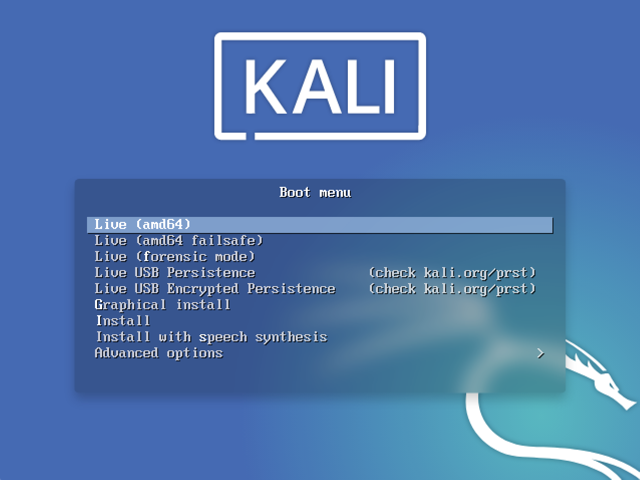

Installing Kali Linux next to a Windows installation has its benefits. However, you need to exercise caution during the setup process. First, make sure that you've backed up any important data on your Windows installation. Since you'll be modifying your hard drive, you'll want to store this backup on external media. Once you've completed the backup, we recommend you peruse our [Kali Linux Hard Disk install guide](/docs/installation/hard-disk-install/), which explains the normal procedure for a basic Kali Linux install.

In our example, we will be installing Kali Linux alongside an installation of Windows (10), which is currently taking up 100% of the disk space in our computer. We will start by resizing our current Windows partition to occupy less space and then proceed to install Kali Linux in the newly-created empty partition.

### Installation Prerequisites

This guide will make the following assumptions:

- You have read our [single boot Kali Linux install guide](/docs/installation/hard-disk-install/), as this has the same Installation Prerequisites (System requirements & setup assumptions).
- When [downloading Kali Linux](/docs/introduction/download-official-kali-linux-images/), [pick the **live** image](/docs/introduction/what-image-to-download/#which-image-to-choose), rather than the installer option.
- A single disk to install to _(rather than a dedicated disk per operating system)_.

- - -

We need to use a different image from the [single boot Kali Linux install guide](/docs/installation/hard-disk-install/), as we need the **live** image. This is because we need to edit the disk structure without mounting any partitions (otherwise they would be in-use). After we have finished altering the disk layout, we can still install Kali Linux using the live image, but there will be a few differences such as:

- Changing or removing the [desktop environment](/docs/general-use/switching-desktop-environments/).
- Installing or removing any [metapackages](/docs/general-use/metapackages/).

Both of these can be addressed post installation, as it saves swapping to the installer image (as you will need either multiple CD/DVD/USBs or to re-image half way though).

{}
This installation has the potential to go wrong very easily as it involves editing existing partitions. Be aware of what partitions you are modifying and where you are installing Kali Linux to.<br />
Having a backup of your Linux files available is a good idea in the event something goes wrong.
{}

### Resize Windows Procedure

Before we can install Kali Linux, there needs to be room on the hard disk. By **booting into a live Kali Linux session** with your chosen installation medium, we can resize the partition to our desired size, as the disk will not be in use because Kali Linux will all be in memory.

1. Before Resizing the disk, Make Sure **Fast Startup is turned off** in Windows 10 so that we don't get an error while resizing the partition. If you don't know how to do that:- `Open Control Panel` > `Hardware and Sound` > `Power Options` > On the left, click `Choose what the power buttons do` > Then at the top, click `Change Settings that are currently unavailable` (This will ask for administrator permissions) > Now Unselect the `Turn on fast startup` option and click `Save Changes` at the bottom. Now you are ready to resize the partition.

2. To start resizing, make sure you **insert your Kali Linux installation medium** and **power on the device**. If needed, press any keyboard shortcuts for a "boot order menu" (depends on each manufacture) or boot into BIOS/UEFI and change the boot order to point to the installation medium first.

3. When the boot menu/options appears, you should see at least one new option. Depending on the manufacture, hardware, how the system is configured and install medium, you may see more options _(e.g. Can you boot into non-UEFI?)_.

You may need to try a few different options in order to find success.

{}
You may need to disable secure boot
{}

3. You should be greeted with the Kali Linux **boot screen**. Select **Live**, and you should be booted into the Kali Linux default desktop.



- - -

4. Now launch **[GParted](https://packages.debian.org/testing/gparted)**, which we'll use to shrink the existing Windows partition to give us enough room to install Kali Linux in the free space.


- - -

5. Once GParted has opened, **select your Windows partition** (`/dev/sda2`) & **resize it** leaving enough space (we recommend at least 20 GB) for the Kali Linux installation.

Depending on your setup, it is often the second option (the largest partition). In our example, there are three partitions:

- Window's boot partition (`/dev/sda1`)
- Window's main operating system itself (`/dev/sda2`)
- Window's System Recovery partition (`/dev/sda3`)

{}
If you are moving past into any non-white in the partition then you are editing a section that is in use.<br />
Only remove from the area of the partition that is not in use.<br />
It is normal to leave the third partition (`/dev/sda3`), and only shrink the actual install (`/dev/sda2`).
{}

{}
If you wish to organize the partition to group all the Windows partitions together, placing the free space at the end, you may do so.
{}


- - -

6. Once you have resized your Windows partition, ensure you "**Apply All Operations**" on the hard disk. Exit gparted and **reboot**.


### Kali Linux Installation Procedure

1. The installation procedure from this point onwards is similar to a [Kali Linux Hard Disk install](/docs/installation/hard-disk-install/), until the point of the partitioning.
At this point, you need to select "**Guided - use the largest continuous free space**" _(rather than "Guided - the entire disk")_ which got created earlier with **gparted**.


- - -

2. You can carry on following the [single boot Kali Linux install guide](/docs/installation/hard-disk-install/), except you will not have the option to select [desktop environment](/docs/general-use/switching-desktop-environments/) or [metapackages](/docs/general-use/metapackages/) as you are using the live image. Once the installation is done, **reboot**.

You should be greeted with a **GRUB boot menu**, which will allow you to boot either into Kali Linux or Windows.


### Post Installation

Now that you've completed installing Kali Linux, it's time to customize your system.

The [General Use section](/docs/general-use/) has more information and you can also find tips on how to get the most out of Kali Linux in our [User Forums](https://forums.kali.org/).

#### Time/System Clock

One thing that may be worth knowing about is that occasionally the time will get changed between the Windows and the Linux system. To fix this, we can do the following:

```console
kali@kali:~$ timedatectl set-local-rtc 1 --adjust-system-clock
kali@kali:~$
```

To undo this we can simply do:

```console
kali@kali:~$ timedatectl set-local-rtc 0 --adjust-system-clock
kali@kali:~$
```
