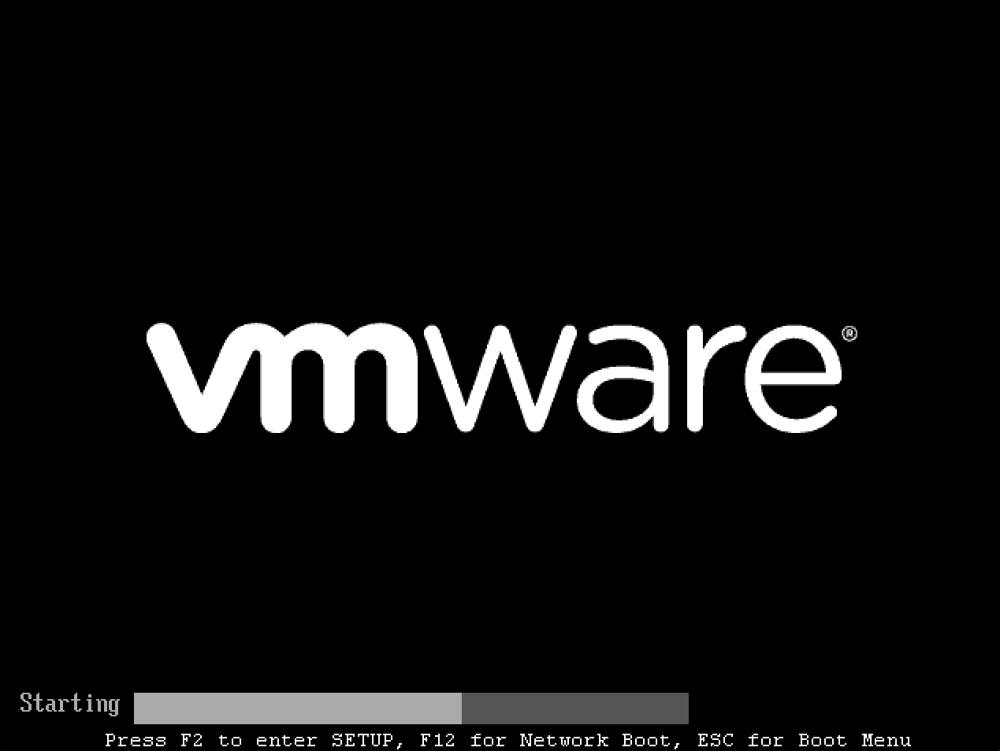
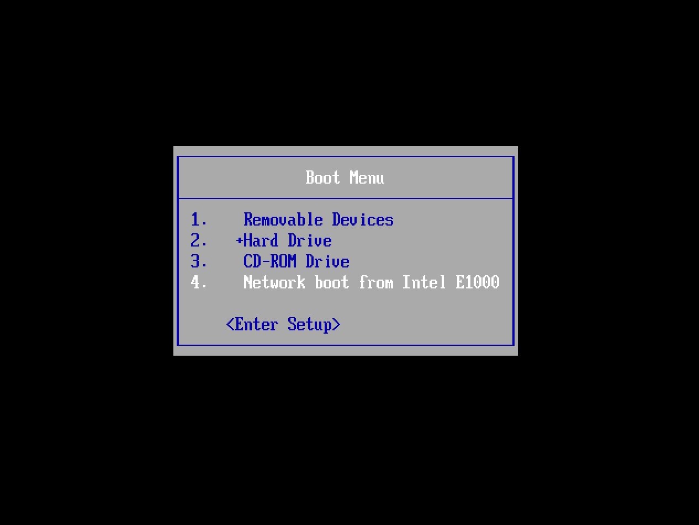
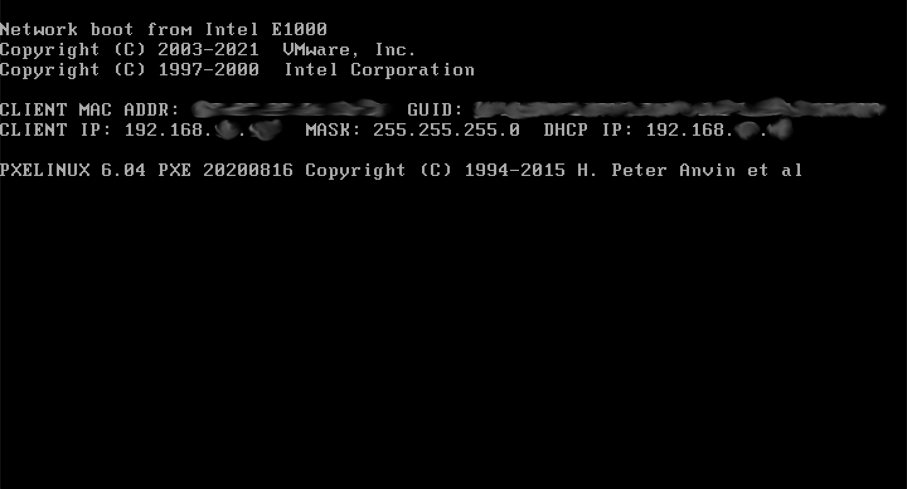
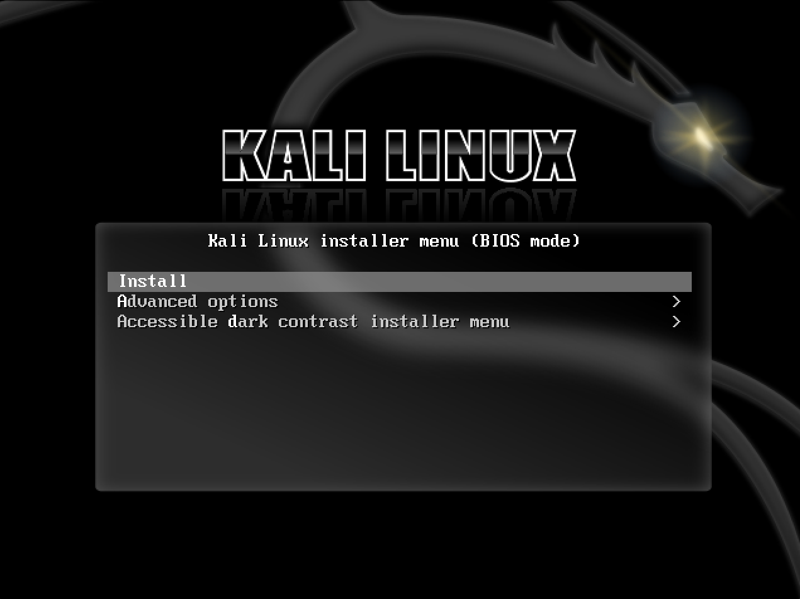
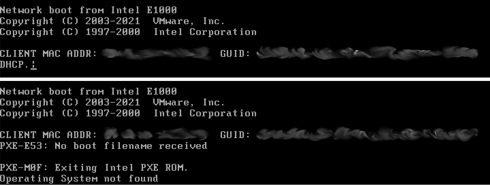

It is possible to boot and installing Kali Linux over the network, using Preboot eXecution Environment ([PXE](https://en.wikipedia.org/wiki/Preboot_Execution_Environment)). There is a range of environments where this beneficial such as a single laptop install with no [CDROM](/docs/installation/hard-disk-install/) or [USB](/docs/usb/) ports, to enterprise deployments supporting [pre-seeding](https://gitlab.com/kalilinux/recipes/kali-preseed-examples) of the Kali Linux installation.

By using a "slimed down" image, network booting (Netboot), it only has the essential packages in order for the setup to work. Everything else is pulled down during installation, making sure everything is fully up-to-date after the installation.

We will cover a few different ways of using PXE. The first way will be how to manually set up PXE with **[dnsmasq](#manually-setting-up-a-pxe-server-with-dnsmasq)**. The final way will utilize **[netbootxyz](#using-netbootxyz-to-host-our-pxe-files)**, which hosts the PXE files and uses a separate DNS server to properly direct computers.

## Manually setting up a PXE Server with `dnsmasq`

First, we need to install **[dnsmasq](https://packages.debian.org/testing/dnsmasq)** which will provide the DHCP/TFTP service:

```console
kali@kali:~$ sudo apt install -y dnsmasq
[...]
kali@kali:~$
```

- - -

In `dnsmasq.conf`, enable **DHCP**, **TFTP** and **PXE booting** and set the `dhcp-range` to match your environment (we are using **192.168.101.100-200**).
If needed you can also define your DNS servers (`8.8.8.8` & `8.8.4.4`) and gateway (`192.168.101.1`) with the `dhcp-option` directive as shown below:

```console
kali@kali:~$ cat <<EOF | sudo tee /etc/dnsmasq.conf
interface=eth0
dhcp-range=192.168.101.100,192.168.101.200,12h
dhcp-boot=pxelinux.0
enable-tftp
tftp-root=/tftpboot/
dhcp-option=3,192.168.101.1
dhcp-option=6,8.8.8.8,8.8.4.4
EOF
kali@kali:~$
```

- - -

Now in our above example, we used `/tftpboot/` for the home directory of TFTP, which we now need to create, as this will hold the Kali Linux Netboot image:

```console
kali@kali:~$ sudo mkdir -pv /tftpboot/
mkdir: created directory '/tftpboot/'
kali@kali:~$
```

- - -

With the edits in place, the dnsmasq service needs to be restarted in order for the changes to take effect:

```console
kali@kali:~$ sudo systemctl restart dnsmasq
kali@kali:~$
kali@kali:~$ sudo systemctl enable dnsmasq
kali@kali:~$
kali@kali:~$ sudo systemctl status dnsmasq
[...]
kali@kali:~$
```
<!-- systemctl enable --now dnsmasq -->

### Download Kali PXE Netboot Images

We can now download the Kali Netboot image we wish to serve. Please pick ONE of the images below, either 64-bit OR 32-bit:

```console
# 64-bit:
sudo wget https://http.kali.org/kali/dists/kali-rolling/main/installer-amd64/current/images/netboot/netboot.tar.gz -P /tftpboot/

# 32-bit:
sudo wget https://http.kali.org/kali/dists/kali-rolling/main/installer-i386/current/images/netboot/netboot.tar.gz -P /tftpboot/
```

- - -

The last step is to extract the contents and do a little bit of house keeping:

```console
kali@kali:~$ sudo tar -zxpvf /tftpboot/netboot.tar.gz -C /tftpboot
[...]
kali@kali:~$
kali@kali:~$ sudo rm -v /tftpboot/netboot.tar.gz
removed '/tftpboot/netboot.tar.gz'
kali@kali:~$
```

### Configure Target to Boot From Network

With everything configured, you can now boot your target system and configure it to boot from the network. It should get an IP address from your PXE server and begin booting Kali Linux.

Depending on the manufacture, will depending on the keyboard shortcut required to bring up the boot menu. Common keys are: `ESC`, `F2`, `F8` and `F12`:



Afterwards, select the network card:



If everything works right, you should shortly see a screen similar to the following.
Please note, it may take a few seconds in order to get an IP address:



Finally, you should see the Netboot GRUB:



### Troubleshooting

If you see either of the following screens, it could be due to the machine unable to get an IP address from the PXE service:



The first thing would be to check the status of dnsmasq:

```console
kali@kali:~$ sudo systemctl status dnsmasq
[...]
     Active: active (running) since Wed 2023-06-07 13:48:15 BST; 17s ago
[...]
Jun 07 13:48:15 kali dnsmasq-dhcp[1960]: DHCP, IP range 192.168.101.100 -- 192.168.101.200, lease time 12h
Jun 07 13:48:15 kali dnsmasq-tftp[1960]: TFTP root is /tftpboot/
Jun 07 13:48:15 kali dnsmasq[1960]: reading /etc/resolv.conf
Jun 07 13:48:15 kali dnsmasq[1960]: using nameserver 8.8.8.8#53
[...]
Jun 07 13:48:31 kali dnsmasq-dhcp[1960]: no address range available for DHCP request via eth0
lines 1-23/23 (END)
```

The line which sticks out here is:

> no address range available for DHCP request via eth0

A possible reason for this is the IP range (`192.168.101.100 ->  192.168.101.200`) is outside of the range used by the interface (`192.168.0.3`):

```
kali@kali:~$ ip a
[...]
2: eth0: <BROADCAST,MULTICAST,UP,LOWER_UP> mtu 1500 qdisc mq state UP group default qlen 1000
[...]
    inet 192.168.0.3/24 brd 192.168.1.255 scope global dynamic noprefixroute eth0
[...]
kali@kali:~$
```

We can have a go at dynamically, generating the configuration:

```console
kali@kali:~$ interface=eth0
kali@kali:~$
kali@kali:~$ network=$( ip -4 addr show dev ${interface} | grep -oP '(?<=inet\s)\d+(\.\d+){2}' )
kali@kali:~$
kali@kali:~$ cat <<EOF | sudo tee /etc/dnsmasq.conf
interface=${interface}
dhcp-range=${network}.100,${network}.200,12h
dhcp-boot=pxelinux.0
enable-tftp
tftp-root=/tftpboot/
dhcp-option=3,$( ip -4 route show dev ${interface} | grep -oP '(?<=default\svia\s)(\d+(\.\d+){3})' )
dhcp-option=6,8.8.8.8,8.8.4.4
EOF
kali@kali:~$
kali@kali:~$ sudo systemctl restart dnsmasq
kali@kali:~$
kali@kali:~$ sudo systemctl status dnsmasq
[...]
```

{}
Please note, you will need to disable your existing DHCP service, else there will be a race in which service is able to response quicker.
{}

### Post Installation

Now that you've completed installing Kali Linux, it's time to customize your system. The [General Use section](/docs/general-use/) has more information and you can also find tips on how to get the most out of Kali Linux in our [User Forums](https://forums.kali.org/).

#### Auto Updating

One last thing we need to do if we want to use this system in the future is set up a cron job to pull in the new Netboot images regularly in case of kernel updates. We will create a simple script and set its permissions:

```console
kali@kali:~$ sudo mkdir -pv /opt/pxe/
mkdir: created directory '/opt/pxe/'
kali@kali:~$
kali@kali:~$ cat <<'EOF' | sudo tee /opt/pxe/tftpboot.sh
#!/usr/bin/env sh

## Our desired path for the PXE image to be saved to
tftp=/tftpboot

## amd64 (64-bit) vs i386 (32-bit)
arch=amd64

## Complete remove and create the previous directory containing the PXE image
rm -rfv "${tftp:?}"/*

## Download the newest version
wget "https://http.kali.org/kali/dists/kali-rolling/main/installer-${arch}/current/images/netboot/netboot.tar.gz" -O "${tftp}/netboot.tar.gz"

## Exract
tar -zxpvf /tftpboot/netboot.tar.gz -C "${tftp}"

## Clean up
rm -v "${tftp}/netboot.tar.gz"
EOF
kali@kali:~$
kali@kali:~$ sudo chmod 0700 /opt/pxe/tftpboot.sh
kali@kali:~$
kali@kali:~$ sudo chown root: /opt/pxe/tftpboot.sh
```

- - -

As we are going to quickly make a new user, `tftp` and set both folders permissions:

```console
kali@kali:~$ sudo adduser --system --home /opt/pxe/ tftp
adduser: Warning: The home dir /opt/pxe/ you specified already exists.
Adding system user `tftp' (UID 117) ...
Adding new user `tftp' (UID 117) with group `nogroup' ...
adduser: The home directory `/opt/pxe/' already exists.  Not touching this directory.
adduser: Warning: The home directory `/opt/pxe/' does not belong to the user you are currently creating.
kali@kali:~$
kali@kali:~$ sudo chown -R tftp: /opt/pxe/ /tftpboot/
kali@kali:~$
```

- - -

The last item left is to setup a schedule task. We will use [cron](https://crontab.guru/#0_5_*_*_2):

```console
kali@kali:~$ sudo crontab -u tftp -e
[...]
0 5 * * 2 /opt/pxe/tftpboot.sh >/dev/null
kali@kali:~$
```

Now, every Tuesday at 05:00, our Netboot image should self-update!

### Pre-seeding PXE

#### Pre-seed file

We can use the following pre-seed file to automatically install our Kali instance. Be sure to change package selection, user information, region information, and hard drive to match what you are using. Alternatively, should you want to be prompted for any of those, just comment out the line:

```console
kali@kali:~$ cat <<'EOF' | sudo tee /opt/pxe/preseed.cfg
# Package selection
d-i pkgsel/include string kali-linux-default kali-desktop-xfce

# User information
d-i passwd/user-fullname string kali
d-i passwd/username string kali
d-i passwd/user-password password kali
d-i passwd/user-password-again password kali

# Region Information
d-i time/zone string US/Eastern
d-i debian-installer/locale string en_US
d-i debian-installer/language string en
d-i debian-installer/country string US
d-i debian-installer/locale string en_US.UTF-8
d-i keyboard-configuration/xkb-keymap select us

# Hard drive
d-i grub-installer/bootdev string /dev/sda

d-i netcfg/get_hostname string kali
d-i netcfg/get_domain string unnasigned-domain
tasksel tasksel/first multiselect standard
d-i mirror/country string enter information manually
d-i mirror/suite string kali-rolling
d-i mirror/codename string kali-rolling
d-i mirror/http/hostname string http.kali.org
d-i mirror/http/directory string /kali
d-i mirror/http/proxy string
d-i partman-auto/method string regular
d-i partman-auto-lvm/guided_size string max
d-i partman-auto/choose_recipe select atomic
d-i partman-partitioning/confirm_write_new_label boolean true
d-i partman/choose_partition select finish
d-i partman/confirm boolean true
d-i partman/confirm_nooverwrite boolean true
d-i partman-md/confirm boolean true
d-i partman-partitioning/confirm_write_new_label boolean true
d-i partman/choose_partition select finish
d-i partman/confirm boolean true
d-i partman/confirm_nooverwrite boolean true
d-i grub-installer/only_debian boolean true
d-i grub-installer/with_other_os boolean true
d-i finish-install/reboot_in_progress note
d-i apt-setup/services-select multiselect
d-i apt-setup/non-free boolean true
d-i apt-setup/contrib boolean true
d-i apt-setup/disable-cdrom-entries boolean true
d-i apt-setup/enable-source-repositories boolean false
d-i pkgsel/upgrade select full-upgrade
d-i passwd/root-login boolean false
d-i preseed/early_command string anna-install eatmydata-udeb
d-i pkgsel/update-policy select none
popularity-contest popularity-contest/participate boolean false
encfs encfs/security-information boolean true
encfs encfs/security-information seen true
console-setup console-setup/charmap47 select UTF-8
samba-common samba-common/dhcp boolean false
macchanger macchanger/automatically_run boolean false
kismet-capture-common kismet-capture-common/install-users string
kismet-capture-common kismet-capture-common/install-setuid boolean true
wireshark-common wireshark-common/install-setuid boolean true
sslh sslh/inetd_or_standalone select standalone
atftpd atftpd/use_inetd boolean false
EOF
kali@kali:~$
```

#### Pre-seed integration to initrd

To incorporate this into our initrd to automatically run we must do the following:

_Please note, we are using 64-bit/AMD64._

```console
kali@kali:~$ cd /tftpboot/debian-installer/amd64/
kali@kali:/tftpboot/debian-installer/amd64$
kali@kali:/tftpboot/debian-installer/amd64$ sudo gunzip initrd.gz
kali@kali:/tftpboot/debian-installer/amd64$
kali@kali:/tftpboot/debian-installer/amd64$ sudo cp -v /opt/pxe/preseed.cfg preseed.cfg
'/opt/pxe/preseed.cfg' -> './preseed.cfg'
kali@kali:/tftpboot/debian-installer/amd64$
kali@kali:/tftpboot/debian-installer/amd64$ echo preseed.cfg | sudo cpio -H newc -o -A -F initrd
6 blocks
kali@kali:/tftpboot/debian-installer/amd64$ sudo gzip initrd
kali@kali:/tftpboot/debian-installer/amd64$
```

Now all that is left to-do, is boot from network, and select "Install" and watch the unattended setup progress!

## Using netbootxyz to host our PXE files

To install and use netbootxyz we recommend to follow the [official documentation](https://netboot.xyz/docs/docker). This will allow us to set up a server and use our existing DHCP server to point to it, rather than creating a new DHCP server, as well as having a web interface to manage items.
