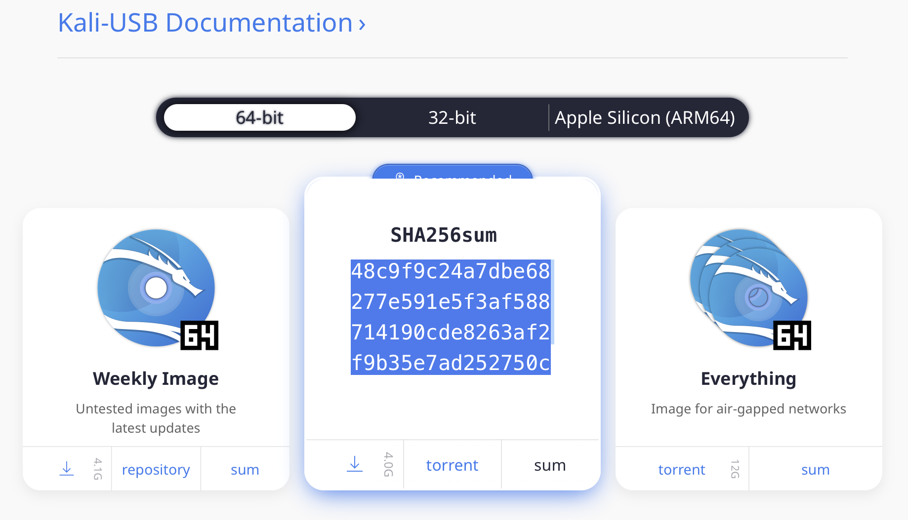

{}
IMPORTANT! Never download Kali Linux images from anywhere other than the official sources.
Always be sure to verify the SHA256 checksums of the file you've downloaded against our [official values](/docs/introduction/download-images-securely/).
It would be easy for a malicious entity to modify a Kali installation to contain exploits or malware and host it unofficially.
{}

#### Where to Get Official Kali Linux Images

##### ISO Files for Intel-based PCs

In order to run Kali "Live" from a [USB drive](/docs/usb/) on standard Windows and Apple PCs, you'll need a Kali Linux [bootable ISO image](/docs/installation/), in either 32-bit or 64-bit format.

If you're not sure of the architecture of the system you want to run Kali on, on Linux or macOS, you can run the command: 

```
uname -m
```
 
 If you get the response, "x86_64", use the 64-bit ISO image (the one containing "amd64" in the file name); if you get "i386", use the 32-bit image (the one containing "i386" in the file name). 
 
 If you're on a Windows system, the procedure for determining whether your architecture is [detailed on Microsoft's website](http://windows.microsoft.com/en-us/windows7/find-out-32-or-64-bit).

The Kali Linux images are available both as directly downloadable ".iso/.img" files or via ".torrent" files.

- [Official Kali ISOs for Intel-based PCs](/get-kali/)

Building your own Kali Linux ISO, standard or customized, is [a very simple process](/docs/development/live-build-a-custom-kali-iso/).

##### Virtual Machines Images

If you want to run Kali Linux as a "guest" under [VMware or VirtualBox](/docs/virtualization/), Kali Linux is available as a pre-built virtual machines with any guest tools already installed. These image are available in a 64-bit (amd64), and 32-bit PAE (i\*86) formats.

- [Official Kali Linux VMware and VirtualBox Images](/get-kali/#kali-virtual-machines)

##### ARM Images

The hardware architectures of [ARM-based devices](/docs/arm/) vary considerably, so it is not possible to have a single image that will work across all of them. Pre-built Kali Linux images for the [ARM architecture](/get-kali/) are available for a wide range of devices.

Scripts for building your own ARM images locally are also [available on GitLab](https://gitlab.com/kalilinux/build-scripts/kali-arm). For more details, see the articles on [setting up an ARM cross-compilation environment](/docs/development/arm-cross-compilation-environment/) and [building a custom Kali Linux ARM chroot](/docs/development/kali-linux-arm-chroot/).

#### Verifying Your Downloaded Kali Image

##### Why do I need to do this?

Before you run Kali Linux Live, or install it to your hard disk, you want to be very sure that what you've got actually _is_ Kali Linux, and not an imposter. Kali Linux is a professional penetration testing and forensics toolkit. As a professional penetration tester, having absolute confidence in the integrity of your tools is critical: if your tools are not trustworthy, your investigations will not be trustworthy, either.

Moreover, as the leading penetration testing distribution, Kali's strengths mean that a bogus version of Kali Linux could do _a tremendous amount of damage_ if it were deployed unwittingly. There are plenty of people with plenty of reason to want to stick very sketchy stuff into something that _looks_ like Kali, and you absolutely do not want to find yourself running something like that.

Avoiding this is simple:

- _Only_ download Kali Linux via the official download page at [kali.org/get-kali/](/get-kali/) - you will not be able to browse to these pages without SSL; encrypting the connection makes it much harder for an attacker to use a "man-in-the-middle" attack to modify your download. There are a few potential weaknesses to even these sources - see the sections on verifying the download with the SHA256SUMS file and its signature against the official Kali Development team private key for something much closer to absolute assurance.
- Once you've downloaded an image, and _before you run it_, _always_ validate that it really _is_ what it's supposed to be by verifying its checksum using one of the procedures detailed below.

There are several methods for verifying your download. Each provides a certain level of assurance, and involves a corresponding level of effort on your part. We list 3 of these methods below:

1. You can download an ISO image from an official Kali Linux "Downloads" mirror, calculate the ISO's SHA256 hash and compare it by inspection with the value listed on the Kali Linux site. This is quick and easy, but potentially susceptible to subversion via a [DNS poisoning](https://en.wikipedia.org/wiki/DNS_spoofing#Cache_poisoning_attacks): it assumes that the site to which, for example, the domain "kali.org" resolves is in fact the actual Kali Linux site. If it somehow were not, an attacker could present a "loaded" image and a matching SHA256 signature on the fake web page. See the section "Manually Verify the Signature on the ISO (Direct Download)", below.

2. You can download an ISO image through the torrents, and it will also pull down a file - unsigned - containing the calculated SHA256 signature. You can then use the shasum command (on Linux and macOS) or a utility (on Windows) to automatically verify that the file's computed signature matches the signature in the secondary file. This is even easier than the "manual" method, but suffers from the same weakness: if the torrent you pulled down is not really Kali Linux, it could still have a good signature. See the section "Verify the Signature on the ISO Using the Included Signature File (Torrent Download)", below.

3. To be as close to absolutely certain as possible that the Kali Linux download you've obtained is the real thing, you can download both a cleartext signature file and and version of the same file that has been signed with the official Kali Linux private key and use GNU Privacy Guard (GPG) to first, verify that the computed SHA256 signature and the signature in the cleartext file match and second, verify that the signed version of the file containing the SHA256 hash has been correctly signed with the official key.

If you use this more complicated process and successfully validate your downloaded ISO, you can proceed with pretty complete assurance that what you've got is the official image and that it has not been tampered with in any way. This method, while the most complex, has the advantage of providing independent assurance of the integrity of the image. The only way this method can fail is if the official Kali Linux private key is not only subverted by an attacker, but also not subsequently revoked by the Kali Linux development team. For this method, see the section on verification using the SHA256SUMS file.

##### _What_ do I need to do this?

If you're running on Linux, you probably already have [GPG](https://www.gnupg.org/) (GNU Privacy Guard) installed. If you're on Windows or macOS, you'll need to install the appropriate version for your platform.

- If you're on a PC running Windows, download and install GPG4Win from [here](https://gpg4win.org/download.html). 
- If you're on a Macintosh running macOS, download and install GPGTools from [here](https://gpgtools.org/). Alternatively, if you have [Homebrew](https://brew.sh) installed, just run `brew install gnupg`

Once you've installed GPG, you'll need to download and import a copy of the Kali Linux official key. Do this with the following command:

```console
$ wget -q -O - https://archive.kali.org/archive-key.asc | gpg --import
```

or the command

```console
$ gpg --keyserver hkps://keys.openpgp.org --recv-key 44C6513A8E4FB3D30875F758ED444FF07D8D0BF6
```

Your output should look like this:

```plaintext
gpg: key ED444FF07D8D0BF6: public key "Kali Linux Repository <devel@kali.org>" imported
gpg: Total number processed: 1
gpg:               imported: 1  (RSA: 1)
```

Verify that the key is properly installed with the command:

```console
$ gpg --fingerprint 44C6513A8E4FB3D30875F758ED444FF07D8D0BF6
```

The output will look like this:

```plaintext
pub   rsa4096 2012-03-05 [SC] [expires: 2025-01-24]
      44C6 513A 8E4F B3D3 0875  F758 ED44 4FF0 7D8D 0BF6
uid           [ full] Kali Linux Repository <devel@kali.org>
sub   rsa4096 2012-03-05 [E] [expires: 2025-01-24]
```

You're now set up to validate your Kali Linux download.

#### How Do I Verify My Downloaded Image?

##### Manually Verify the Signature on the ISO (Direct Download)

If you downloaded the ISO directly from the downloads page, verify it using the following procedure.

On Linux, or macOS, you can generate the SHA256 checksum from the ISO image you've downloaded with the following command (assuming that the ISO image is named "kali-linux-2024.1-live-amd64.iso", and is in your current directory):

```console
$ shasum -a 256 kali-linux-2024.1-live-amd64.iso
```

The output should look like this:

```plaintext
48c9f9c24a7dbe68277e591e5f3af588714190cde8263af2f9b35e7ad252750c  kali-linux-2024.1-live-amd64.iso
```

On Windows, you can open the command prompt and run 

```console
certutil -?
``` 

If certutil is available, you can run:

```console 
certutil -hashfile kali-linux-2024.1-live-amd64.iso sha256
```

To verify your download. Certain versions of Windows do not have the native ability to calculate SHA256 checksums. If you do not have `certutil` installed, you can use a utility such as [Microsoft File Checksum Integrity Verifier](http://www.microsoft.com/en-us/download/details.aspx?id=11533) or [Hashtab](http://implbits.com/products/hashtab/) to verify your download.

The resulting SHA256 signature: 

```plaintext 
48c9f9c24a7dbe68277e591e5f3af588714190cde8263af2f9b35e7ad252750c
``` 

Can be seen to match the signature displayed in the "sha256sum" section on the official download page for the 64-bit Intel architecture Kali Linux 2024.1 ISO image:



##### Verify the Signature on the ISO Using the Included Signature File (Torrent Download)

If you downloaded your copy of the Kali Linux ISO image via the torrents, in addition to the ISO file (e.g. kali-linux-2024.1-live-amd64.iso), there will be a second file containing the computed SHA256 signature for the ISO, with the extension ".txt.sha256sum" (e.g. kali-linux-2024.1-live-amd64.txt.sha256sum).

You can use this file to verify the authenticity of your download on Linux or macOS with the following command:

```console
$ grep kali-linux-2024.1-live-amd64.iso kali-linux-2024.1-live-amd64.txt.sha256sum | shasum -a 256 -c
```

If the image is successfully authenticated, the response will look like this:

```plaintext
kali-linux-2024.1-live-amd64.iso: OK
```

For Windows, provided you have `certutil` you can use the command above and then manually check the contents of the txt file to see if the two SHA256 sums match. If `certutil` is not available, any of the tools stated above would be able to provide you the SHA256 sum of your download. 

{}
IMPORTANT! If you are unable to verify the authenticity of the Kali Linux image you have downloaded as described in the preceding section, do NOT use it! Using it could endanger not only your own system, but any network you connect to as well as the other systems on that network. Stop, and ensure that you have downloaded the images from a legitimate Kali Linux mirror.
{}

##### Verify the ISO Using the SHA256SUMS File

{}
If using Powershell on Windows you may receive a fully uppercase result. This can cause an error when comparing the two sums. Send this result through a [converter](https://convertcase.net/) to get a proper result.
{}

This is a more complex procedure, but offers a much higher level of validation: it does not rely on the integrity of the web site you downloaded the image from, only the official Kali Linux development team key that you install independently. To verify your image this way for an Intel architecture version of Kali, you will need to download three files from the [Kali "Live CD Image" site for the current release](http://cdimage.kali.org/current/) (v2024.1, as of this writing):

- The ISO image itself (e.g. kali-linux-2024.1-live-amd64.iso)
- The file containing the calculated SHA256 hash for the ISO, SHA256SUMS
- The signed version of that file, SHA256SUMS.gpg

Before verifying the checksums of the image, you must ensure that the SHA256SUMS file is the one generated by Kali Linux. That's why the file is signed by Kali's official key with a detached signature in SHA256SUMS.gpg. If you have not already done so, Kali's official key can be downloaded and imported into your keychain with this command:

```console
$ wget -q -O - https://archive.kali.org/archive-key.asc | gpg --import
```

or this command

```console
$ gpg --keyserver hkps://keys.openpgp.org --recv-key 44C6513A8E4FB3D30875F758ED444FF07D8D0BF6
```

Your output should look like this:

```plaintext
gpg: key ED444FF07D8D0BF6: public key "Kali Linux Repository <devel@kali.org>" imported
gpg: Total number processed: 1
gpg:               imported: 1  (RSA: 1)
```

You should verify that the key is properly installed with the command:

```console
$ gpg --fingerprint 44C6513A8E4FB3D30875F758ED444FF07D8D0BF6
```

The output will look like this:

```plaintext
pub   rsa4096 2012-03-05 [SC] [expires: 2025-01-24]
      44C6 513A 8E4F B3D3 0875  F758 ED44 4FF0 7D8D 0BF6
uid           [ full] Kali Linux Repository <devel@kali.org>
sub   rsa4096 2012-03-05 [E] [expires: 2025-01-24]
```

Once you have downloaded both SHA256SUMS and SHA256SUMS.gpg, you can verify the signature as follows:

```console
$ gpg --verify SHA256SUMS.gpg SHA256SUMS
gpg: Signature made Mon Sep  2 06:42:05 2019 EDT
gpg:                using RSA key 44C6513A8E4FB3D30875F758ED444FF07D8D0BF6
gpg: Good signature from "Kali Linux Repository <devel@kali.org>" [full]
```

{}
If you do not get that "Good signature" message or if the key ID does not match, then you should stop and review whether you downloaded the images from a legitimate Kali Linux mirror. The failed verification strongly suggests that the image you have may have been tampered with.
{}

If you did get the "Good signature" response, you can now be assured that the checksum in the SHA256SUMS file was actually provided by the Kali Linux development team. All that remains to be done to complete the verification is to validate that the signature you compute from the ISO you've downloaded matches the one in the SHA256SUMS file. You can do that on Linux or macOS with the following command (assuming that the ISO is named "kali-linux-2024.1-live-amd64.iso" and is in your working directory):

```console
$ grep kali-linux-2024.1-live-amd64.iso SHA256SUMS | shasum -a 256 -c
```

If the image is successfully authenticated, the response will look like this:

```plaintext
kali-linux-2024.1-live-amd64.iso: OK
```

{}
If you do not get "OK" in response, then stop and review what's happened: the Kali image you have has apparently been tampered with. Do NOT use it.
{}

Once you've downloaded and verified your image, you can [proceed to create a bootable "Kali Linux Live" USB drive](/docs/usb/live-usb-install-with-windows/).
