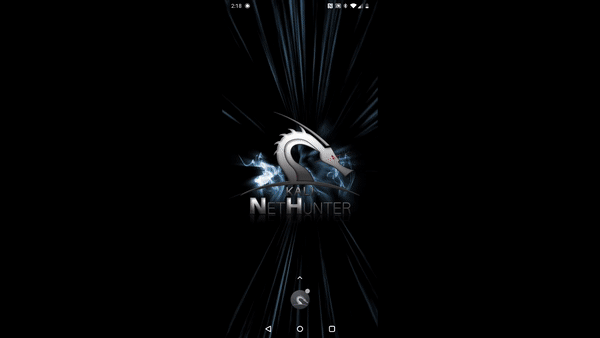

Kali NetHunter is a custom OS for Android devices. This takes Kali Linux desktop and makes it mobile.

Kali NetHunter is made up of three parts:

- ROM
- App (and AppStore)
- Kali Chroot

Kali NetHunter was [first released in September 2014](https://twitter.com/kalilinux/status/514404154933260288) with v1.0, supporting just Nexus devices (5,7 and 10). There was a minor release of Kali NetHunter v1.1 in January 2015, and at the same time device support started to appear, such as OnePlus One and Nexus 4.

Kali NetHunter v3 was the next major release in January 2016, which was a complete NetHunter app rewrite, allowing for more control and actions to be performed from it, build scripts and Android 5 and 6 support. Nexus 6 device also became supported.

Kali NetHunter then joined the **rolling release** with 2019.2 release in May 2019, where 13 devices where supported, with a mixture of Android 4 to 9. From this point, Kali NetHunter matched the release points of Kali Linux, with each of them adding more devices support, image and overall features.

- - -

In July 2019, the **Kali NetHunter store**, went public, allowing for a place of dedicated information security focused apps to be located.

With the release of Kali NetHunter 2019.4, **NetHunter KeX** was launched, giving a "full Kali desktop on Android phones".

