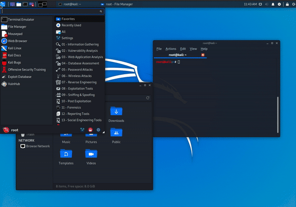

**Kali Undercover** is a set of scripts that change the theme of your Kali Linux to a **Windows 10** alike theme.

It was released with [**Kali Linux 2019.4**](/blog/kali-linux-2019-4-release/) with an important concept in mind, *to hide in plain sight*.



#### Going "undercover"

Switching to undercover mode is pretty simple, just run the following command:

```console
kali@kali:~$ kali-undercover
kali@kali:~$
```

or, you could also look for **"Kali Undercover Mode"** from the menu of your desktop and launch it from there.

**Swoosh!** Now, you are _(almost)_ invisible to most indescrete eyes by having a theme that would make most people think you are using Windows 10.

#### Reverting Back

Now, to **revert** back into your previous Kali Linux theme just re-enter the previous command:

```console
kali@kali:~$ kali-undercover
kali@kali:~$
```

**Ta-da!** Welcome back! Now, all your desktop settings should be restored.

- - -

#### Purpose of Undercover Mode in Kali Linux

The main purpose of introducing **Kali Undercover** mode is **to prevent any unnecessary attention** while using Kali Linux in _public_.

Let's imagine a scenario: you are ethically pentesting your client and you are in their office or reception doing reconnaissance or something that involves the use of **Kali Linux**.

Someone from your client's office or some random on-looker spots the desktop environment/wallpaper of Kali Linux, so they might think you are doing something mischievous even though you are doing it _ethically_ and warn the authority. All the hard work that you did from the beginning to become stealthy will go in vain. And that's because of what? A **wallpaper**! For a client who requested you to become stealthy, this is not what you would want.

Hence, to prevent any kind of unwanted attention from public it's better to go **"Undercover!"**.
