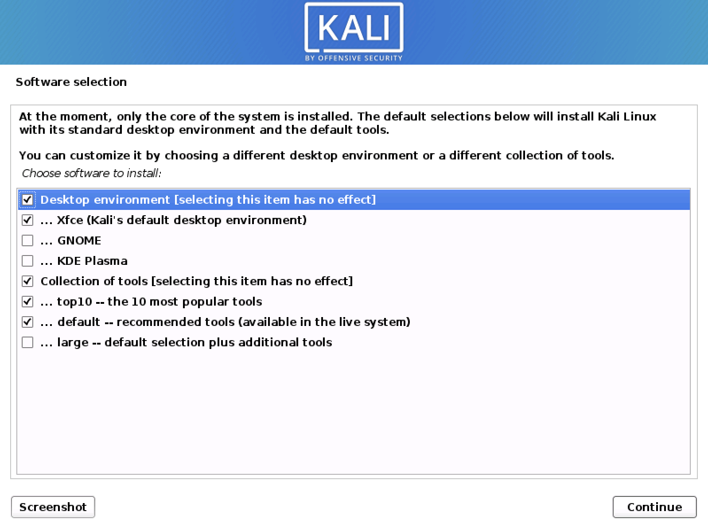

In this section, we will describe the process of installing Kali Linux on 32-bit and 64-bit hardware using the images published on the [Kali Linux download page](/get-kali/).

#### Content

- [Which image to choose](#which-image-to-choose)
- [Which desktop environment and software collection to choose during installation](#which-desktop-environment-and-software-collection-to-choose-during-installation)

- - -

#### Which Image to Choose

The [Kali Linux download page](/get-kali/) offers different image types (**Installer**, **NetInstaller** and **Live**) for download, each available for both 32-bit and 64-bit architectures. Additionally, there is an **Everything** flavor of the *Installer* and *Live* images, for 64-bit architectures only.

**If in doubt, use the "Installer" image**. You will need to check your system architecture to know whether to get 32-bit or 64-bit. If you don't know it, you're best to research how to find out _(As a rule of thumb, if your machine's newer than 2005 you should be okay with amd64/x64/64-bit)_

##### Installer

**This is the recommended image to install Kali Linux**. It contains a local copy of the [(meta)packages](/docs/general-use/metapackages/) listed (top10, default & large) so it can be used for **complete offline installations** without the need of a network connection.

This image **cannot be used to boot a live system** _(such as directly running Kali from a USB)_. It is **only** an installer image.

##### NetInstaller

This image can be used if you want the latest package **every time you install** Kali Linux or the standard installer image is too big to download. This image is very small because it does not contain a local copy of [(meta)packages](/docs/general-use/metapackages/) to install. They will all be downloaded during installation, so as a result this requires a network connection which will slow down the installation time.

Only use this image if you have reasons not to use the standard installer image above.

This image **cannot be used to boot a live system** _(such as directly running Kali from a USB)_. It is **only** an installer image.

##### Live

This image is for **running Kali Linux without installing it first** so it is perfect for running off a [USB drive](/docs/usb/) _(or a CD/DVD)_.

You are able to install Kali Linux in its default configuration from this image but **you will not be able to choose** between **desktop environments** or to specify **additional [(meta)packages](/docs/general-use/metapackages/)** to install.

##### Everything

This image is meant for offline scenarios, when you want to use Kali Linux in a place that has no network connectivity. The image is *huge* (more than 9GB), as it contains nearly all of Kali's tools already. It's only available for the 64-bit architecture, and it can be downloaded via BitTorrent only.

Kali "everything" is not exactly an image, it's a flavor. You can download either the **Installer Everything** image or the **Live Everything** image. In both case, all the tools are already there, no need for an Internet connection.

- - -

#### Which Desktop Environment and (Meta)Packages to Choose During Installation:

Each Kali Linux installer image _(not live)_ allows the user to select the preferred "Desktop Environment (DE)" and software collection ([metapackages](/docs/general-use/metapackages/)) to be installed with operating system (Kali Linux).

**We recommend sticking with the default selections and add further packages after the installation as required**. `Xfce` is the default desktop environment, and `kali-linux-top10` and `kali-linux-default` are the tools which get installed at the same time.

At this screen, you may wish to not install a desktop environment, then Kali Linux becomes "headless" (no graphic interface) which uses less system resources up and commonly found on servers, dropboxes, low powered ARM devices, and the cloud. This is meant for people who are completely comfortable with the command line. You are able to install multiple Desktop Environments, allowing you to switch, we wouldn't recommend it. You may change your mind and [switch desktop environments](/docs/general-use/switching-desktop-environments/) at a later date.

May wish to not to install any of the pre-defined software packages/bundles/collections ([metapackages](/docs/general-use/metapackages/)), giving you a finer degree of control of manually installing exactly what software you want. Alternatively you may want to be more prepared and install more than the default toolset.
Please be aware, that there are more tools available in Kali which has be manually installed after the setup (as they all cannot be stored in the setup image).

Overall, these extra choices are for a more efficient installation experience, meant for advanced users. Please be aware of their pitfalls.

- - -

The following sections in the "Kali Documentation Installation" of this documentation, will be using the "Installer" image for the guides unless stated otherwise.
