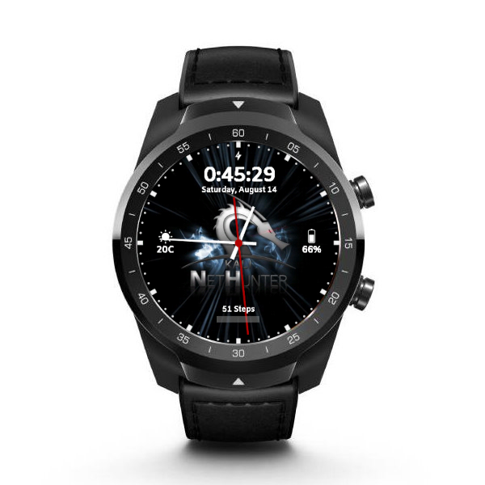

All variants are supported (TicWatch Pro, Pro 2020, Pro 4G/LTE)

# From unpacking to running NetHunter in 6 steps:

1. Unlock the bootloader
2. Flash vendor image, TWRP, and optimized WearOS
3. Resize system partition in TWRP
4. Flash and launch Magisk app to finish the rooting process
5. Flash NetHunter
6. Set NetHunter watch face 

## 1. Unlock the bootloader

- Connect your watch to your PC with it's USB cable, and fire up a terminal. 
- If you have set up your watch on the phone you can access settings, otherwise hold both buttons for a few seconds on the welcome screen.
- Enable developer settings by going to System -> About -> tap Build number 10 times
- Enable ADB, re-plug USB and accept debug from PC
- Reboot into bootloader with `adb reboot bootloader` from the terminal 
- Unlock bootloader with `fastboot flashing unlock`

## 2. Flash vendor image, TWRP, and optimized WearOS

Download and extract the installation files into a folder.
Please note Magisk 21.0 is recommended, included in the following link.

- Again enable ADB, and reboot to bootloader with `adb reboot bootloader`
- `fastboot flash vendor vendor.img`
- `fastboot flash recovery twrp-3.4.0-0-catfish.img`
- Boot into recovery by selecting it with the side buttons (switch with bottom one, select with upper button)
- Select "Wipe -> next page -> Format Data"
- Reboot to Recovery
- Select "Install -> ADB Sideload" and tick "Wipe Dalvik Cache, Wipe Cache"
- `adb sideload 2-ROM-PWDD.190617.074-AUG-09.zip`
- Reboot & do initial setup (pair with your phone through WearOS app)

## 3. Resize system partition in TWRP

- Again enable ADB
- `adb reboot recovery`
- Select Wipe -> next page -> File System Options - select System - Resize (to have ~175MB free on /system instead of 0)

## 4. Flash and launch Magisk app to finish the rooting process

- `adb sideload Magisk-v21.0.zip`
- Reboot to System
- Launch Magisk Manager
- You may want to disable auto-update, set grant access in auto response, and disable toast notifications for easier navigation in the future

## 5. Flash NetHunter

- `adb reboot recovery`
- Make sure that the system partition is mounted: Mount -> System (make sure that "mount as RO" is disabled), some users report /system is not being mounted by NetHunter installer
- Select Install -> ADB Sideload
- `adb sideload` NetHunter image
- Reboot 
- Start NetHunter app & chroot
- Reboot

## 6. Set NetHunter watch face

- Install Facer onto your phone from Play Store
- Search for NetHunter
- Install Facer companion app to watch
- Select & Sync

### Enjoy Kali NetHunter on the TicWatch Pro

## Download links

- [Build files](https://build.nethunter.com/contributors/re4son/catfish/TicWatch_Pro_NetHunter_files.zip)
- [TicWatch Pro NetHunter zip](https://www.kali.org/get-kali/#kali-mobile) - Get the latest update under TicWatch section

## Additional supported apps

- Drivedroid: use `adb install` to install the latest version
Download link: https://store.nethunter.com/repo/com.softwarebakery.drivedroid_105000.apk
- TotalCommander: useful for selecting eg. a Ducky script, use `adb install` method
Download link: https://www.totalcommander.ch/android/tcandroid323-armeabi.apk

## Supported features

- Kali services
- Custom Commands
- MAC Changer
- HID Attacks
- DuckHunter
- Bad USB
- Nmap Scan
- WPS Attacks
- Bluetooth Arsenal

## Upcoming features (not guaranteed)

- Nexmon, as the chipset is supported, we are very close - ETA 2024.2
- Router Keygen (to be optimised)
- Hijacker (if nexmon succeeds) - ETA 2024.2
- Mifare Classic Tool (need to build OS with android.hardware.nfc enabled) - ETA 2024.4

## Hardware limitations

- Power resource is not enough for any external adapters / can't seem to have xhcdi chip for OTG
