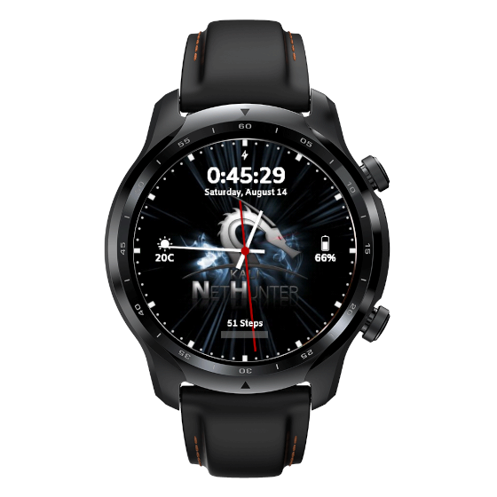

All variants are supported (TicWatch Pro 3 GPS/LTE/Ultra GPS/Ultra LTE) with a generic installer as of now.

# From unpacking to running NetHunter in 5 steps:

1. Unlock the bootloader
2. Flash TWRP, WearOS image, Magisk, dm-verity disabler
3. Finalise Magisk app to finish the rooting process
4. Install NetHunter
5. Set NetHunter watch face 

## 1. Unlock the bootloader

- Connect your watch to your PC with a DIY USB cable or a [3D printed data dock](https://social.thangs.com/m/59021), and fire up a terminal. 
- If you have set up your watch on the phone you can access settings, otherwise hold both buttons for a few seconds on the welcome screen.
- Enable developer settings by going to System -> About -> tap Build number 10 times
- Enable ADB, re-plug USB and accept debug from PC
- Reboot into bootloader with `adb reboot bootloader` from the terminal 
- Unlock bootloader with `fastboot oem unlock`

## 2. Flash TWRP, WearOS image, Magisk, dm-verity disabler

Please note that Magisk 24.3 is recommended.

- Again enable ADB, and reboot to bootloader with `adb reboot bootloader`
- Disable vbmeta verification: `fastboot --disable-verity --disable-verification flash vbmeta vbmeta.img`
- Flash recovery `fastboot flash recovery recovery.img`
- Boot into recovery by selecting it with the side buttons (switch with bottom one, select with upper button)
- Select Wipe -> Next page -> Advanced Wipe -> Format Data
- Reboot to recovery
- Select "Install -> ADB Sideload"
If you want to install OneOS:
- Flash OneOS with `adb sideload`
- Flash Mobvoi Apps package with `adb sideload`
- If you have an Ultra, `adb sideload` the Ultra addon package.
If you want to keep stock WearOS, continue from here. 
- Make a copy of your Magisk apk file to Magisk-v24.3.zip
- Flash Magisk with `adb sideload Magisk-v24.3.zip`
- Copy and flash DM-Verity_ForceEncrpyt Disabler with `adb push disabler.zip /sdcard/` and Install via TWRP
- Reboot & do initial setup (pair with your phone through WearOS app)

## 3. Finalise Magisk app to finish the rooting process

- Enable ADB again
- Finalise Magisk installation with app install `adb install Magisk-v24.3.apk`
- Launch Magisk Manager
- You may want to disable auto-update, set grant access in auto response, and disable toast notifications for easier navigation in the future

## 4. Install NetHunter

- Reboot to recovery
- Select Install -> ADB Sideload
- Flash NetHunter image with `adb sideload`
- Reboot 
- Start NetHunter app & chroot
- Reboot

## 5. Set NetHunter watch face

- Install Facer onto your phone and watch from Play Store
- Search for NetHunter
- Select & Sync
- Set density so NetHunter app menu buttons will be reachable on OneOS `adb shell wm density 300`

### Enjoy Kali NetHunter on the TicWatch Pro 3

## Downloads

- [Magisk](https://build.nethunter.com/contributors/re4son/catfish/TicWatch-Pro-3-files/Magisk-v24.3.apk)
- [TWRP image for rover](https://build.nethunter.com/contributors/re4son/catfish/TicWatch-Pro-3-files/rover_recovery.img)
- [TWRP image for rubyfish](https://build.nethunter.com/contributors/re4son/catfish/TicWatch-Pro-3-files/rubyfish_recovery.img)
- [vbmeta image](https://build.nethunter.com/contributors/re4son/catfish/TicWatch-Pro-3-files/vbmeta.img)
- [dm-verity disabler](https://build.nethunter.com/contributors/re4son/catfish/TicWatch-Pro-3-files/Disable-DM-Verity_ForceEncrypt.zip)
- [TicWatch Pro 3 NetHunter zip](https://www.kali.org/get-kali/#kali-mobile) - Get the latest update under TicWatch section
- [OneOS, Stock ROMs and Mobvoi packages (optional)](https://build.nethunter.com/contributors/re4son/catfish/TicWatch-Pro-3-files/)

## Additional recommended apps

- TotalCommander: useful for selecting eg. a Ducky script, use "adb install" method
Download link: https://www.totalcommander.ch/android/tcandroid323-armeabi.apk

## Supported features

- Kali services
- Custom Commands
- Bluetooth Arsenal
- KeX
- MAC Changer
- HID Attacks
- DuckHunter
- Nmap Scan
- WPS Attacks

## Upcoming features (not guaranteed)

- Nexmon, as the chipset is supported, needs some time - ETA 2024.2
- Router Keygen (to be optimised)
- Hijacker (if nexmon succeeds) - ETA 2024.2
- Mifare Classic Tool (need to build OS with android.hardware.nfc enabled) - ETA 2024.4

## Hardware limitations

- Power resource is not enough for any external adapters, although this kernel might support Y cable in the future!

