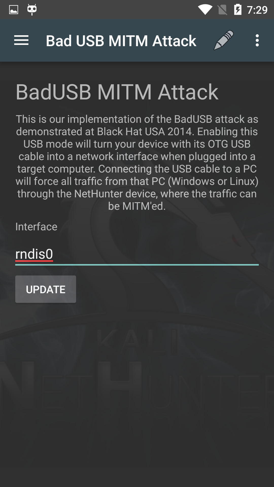

This is our implementation of the [BadUSB](https://srlabs.de/badusb/) attack as demonstrated at Black Hat USA 2014. Enabling this USB mode will turn your device with its OTG USB cable into a network interface when plugged into a target computer. Connecting the USB cable to a PC will force all traffic from that PC (Windows or Linux) through the NetHunter device, where the traffic can be MitM'd.

&nbsp;

