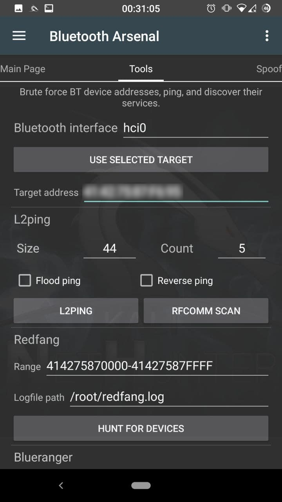
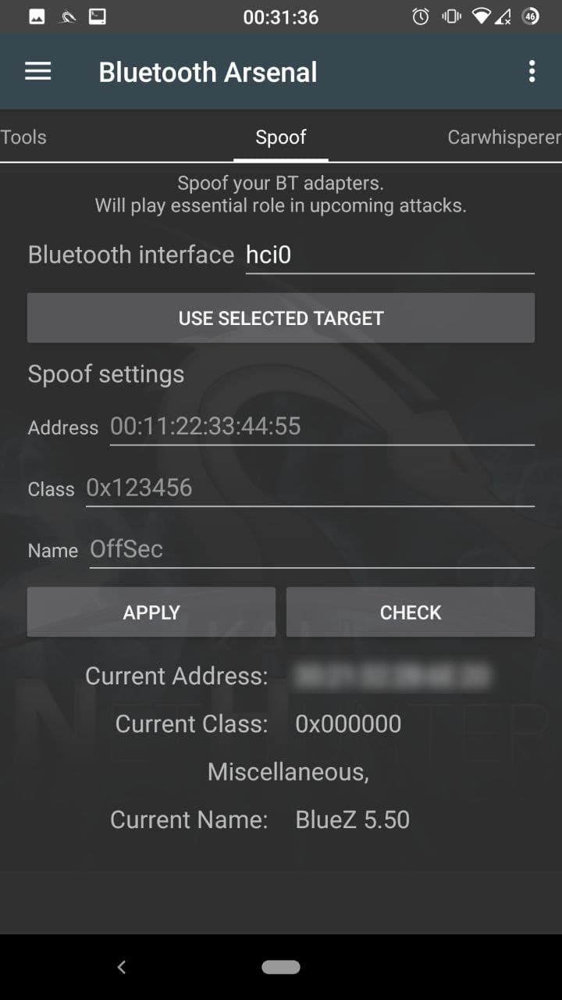
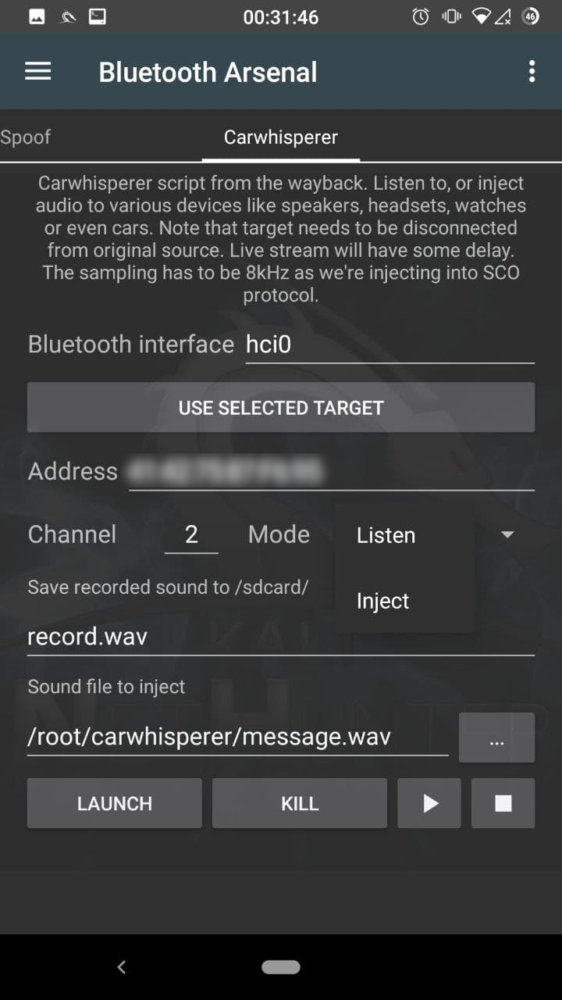

Bluetooth-Arsenal is the control centre for Bluetooth based attacks.

&nbsp;

## Start Bluetooth Arsenal

Click on the hamburger menu item and select “Bluetooth Arsenal” to open the Bluetooth menu. Here you can start & stop the services, enable the interfaces, and scan for discoverable devices. Note that devices can be also found which is not in discovery mode, using the Redfang in the next page. BLE is not supported yet.

Only first run: Tap on "Check and install" on the welcome popup to install dependencies. If you need to setup or update in the future, use the options menu at any time on the top right corner.

&nbsp;

## Main Menu

Connect your bluetooth adapter(s) via OTG if you haven't done so, and press the refresh icon to have them in the spinner menu.
Enable dbus, bluetooth services, and bring up the adapter (hci0) using the switches. If you select a second adapter (hci1), tap refresh again, and bring up that one too with the interface switch. Select the required interface for scanning in the spinner. Enter your scan time if 10 seconds is not ideal. You are ready to scan, press "SCAN FOR DEVICES". If any found, tap on it, so it will be selected for later usage.

&nbsp;

&nbsp;

## Tools

&nbsp;

&nbsp;

&nbsp;

Enter your interface name, if your use multiple adapters. You can paste the selected target address by tapping on the "USE SELECTED TARGET".

#### L2ping

Ideal for crashing target's bluetooth stack, so the connected device(s) may get disconnected, available for discovery or attacks. Modify the size, or count if needed. Flood ping also boosts up the possibility to disconnect paired devices. Reverse ping sends echo response instead of echo request.

#### Redfang

Use to find devices which are not in pairing mode. Enter the target range, and modify the logfile path if needed. Tap on "HUNT FOR DEVICES" to start.

#### Blueranger

See how close the target is. Tap on "CHECK PROXIMITY" to start.

#### SDPtool

Look at the target's services to find open ones. Handsfree service is our vulnerable audio service. Tap on "DISCOVER SERVICES" to start.

&nbsp;

## Spoof

&nbsp;

&nbsp;

Enter your interface name, if your use multiple adapters. You can paste the selected target's address, name, and class by tapping on the "USE SELECTED TARGET", otherwise enter the desired modifications.

Tap on "APPLY" to set. You can also verify by tapping on "CHECK".

&nbsp;

## Carwhisperer

&nbsp;

&nbsp;

Enter your interface name, if your use multiple adapters. You can paste the selected target address by tapping on the "USE SELECTED TARGET".

Modify the channel, if the target's Handsfree service is on a different one. Select the mode:

#### Listen

Will start recording the audio from the target's microphone. Modify the record filename if needed.

#### Inject

Will inject the selected audio to the target, so it will be played on it's speaker. Enter or select the audio file's path to inject.

Tapping on "LAUNCH" starts the script in the terminal. You can kill in the terminal with CTRL+C or in the app by tapping on "KILL".
Play button starts to stream live on your speaker if listening is running, otherwise it will play the last recording.
Please note that the Stop button will stop the playback, pause is not supported.

&nbsp;

## Bad Bluetooth

&nbsp;

&nbsp;

#### Server

Enter your desired Keyboard bluetooth interface, address, and name to use for BadBT Server. Make sure your interface is up and running including dbus, and bluetooth service.

Tap on "Start Server", it will run in a Terminal window, ready to accept incoming connections from target clients. Some targets may require typing in "yes" in terminal for pairing process.

&nbsp;

&nbsp;

#### Client

Once a target is connected, head back to NetHunter app and it's time to send some strings, alternatively you can use interactive mode (needs a physical keyboard to be connected to your phone).

For Send Strings mode, you can set basic prefixes such as Android Home, Browser, Windows CMD, etc..

Please note these modes are experimental, and possilbly HID Ducky format will be implemented.

When ready, tap "Send".

&nbsp;
