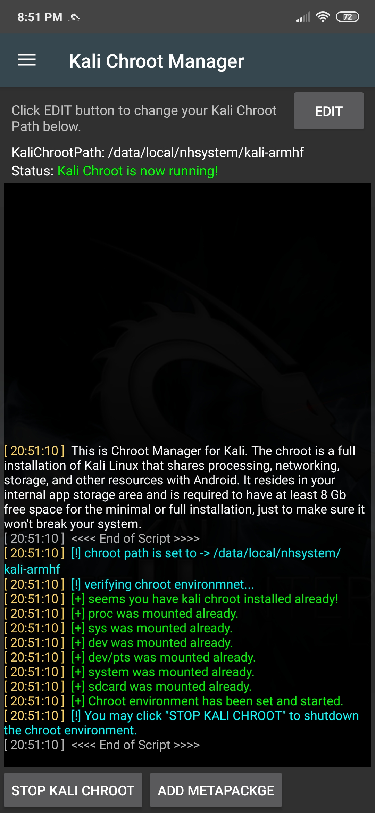
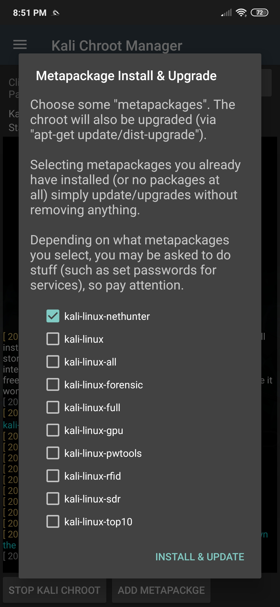

The NetHunter chroot manager allows you to download and install a Kali Linux chroot (if one does not already exist), backup and restore a chroot, as well as remove an existing chroot. In addition, one can install various Kali Linux metapackages as required.

In general, the "kali-nethunter" metapackage contains everything needed to run NetHunter, so be sure to only add extra metapackages if they're really needed, especially if disk space is at a premium. To get a general idea of the disk space required for each of the metapackages, refer to the [Kali Linux Metapackages blog post](/blog/kali-linux-metapackages/).

