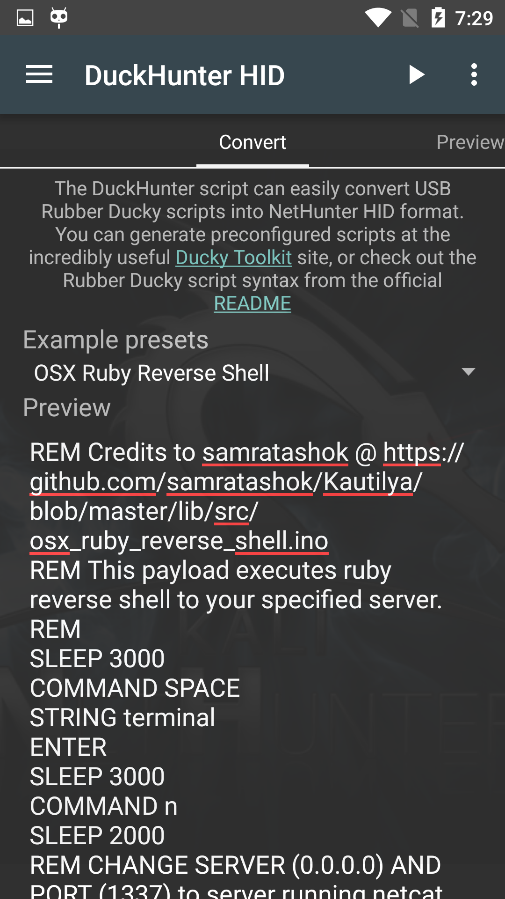

The DuckHunter HID option allows you to quickly and easily convert [USB Rubber Ducky](https://github.com/hak5darren/USB-Rubber-Ducky) scripts into NetHunter HID Attacks format. You can choose an option from the **Example presets** menu or choose from a larger selection of preconfigured scripts at the [Duck Toolkit](https://ducktoolkit-411.rhcloud.com/Home.jsp) site.

## Demo Video


