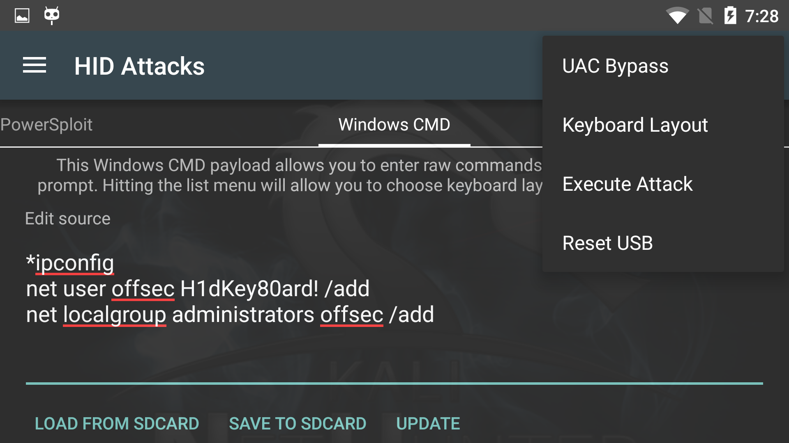

The NetHunter HID Attacks turn your device and its OTG USB cable into a pre-programmed keyboard, able to type any given commands. Previously, only ["Teensy"](https://www.pjrc.com/teensy/) type devices were able to do this... but no longer! This attack generally works very well. However, if it becomes non-responsive, simply select **Reset USB** from the menu to freshen up the USB stack.

