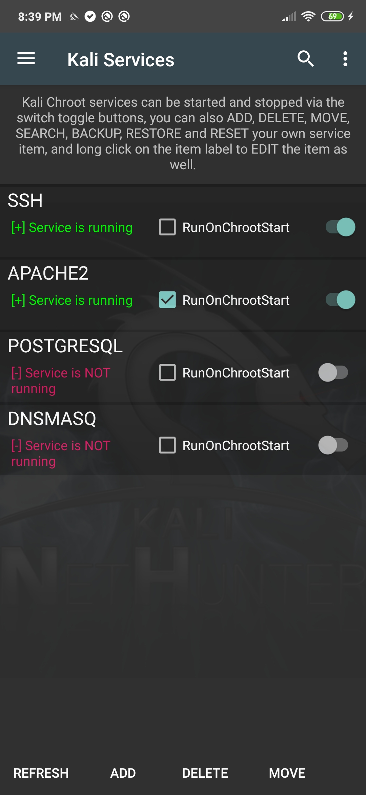

The Kali Services pane allows you to start and stop various chrooted services such as SSH, Apache, OpenVPN, etc. To start or stop any of the available network services, simply tap on the appropriate button from the available options. This pane also allows you to enable these services at boot time if so desired. Be aware that these services correspond to chrooted Kali Linux services, rather than native Android services.

**Warning:** Ensure you have changed any default passwords before enabling remote access to your device as Kali comes with a default "toor" password.

