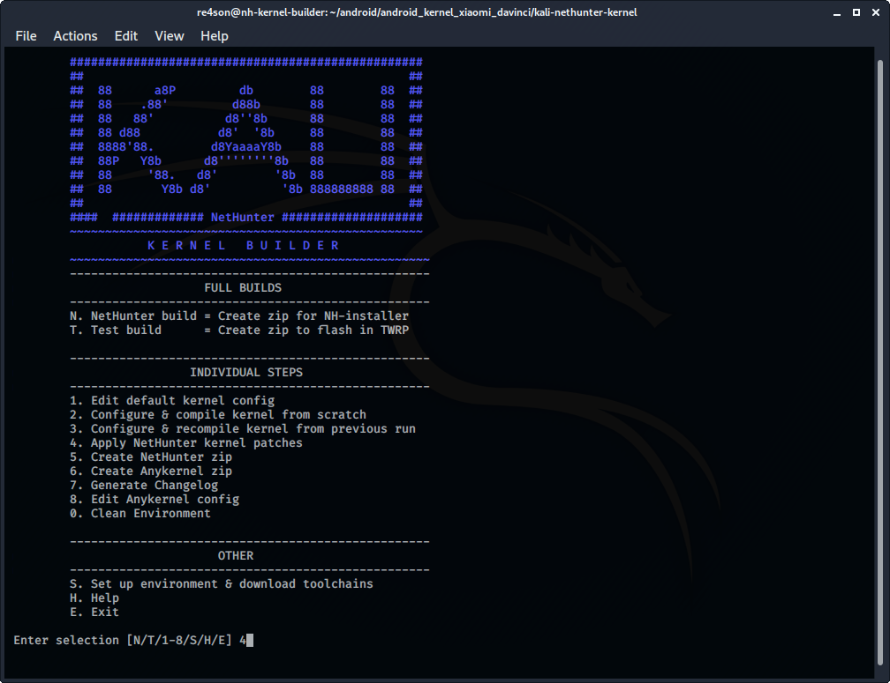
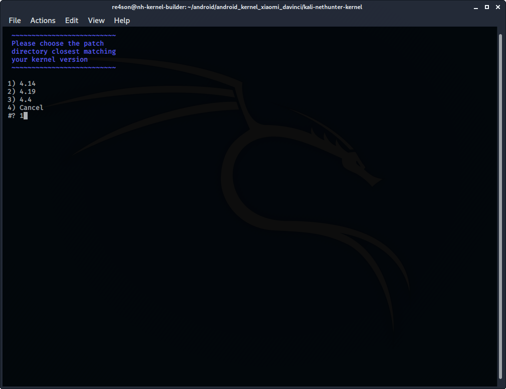
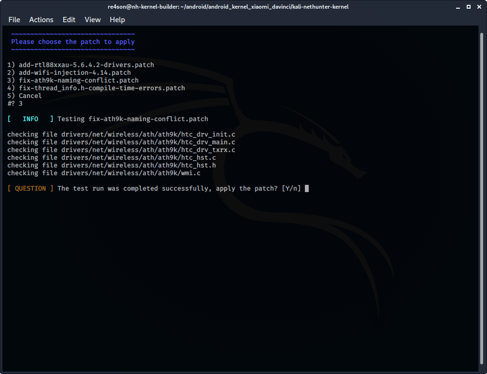

We will continue from the [Porting NetHunter page](/docs/nethunter/porting-nethunter/) and work on the Neus 6P kernel as an example. The idea stays the same though.

&nbsp;

## Patching

By default, we apply wifi injection patches and patches that add wifi drivers.
Kernel versions below 4.x will require HID keyboard / mouse patches. Some devices need additional patches to avoid build errors.
We no longer need CD-ROM patches as all modern operating systems support being installed from USB storage devices, thus we can mount NetHunter as USB drive.

In the Kernel-Builder, choose ***"Apply NetHunter kernel patches"***:

&nbsp;

 navigate to the directory that closest resembles your kernel version:

&nbsp;

 and apply each applicable patch:

&nbsp;

We recommend that you work in another terminal window in parallel and commit the changes to the kernel source after having applied each patch.

**Every device's kernel is different. If the above patches fail, you can try to patch by hand. Even if the patches fail, the sources can be quite similar, so patching manually is possible in most cases. If you succeed, feel free to add your patch to the [kernel builder's repo](https://gitlab.com/kalilinux/nethunter/build-scripts/kali-nethunter-kernel)**.
