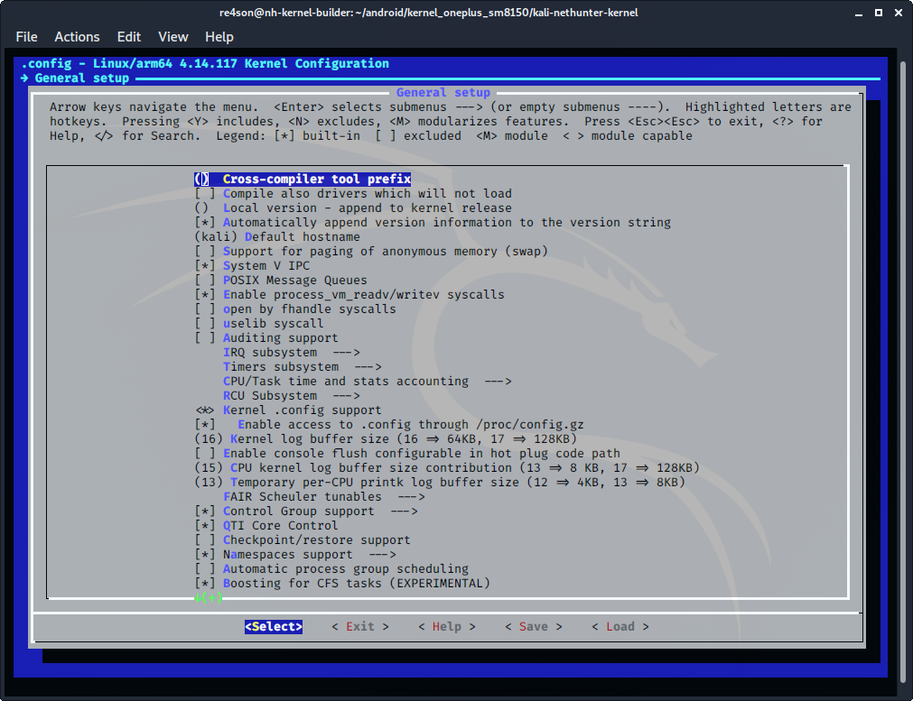
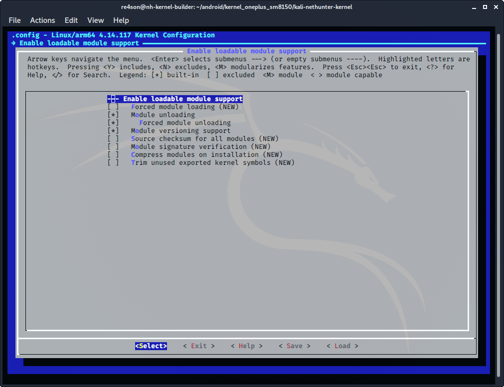
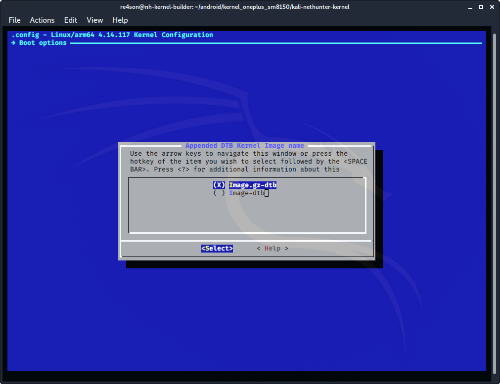

## Kernel Configuration

### General

In section "General Setup":

- clear ***"Local version"***
- set ***"Default host name"*** to "kali"
- select ***"System V IPC"***
  (CONFIG_SYSVIPC=y)

&nbsp;

### Modules

We want to enable modules in _Enable Loadable Module Support_ just in case there are any devices we want to load through the command line using **modprobe**. We discourage to build frequently used rivers as modules:

- Enable ***"loadable module support"***
  (CONFIG_MODULES=y):

- select ***"Module unloading"***
  (CONFIG_MODULE_UNLOAD=y)
- select ***"Forced module unloading"***
  (CONFIG_MODULE_FORCE_UNLOAD=y)
- select ***"Module versioning support"***
  (CONFIG_MODVERSIONS=y)

&nbsp;

### Kernel Image

Our preferred image type is a compressed and concatenated image file if the kernel source permits it:

- select ***"Build a concatenated Image.gz/dtb by default"***
  (CONFIG_BUILD_ARM64_APPENDED_DTB_IMAGE=y)
- Under ***"Boot options ->"***
- Selected ***"Appended DTB Kernel Image name (Image.gz-dtb)"***
  (IMG_GZ_DTB=y)

