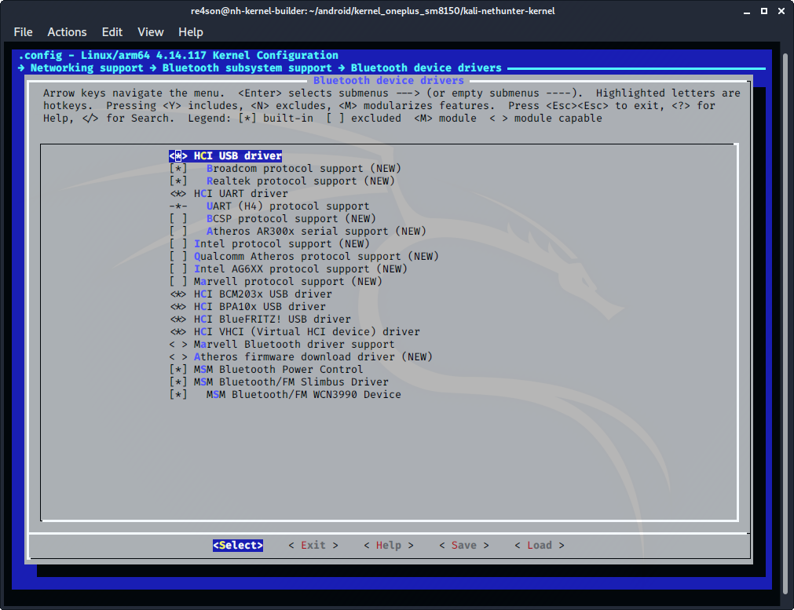
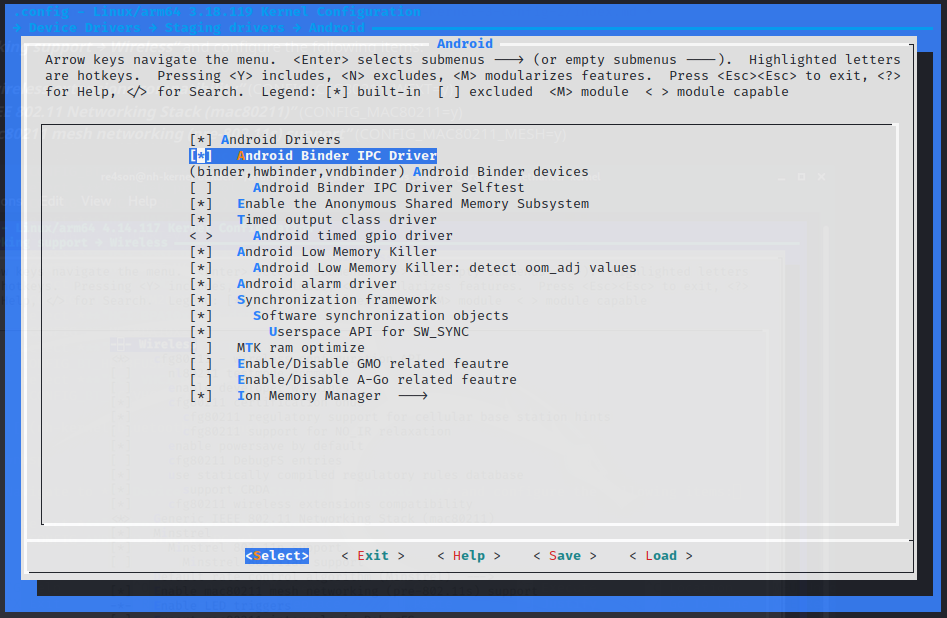
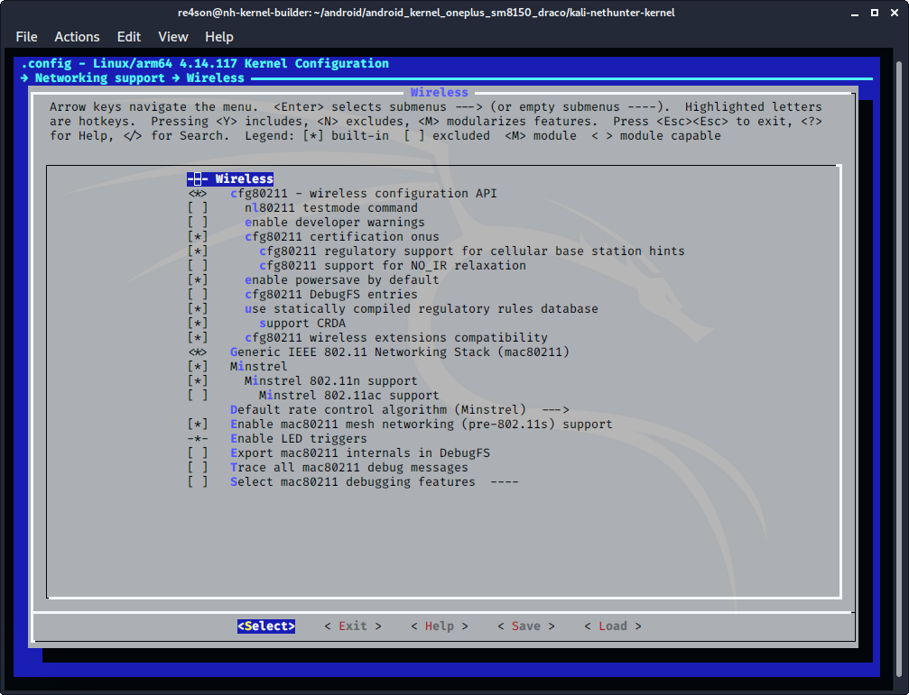
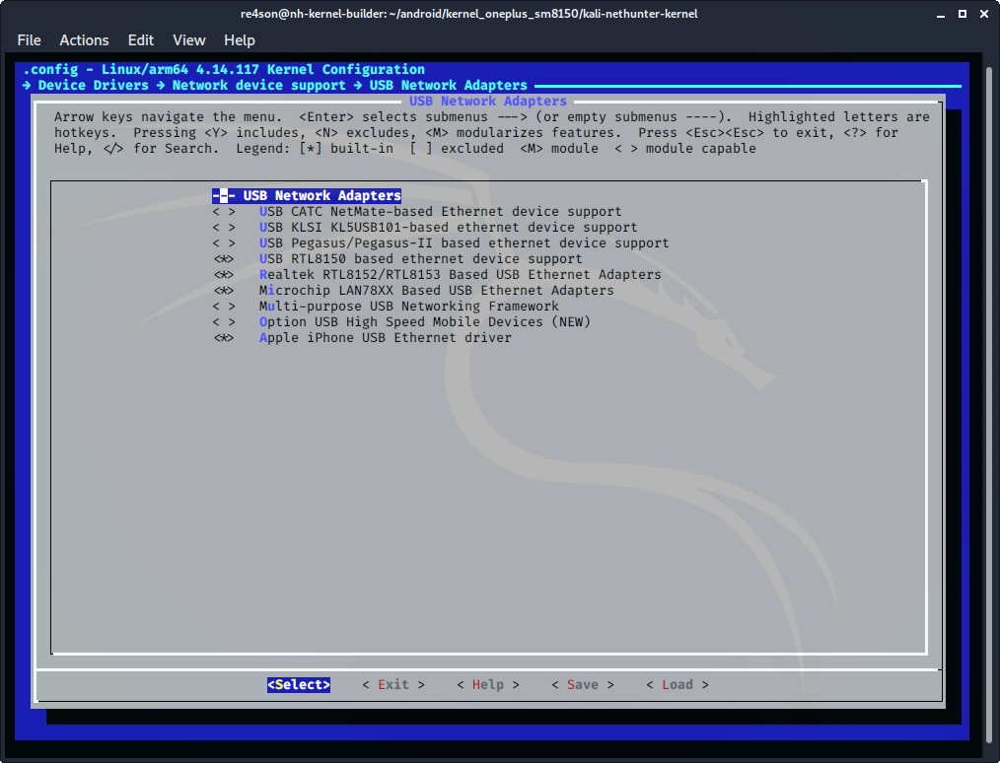

## Kernel Configuration cont.

### Bluetooth

Navigate to ***"Networking support → Bluetooth subsystem support → Bluetooth device drivers"***

- select ***"HCI USB driver"***
  (CONFIG_BT_HCIBTUSB=y)
- select ***"Broadcom protocol support"***
  (CONFIG_BT_HCIBTUSB_BCM=y)
- select ***"Realtek protocol support"***
  (CONFIG_BT_HCIBTUSB_RTL=y)
- select ***"HCI UART driver"***
  (CONFIG_BT_HCIUART=y)
- select ***"UART (H4) protocol support"***
  (CONFIG_BT_HCIUART_H4=y)
- select ***"HCI BCM203x USB driver"***
  (CONFIG_BT_HCIBCM203X=y)
- select ***"HCI BPA10x USB driver"***
  (CONFIG_BT_HCIBPA10X=y)
- select ***"HCI BlueFRITZ! USB driver"***
  CONFIG_BT_HCIBFUSB=y)
- select ***"HCI VHCI (Virtual HCI device) driver"***
  (CONFIG_BT_HCIVHCI=y)

&nbsp;

Navigate to ***"Device Drivers → Staging -> Android "*** and configure the following items:

- select ***"Android Binder IPC Driver"*** 
  (CONFIG_ANDROID_BINDER_IPC=y)

&nbsp;

### MAC80211

Navigate to ***"Networking support → Wireless"*** and configure the following items:

- select ***"cfg80211 wireless extensions compatibility"***
  (CONFIG_CFG80211_WEXT=y)
- select ***"Generic IEEE 802.11 Networking Stack (mac80211)"***
  (CONFIG_MAC80211=y)
- select ***"Enable mac80211 mesh networking (pre-802.11s) support"***
  (CONFIG_MAC80211_MESH=y)

&nbsp;

### Ethernet

Navigate to ***"Device Drivers_ -> _Network Device Support_ ->  _USB Network Adapters"*** and configure the following options:

- select ***"USB RTL8150 based ethernet device support"***
  (CONFIG_USB_RTL8150=y)
- select ***"Realtek RTL8152/RTL8153 Based USB Ethernet Adapters"***
  (CONFIG_USB_RTL8152=y)

