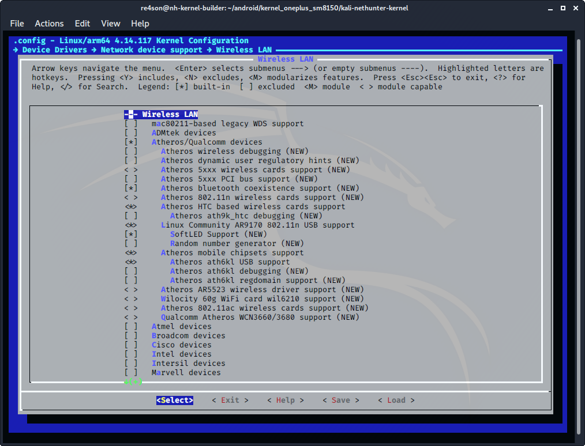
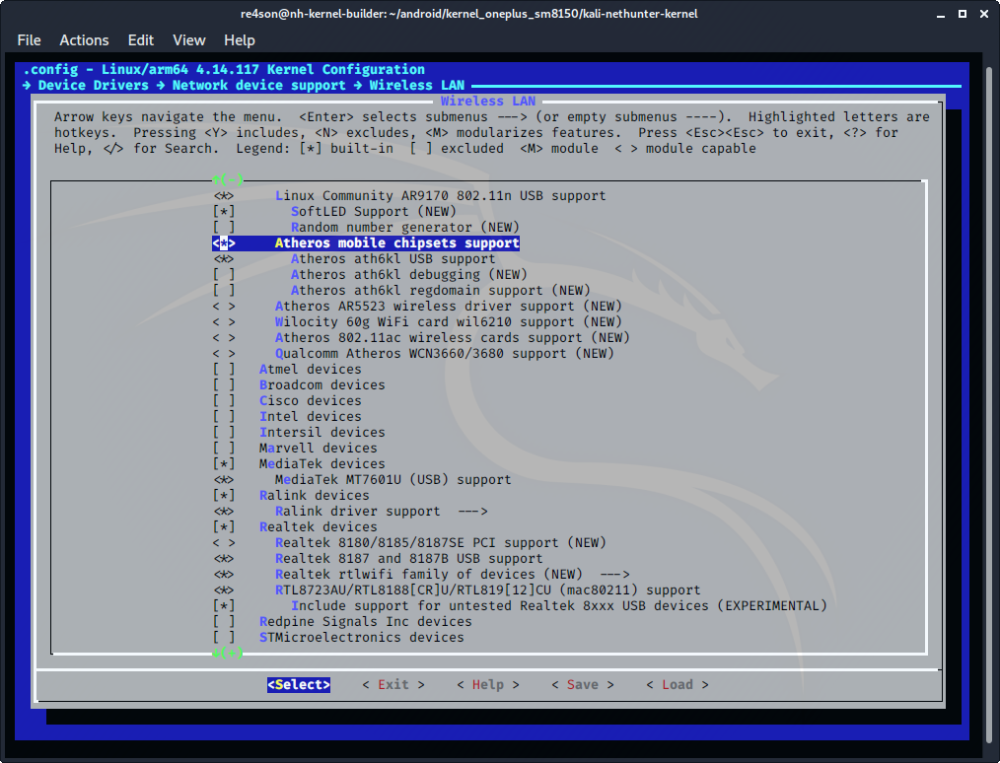
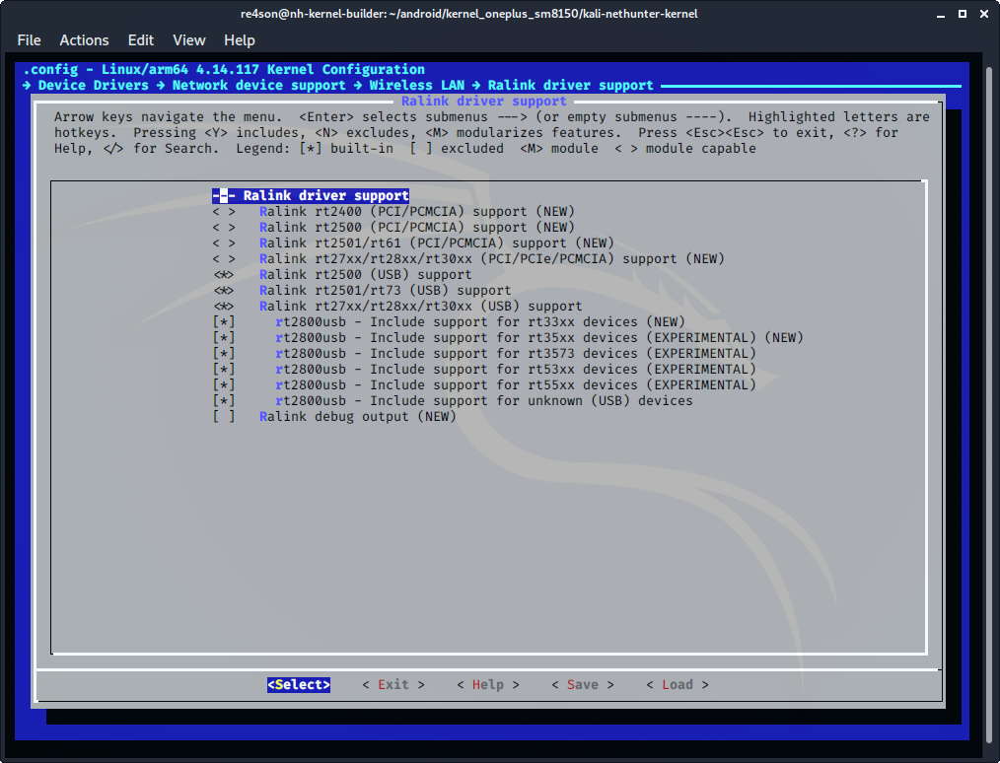
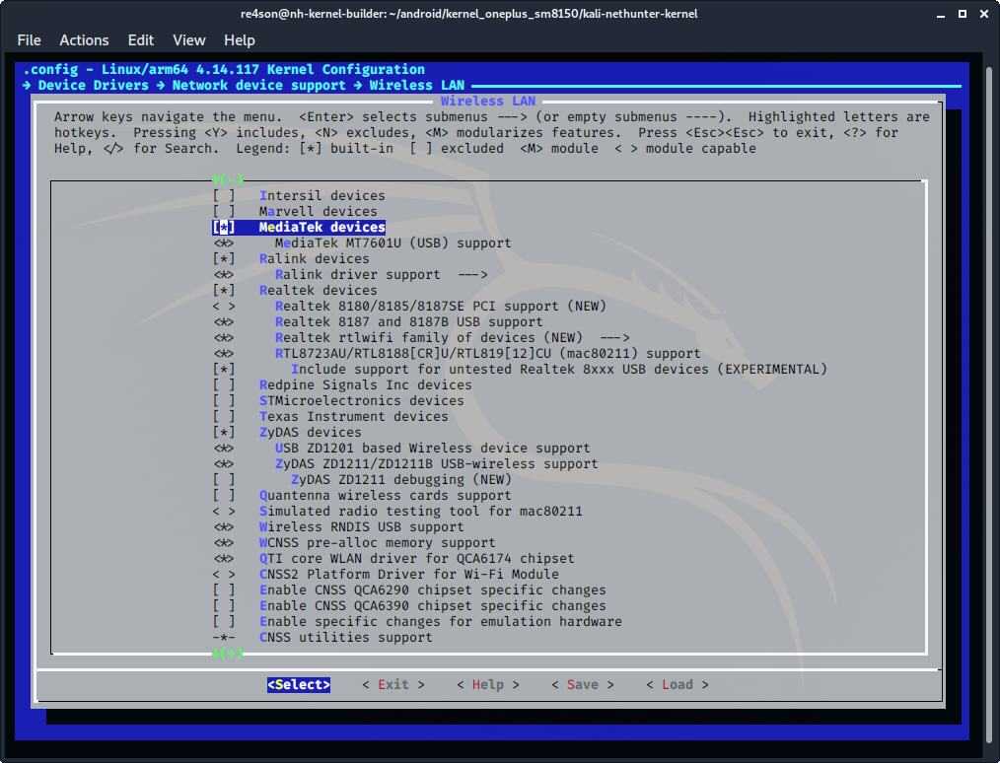

## Kernel Configuration cont.

&nbsp;

### Wireless LAN

Navigate to _Device Drivers_ -> _Network Device Support_ ->  _Wireless LAN_ and make the following selections:

- select ***"Atheros/Qualcomm devices"***
  (CONFIG_WLAN_VENDOR_ATH=y)
- select ***"Atheros HTC based wireless cards support"***
  (CONFIG_ATH9K_HTC=y)
- select ***"Linux Community AR9170 802.11n USB support"***
  (CONFIG_CARL9170=y)
- select ***"Atheros mobile chipsets support"***
  (CONFIG_ATH6KL=y)
- select ***"Atheros ath6kl USB support"***
  (CONFIG_ATH6KL_USB=y)

&nbsp;

- select ***"MediaTek devices"***
  (CONFIG_WLAN_VENDOR_MEDIATEK=y)
- select ***"MediaTek MT7601U (USB) support"***
  (CONFIG_MT7601U=y)
- select ***"Ralink devices"***
  (CONFIG_WLAN_VENDOR_RALINK=y)
- select ***"Ralink driver support"***
  (CONFIG_RT2X00=y)

&nbsp;

Open Ralink driver support and configure the following drivers:

- select ***"Ralink rt2500 (USB) support"***
   (CONFIG_RT2500USB=y)
- select ***"Ralink rt2501/rt73 (USB)"******
  (CONFIG_RT73USB=y)
- select ***"Ralink rt27xx/rt28xx/rt30xx (USB)"***
  (CONFIG_RT2800USB=y)
- select ***"rt2800usb - Include support for rt33xx devices"***
  (CONFIG_RT2800USB_RT33XX=y)
- select ***"rt2800usb - Include support for rt35xx devices"***
  (CONFIG_RT2800USB_RT35XX=y)
- select ***"rt2800usb - Include support for rt3573 devices"***
  (CONFIG_RT2800USB_RT3573=y)
- select ***"rt2800usb - Include support for rt53xx devices"***
  (CONFIG_RT2800USB_RT53XX=y)
- select ***"rt2800usb - Include support for rt55xx devices"***
  (CONFIG_RT2800USB_RT55XX=y)
- select ***"rt2800usb - Include support for unknown (USB)"***
  (CONFIG_RT2800USB_UNKNOWN=y)

&nbsp;&nbsp;

Continue down the page and enable the following drivers:

- select ***"Realtek devices"***
  (CONFIG_WLAN_VENDOR_REALTEK=y)
- select ***"Realtek 8187 and 8187B USB support"***
  (CONFIG_RTL8187=y)
- select ***"Realtek rtlwifi family of devices"***
  (CONFIG_RTL_CARDS=y)
- select ***"RTL8723AU/RTL8188[CR]U/RTL819[12]CU (mac80211) support"***
  (CONFIG_RTL8192CU=y)
- select ***"Include support for untested Realtek 8xxx USB devices"***
  (CONFIG_RTL8XXXU_UNTESTED=y)
- select ***"ZyDAS devices"***
  (CONFIG_WLAN_VENDOR_ZYDAS=y)
- select ***"USB ZD1201 based Wireless device support"***
  (CONFIG_USB_ZD1201=y)
- select ***"ZyDAS ZD1211/ZD1211B USB-wireless support"***
  (CONFIG_ZD1211RW=y)
- select ***"Wireless RNDIS USB support"***
  (CONFIG_USB_NET_RNDIS_WLAN=y)

