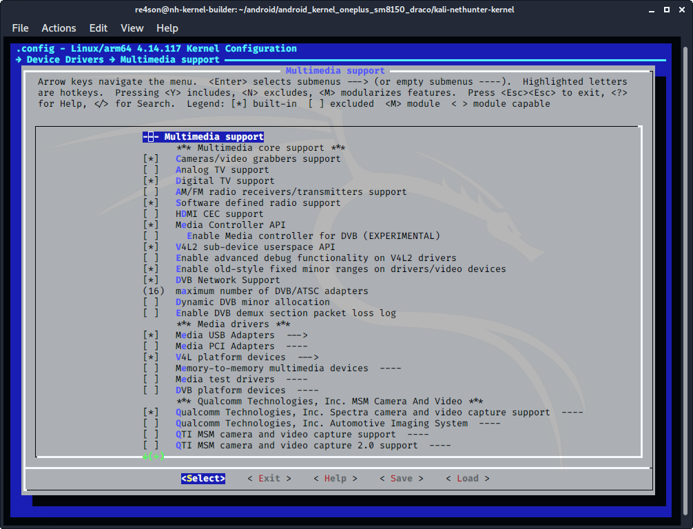

## Kernel Configuration

### SDR

**Please note some devices have the Digital TV support in a submenu, and some kernel 3.x versions don't support RF hardware by default**.

Navigate to ***"Device Drivers -> Multimedia support"*** and configure the following items:

- select ***"Digital TV support"***
  (CONFIG_MEDIA_DIGITAL_TV_SUPPORT=y)
- select ***"Software defined radio support"***
  (CONFIG_MEDIA_SDR_SUPPORT=y)

&nbsp;

Navigate to _Device Drivers_ -> _Multimedia_ -> _DVB/ATSC adapters_ -> _Customize DVB Frontends_ and enable the following:

- select ***"AirSpy"***
  (CONFIG_USB_AIRSPY=y)
- select ***"HackRF"***
  (CONFIG_USB_HACKRF=y)
- select ***"Mirics MSi2500"***
  (USB_MSI2500=y)

&nbsp;

Return to ***"Device Drivers -> Multimedia support"*** and remove the following selection:

- ***"Autoselect ancillary drivers (tuners, sensors, i2c, spi, frontends)"***
  (CONFIG_MEDIA_SUBDRV_AUTOSELECT=n)

Then open ***"Device Drivers -> Multimedia support->Customize TV tuners"*** and **unselect all**

You can reduce the selection to the following few from the section ***"DVB-T (terrestrial) frontends"***section:

- select ***"Realtek RTL2830 DVB-T"***
  (CONFIG_DVB_RTL2830=y)
- select ***"Realtek RTL2832 DVB-T"***
  (CONFIG_DVB_RTL2832=y)
- select ***"Realtek RTL2832 SDR"***
  (CONFIG_DVB_RTL2832_SDR=y)
- select ***"Silicon Labs Si2168"***
  (CONFIG_DVB_SI2168=y)
- select ***"ZyDAS ZD1301"***
  (CONFIG_DVB_ZD1301_DEMOD=y)

