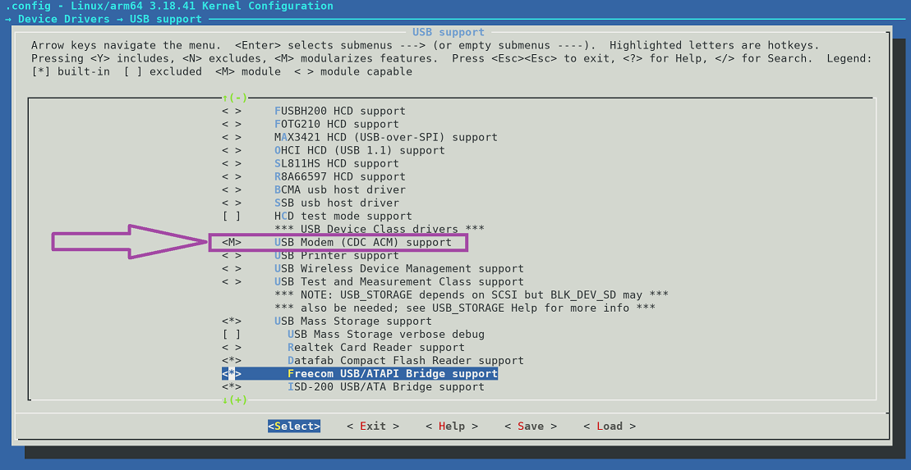

## Kernel Configuration cont.

**If your kernel is above 4.x please skip to the [next page](/docs/nethunter/nethunter-kernel-7-config-6/)**

### USB Modem

CDC ACM support is required for Proxmark and similar devices

Navigate to ***Device Drivers -> USB support*** and select the following option:

- select ***"USB Modem (CDC ACM) support"***
  (CONFIG_USB_ACM=y)

&nbsp;

### USB Gadget support

USB Gadget support is only possible with patches on 3.x kernels.

Please refer to [patching kernel](/docs/nethunter/nethunter-kernel-1-patching/) page.

## Exit, save, and build
