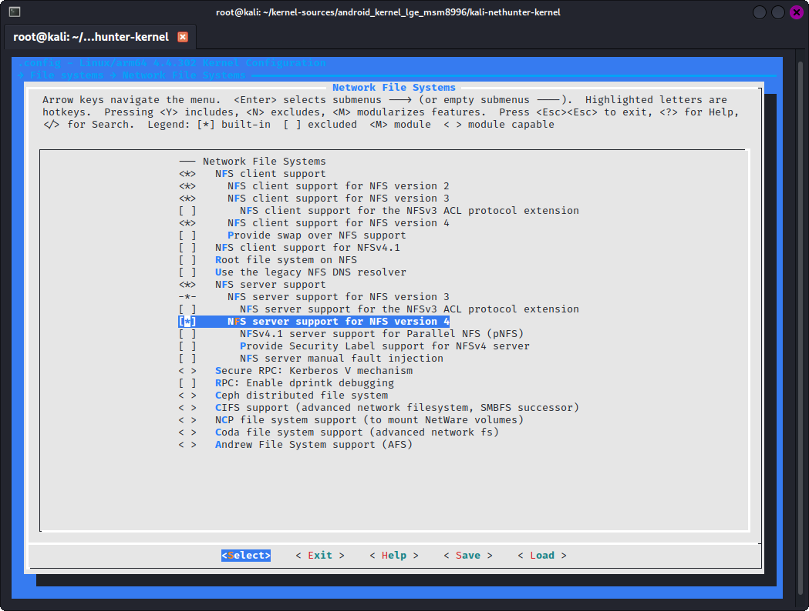

### NFS Support

NFS client and server support is required in case it's disabled by default.

Navigate to ***File Systems -> Network File Systems*** and select the following option:

- select ***"Network File Systems"***
  (CONFIG_NETWORK_FILESYSTEMS=y)
- select ***"NFS client support for NFS version 2"***
  (CONFIG_NFS_V2=y)
- select ***"NFS client support for NFS version 3"***
  (CONFIG_NFS_V3=y)
- select ***"NFS client support for NFS version 4"***
  (CONFIG_NFS_V4=y)
- select ***"NFS server support"***
  (CONFIG_NFSD=y)
- select ***"NFS server support for NFS version 3"***
  (CONFIG_NFSD_V3=y)
- select ***"NFS server support for NFS version 4"***
  (CONFIG_NFSD_V4=y)

