##### *Being mobile doesn't mean putting up with tiny!*

Kali NetHunter Desktop Experience puts the Kali Linux desktop in the palm of your hand.

Connect a monitor via HDMI or screen casting and you have a Kali experience indistinguishable from sitting in front of a desktop computer.

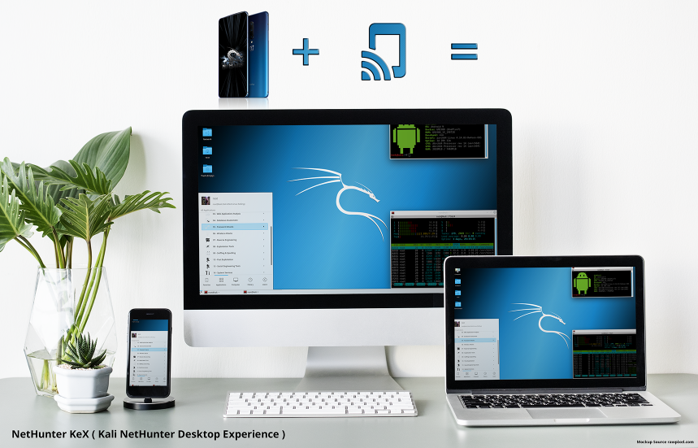

#### Content:

[Start the KeX Manager](#start-the-kex-manager)

[Set-up KeX](#set-up-kex)

[Start & Stop KeX](#start-kex)

[Launch the KeX Client](#launch-the-kex-client)

[Use KeX controls](#use-kex-controls)

[Advanced KeX Settings](#advanced-kex-settings)

#### Start the KeX Manager

Click on the hamburger menu item and select *"KeX Manager"* to open the KeX menu.
Here you can start & stop the service, open the KeX client and configure advanced settings.
KeX can be started by executing the following steps:

- Only once: Set a KeX password before first use
- Start the KeX Server
- Open the KeX Client
- Only once: Enter the KeX password (it gets stored securely in the connection profile)
- Click *"Connect"* in the KeX client to connect to the KeX server
- Connect HDMI monitor and bluetooth keyboard and mouse (optional, device can be used as touchpad)

Optional:

- Open *"ADVANCED SETTINGS"* and set a custom resolution to fit the connected monitor

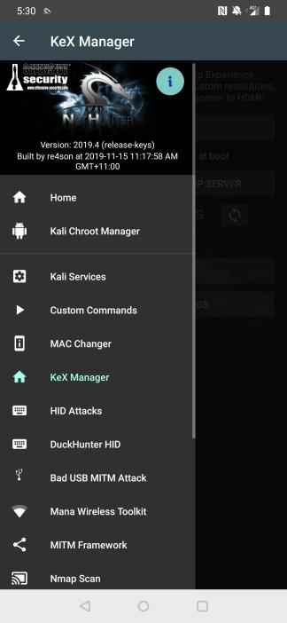

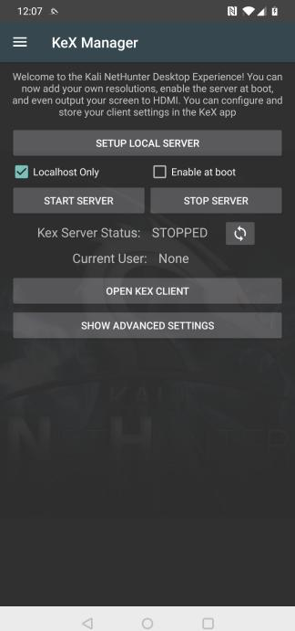

#### Set-up KeX
Before starting the KeX server for the first time, click on *"SETUP LOCAL SERVER"* and configure a session password and a read only password.

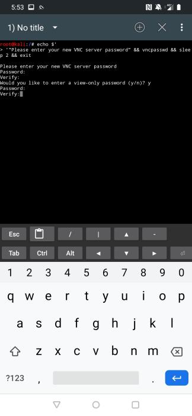

#### Start KeX
To start KeX, click on *"START SERVER"*.
To stop KeX, click on *"STOP SERVER"*.
To display whether the server is running or not, click the refresh button.

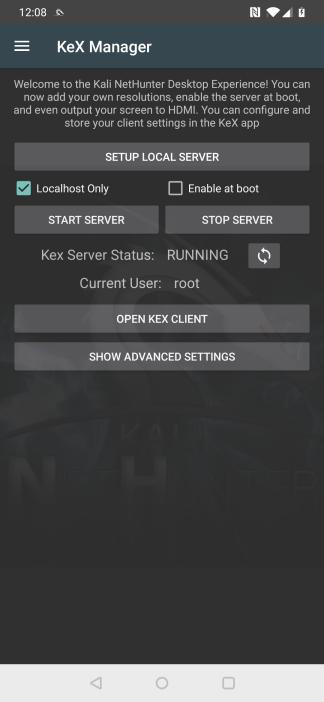

#### Launch the KeX Client
To launch the KeX client, click *"OPEN KEX CLIENT"*

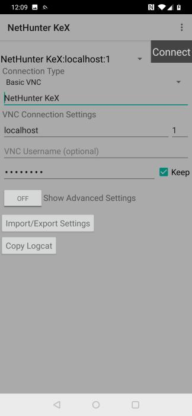

Before connecting for the first time, enter the password (the one you have configured when setting up the server) in the password field

Press *"Connect"*

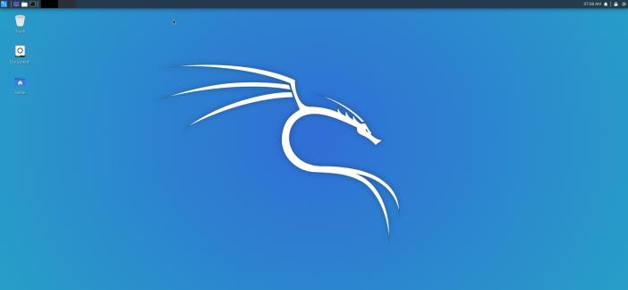

#### Use KeX controls

Touching the screen displays the on-screen-display for 2 seconds, which allows you to open the on-screen keyboard or the context menu to configure or disconnect the KeX session.

You can disconnect and re-connect to your session any time.

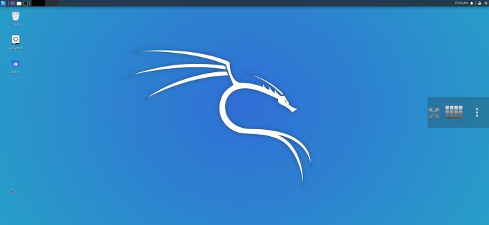

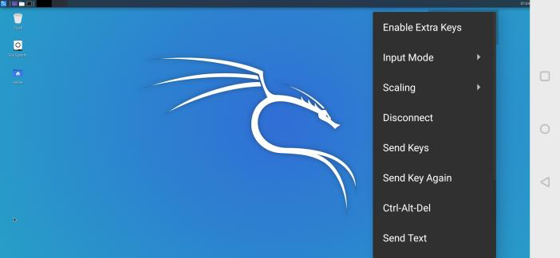

#### Advanced KeX Settings

Open the *"ADVANCED SETTINGS"* menu to tweak the display resolution settings.

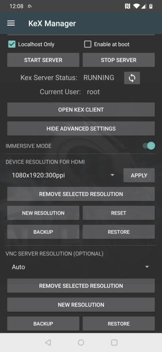

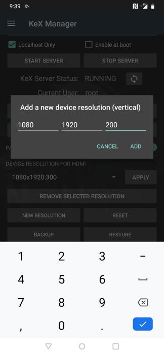
