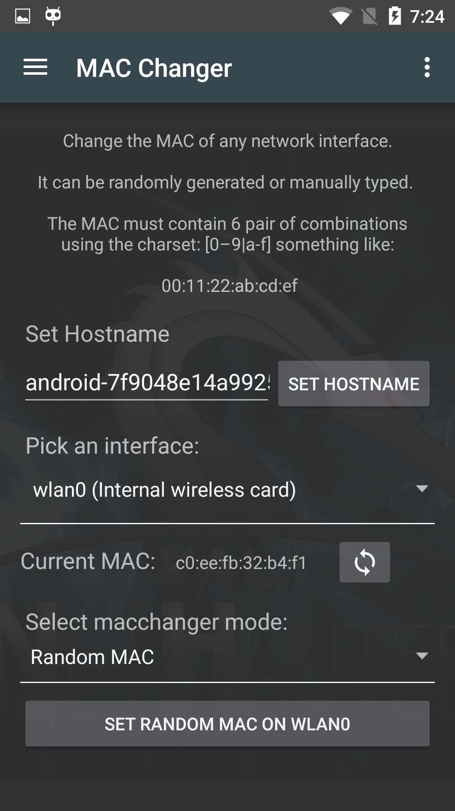

The MAC Changer pane allows you to change the MAC address of your NetHunter device network interfaces. You can choose to have the MAC address set to a random value or you can enter it manually using the standard 6-pair notation like _00:11:22:AA:BB:CC_.

