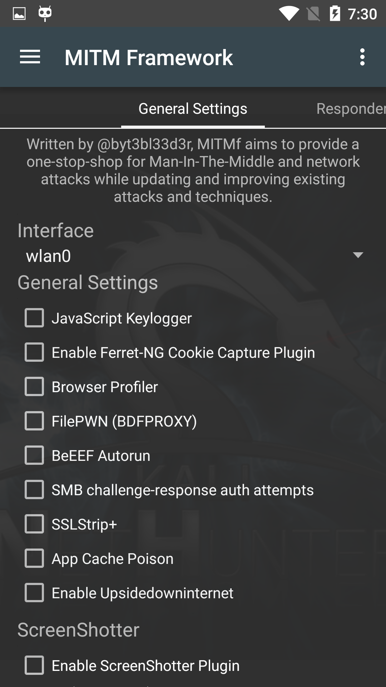
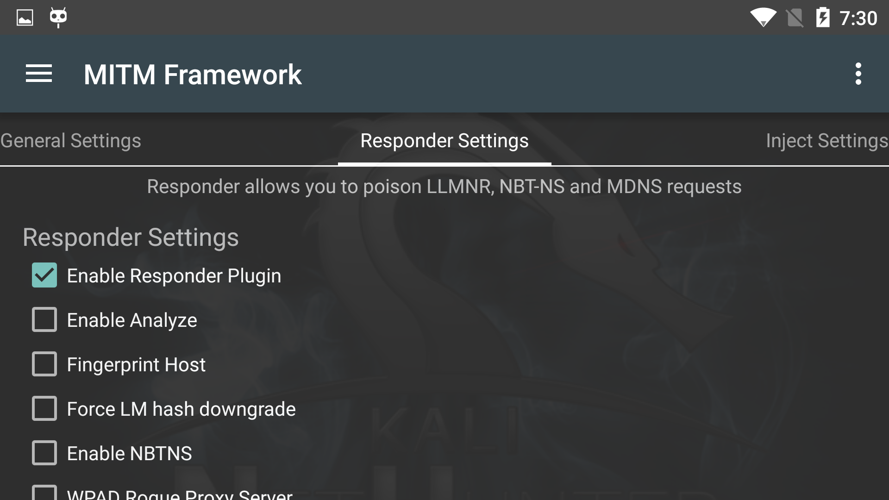
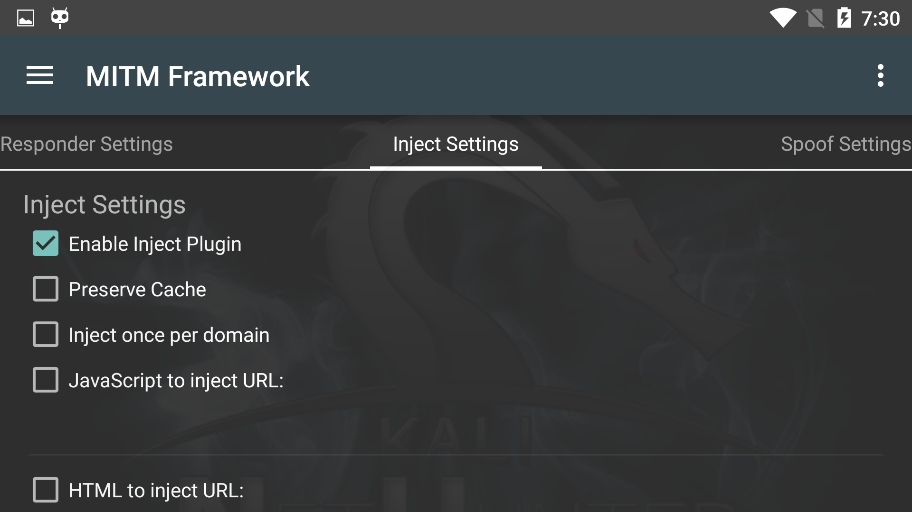

The Man in the Middle Framework was written by @byt3bl33d3r and provides you with convenient one-stop shopping for all of your MitM and network attack needs. It includes keylogging, cookie capture, ARP poisoning, injection, spoofing, and much, much more.

