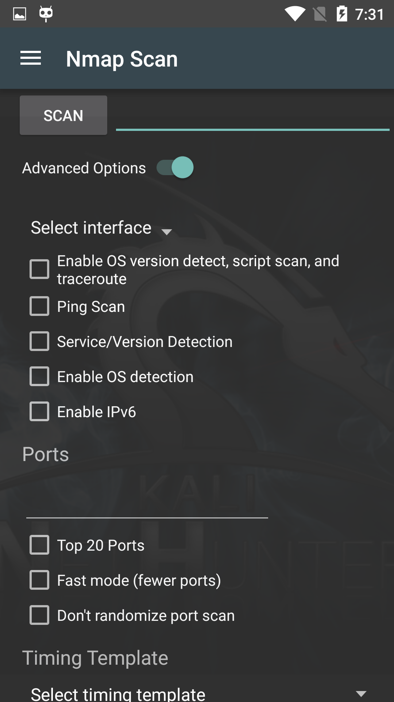

The Nmap Scan pane gives you easy access to the most commonly-used options of the immensely powerful [Nmap](https://nmap.org/) scanner, allowing you to easily launch in-depth scans on targets or networks, without having to type a long string on the command-line with an on-screen keyboard.

