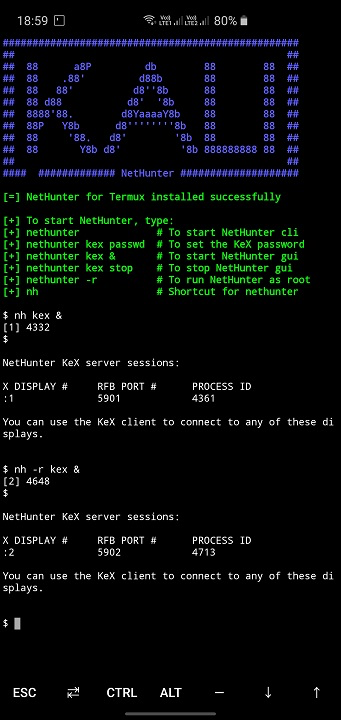
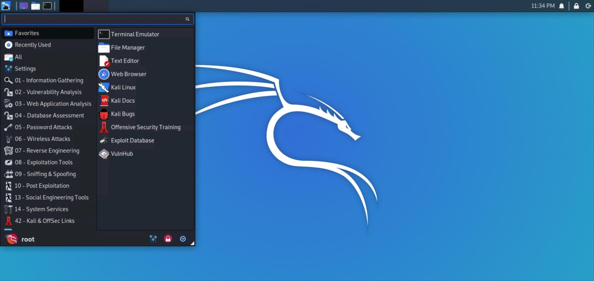

<!-- Based on https://gitlab.com/kalilinux/nethunter/build-scripts/kali-nethunter-project/-/tree/master/nethunter-rootless -->

## NetHunter Rootless Edition

##### *Maximum flexibility with no commitment*

Install Kali NetHunter on any stock, unrooted Android device without voiding the warranty.





Prerequisite:
--------------

Android Device
(Stock unmodified device, no root or custom recovery required)

Installation:
--------------

- Install the NetHunter-Store app from [store.nethunter.com](https://store.nethunter.com/)
- From the NetHunter Store, install __Termux__, __NetHunter-KeX client__, and __Hacker's keyboard__
  _Note:_
       _The button "install" may not change to "installed" in the store client after installation - just ignore it._
      _Starting termux for the first time may seem stuck while displaying "installing" on some devices - just hit enter._

- Open Termux and type:

```console
kali@kali:~$ termux-setup-storage
kali@kali:~$ pkg install wget
kali@kali:~$ wget -O install-nethunter-termux https://offs.ec/2MceZWr
kali@kali:~$ chmod +x install-nethunter-termux
kali@kali:~$ ./install-nethunter-termux
```

Usage:
-------

Open Termux and type one of the following:

| Command                   | To                                                      |
| ------------------------- | ------------------------------------------------------- |
| `nethunter`               | start Kali NetHunter command line interface             |
| `nethunter kex passwd`    | configure the KeX password (only needed before 1st use) |
| `nethunter kex &`         | start Kali NetHunter Desktop Experience user sessions   |
| `nethunter kex stop`      | stop Kali NetHunter Desktop Experience                  |
| `nethunter <command>`     | run <command> in NetHunter environment                  |
| `nethunter -r`            | start Kali NetHunter cli as root                        |
| `nethunter -r kex passwd` | configure the KeX password for root                     |
| `nethunter -r kex &`      | start Kali NetHunter Desktop Experience as root         |
| `nethunter -r kex stop`   | stop Kali NetHunter Desktop Experience root sessions    |
| `nethunter -r kex kill`   | Kill all KeX sessions                                   |
| `nethunter -r <command>`  | run `<command>` in NetHunter environment as root        |

Note: The command `nethunter` can be abbreviated to `nh`.
_Tip: If you run kex in the background (`&`) without having set a password, bring it back to the foreground first when prompted to enter the password, i.e. via `fg <job id>` - you can later send it to the background again via `Ctrl + z` and `bg <job id>`_

To use KeX, start the KeX client, enter your password and click connect
_Tip: For a better viewing experience, enter a custom resolution under "Advanced Settings" in the KeX Client_

 &nbsp;

## NetHunter Editions:

Please refer to [this table](/docs/nethunter/#1-0-nethunter-editions) for a comparison of the different NetHunter editions.

## Tips:

1. Run `sudo apt update && sudo apt full-upgrade -y` first thing after installation to [update Kali](/docs/general-use/updating-kali/). If you have plenty of storage space available you might want to run `sudo apt install -y kali-linux-default` as well.
2. All of the penetration testing tools should work but some might have restrictions, e.g. metasploit works but doesn't have database support. If you discover any tools that don't work, please post it in our [forums](https://forums.kali.org/forumdisplay.php?14-NetHunter-Forums).
3. Some utilities like "top" won't run on unrooted phones.
4. Non-root users still have root access in the chroot. That's a proot thing. Just be aware of that.
5. Galaxy phone's may prevent non-root users from using sudo. Just use "su -c" instead.
6. Perform regular backups of your rootfs by stopping all nethunter sessions and typing the following in a termux session:
   `tar -cJf kali-arm64.tar.xz kali-arm64 && mv kali-arm64.tar.xz storage/downloads`
   That will put the backup in your Android download folder.
   _Note: on older devices, change "arm64" to "armhf"_
7. Please join us in our [forums](https://forums.kali.org/forumdisplay.php?14-NetHunter-Forums) to exchange tips and ideas and be part of a community that strives to make NetHunter even better.
