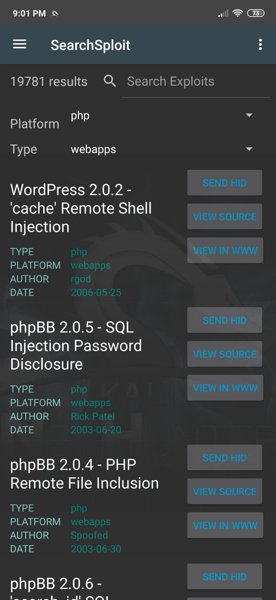

The SearchSploit pane allows you to easily search [The Exploit Database](https://www.exploit-db.com/) archive for entries based on criteria of your choosing. Once you've found an exploit of interest, you can choose to view it online or even edit it locally to tailor it to your particular target.

