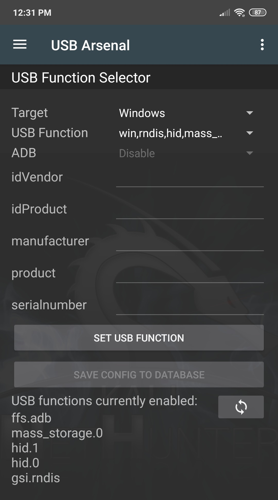
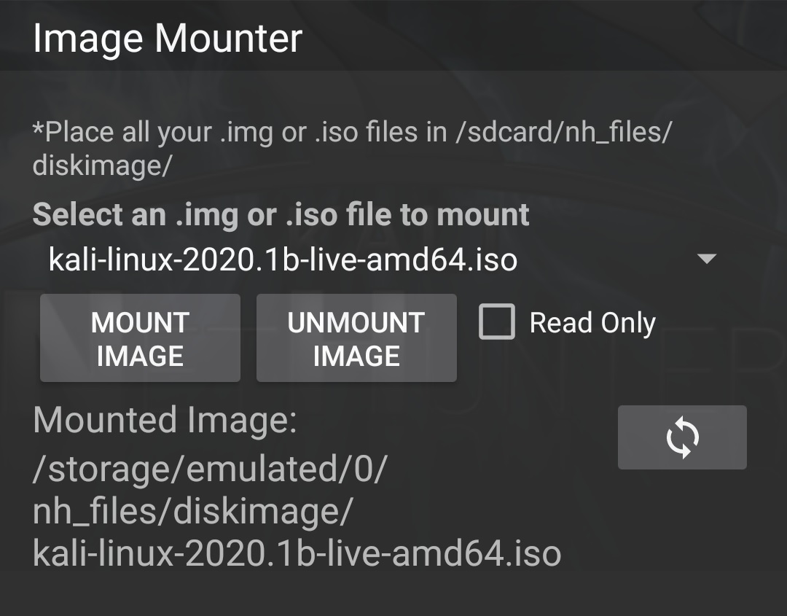
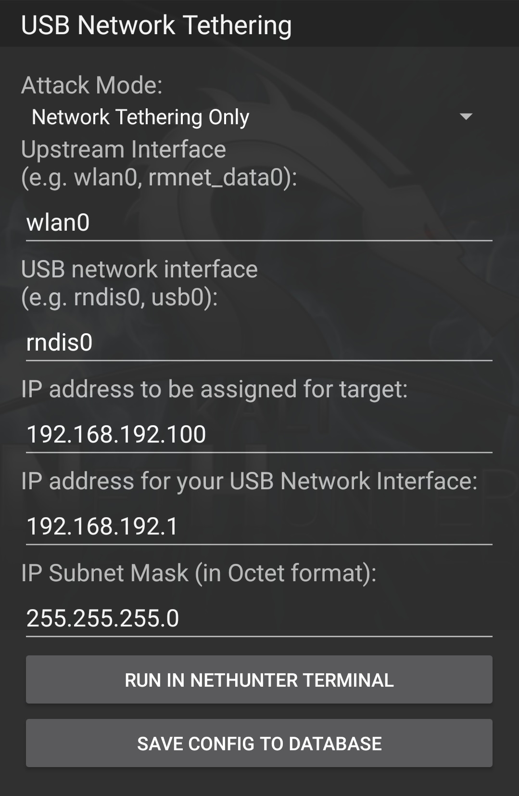

USB-Arsenal is the control centre for USB based attacks.
It is used to enable USB gadget modes using the *USB Function Selector*:

&nbsp;

&nbsp;

If mass storage gadget mode has been enabled then .iso and .img files can be mounted in the *Image Mounter* menu, before connecting the device to the USB port of a computer which will then treat NetHunter as a USB drive on which the image was installed:

&nbsp;

&nbsp;

If RNDIS gadget mode is enabled then the *USB Network Tethering* menu can be used for various network interface based attacks:

&nbsp;

