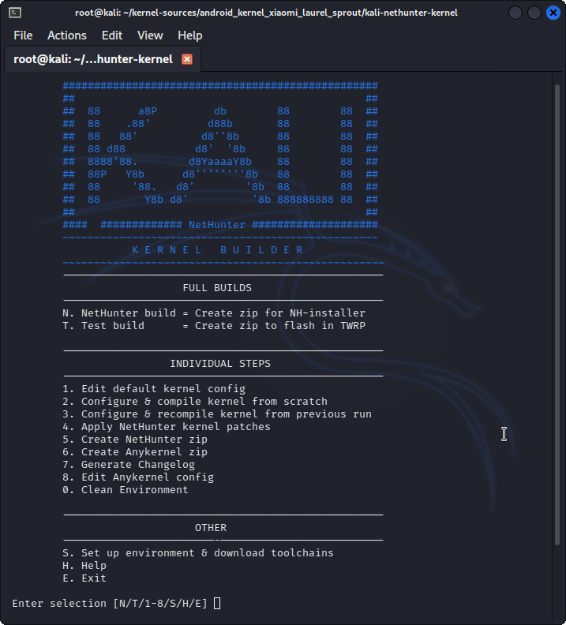

In order to port NetHunter to a new device, it's important to understand how NetHunter is separated. NetHunter is divided by the rootfs (also known as the chroot but will be referred to here as rootfs) and the kernel. For the most part, the rootfs is not important to your Android device as it only contains Kali Linux. The kernel is integral to getting things like Bluetooth, wireless USB, and HID keyboard (etc) working.

You also need a device with an unlocked bootloader, for flashing the kernel, and you must be able to get root on the device. Root is needed so we can write applications to system, such as busybox and bootkali, and execute commands that allow us to get Kali running.

**If you are looking to port a device, it's all about the kernel. Device must be unlockable/rootable**.

## Getting Started

Let's assume that you've already followed the directions on the [main docs page](/docs/nethunter/building-nethunter/). You have all the dependencies met and you are ready to go. The first thing we want to do is build a test kernel.

## Kernel Version

If your device is older, please check to make sure your kernel version is 3.4+ and above. With the switch to kali rolling we are starting to see errors inside chroot where the kernel is not able to support loading Kali.

## Finding Kernel Sources

One of the reasons why Nexus was chosen is because all kernel sources are made available through [Google's own website](https://android.googlesource.com).  
Finding sources can be easy or difficult depending on the manufacturer, here are the most common ones.  
[Google](https://android.googlesource.com/kernel/msm/) (pick your architecture and look at the branches)  
[LG](http://opensource.lge.com/index)  
[Samsung](http://opensource.samsung.com/reception.do)  
[HTC](https://www.htcdev.com/devcenter/downloads)  
[OnePlus](https://github.com/OnePlusOSS)  
[Motorola](https://github.com/MotorolaMobilityLLC)  
[Sony](https://github.com/sonyxperiadev/kernel)  

Another good resource is usually [XDA forums](https://forum.xda-developers.com/) as someone else might have already built a working kernel and they must provide the sources under GPL. Most kernel development pages on XDA must provide a link to their sources.

## Making a Test Kernel

Assuming you don't have a toolchain downloaded already, you can begin by cloning our kernel builder to the root of your kernel's folder, and prepare the environment:

```console
kali@kali:~$ git clone https://gitlab.com/kalilinux/nethunter/build-scripts/kali-nethunter-kernel
kali@kali:~$ cd kali-nethunter-kernel
```
***[Optional step]*** You can find multiple example config files available in local.config.examples.  
If you find something that matches your device, copy it to kali-nethunter-kernel named as local.config ***(Make sure to then edit it to check that everything matches your kernel!)***

As mentioned in the square brackets this step is optional.  
This is because it is not recommended to follow this step in case your device isn't listed in local.config.examples as every device is different and using the wrong config will cause compilation errors, so you would be better off skipping to the next step in that case. 

```console
kali@kali:~$ cp local.config.examples/CONFIG_YOU_WANT local.config
kali@kali:~$ nano local.config
```

***[Recommended step]*** You can make your own local.config by copying config to a file called local.config and then editing local.config to match your device's kernel.  
After you finish editing local.config, make sure to delete everything except for what you have edited.  
***Note: In case you don't know what to edit, make sure to look at the different configs inside local.config.examples to get an idea.***  
If you still don't understand what to edit, take a look inside build.sh to understand how it works  

```console
kali@kali:~$ cp config local.config
kali@kali:~$ nano local.config
```
After a local.config file has been created, you can start the building process by running build.sh 

```console
kali@kali:~$ ./build.sh
```



First, select ***S. Setup Environment and download toolchains***.  
Next, build your test kernel with ***2. Configure & compile kernel from scratch***

When prompted, select your device's defconfig then save and exit to start the building process. 
 
If the build was successful, add your device details like codename, boot_block, slot_device, etc with ***8. Edit Anykernel config***  
Create your first test kernel installer with ***6. Create Anykernel zip*** and then flash your kernel to see it in action. 

If the build was ***Not*** successful then you can try the following 

Make sure that the local.config file that you used has everything properly configured  
Know exactly what errored out by looking for what went wrong to search it on google  
Look if there is any patch inside ***4. Apply Nethunter kernel patches*** that addresses the same error and patch it if it does  
If none of the above works, then it would be best to go back and forth between viewing build.sh script and [Porting nethunter](https://www.kali.org/docs/nethunter/porting-nethunter/#making-a-test-kernel) to try and manually fix the issue. 
  
  
  
***Note: If you will continue and modify the kernel, you can use ***3. Configure & recompile kernel from previous run*** to save time.***