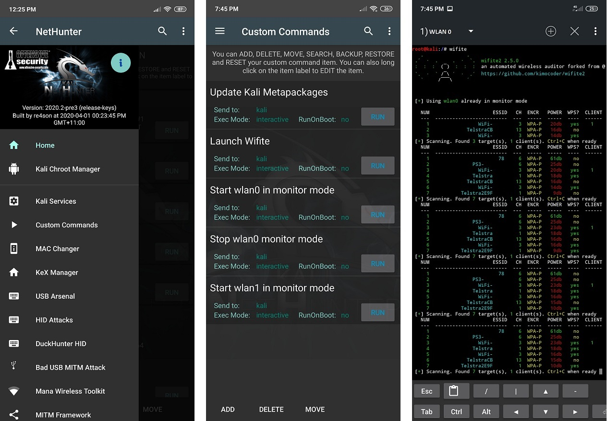

External wireless cards are necessary because Android devices do not support monitor mode on most devices apart from some Qualcomm chips used in modern Snapdragon SOC. There are some devices that can support monitor mode with a modified firmware and kernel such as the Nexus 5, 7 (2012), and Nexus 6P. Right now, only a specially modified version of Nexus 5 supports monitor mode for Nethunter.

A couple of limitations are that Android devices require a USB-OTG cable and the power output is limited. Because of these limitations, not all wireless cards can receive the necessary power output and may not have external power (y-cable) support.

When asking the question "What is the best card for use with NetHunter?", you need to ask yourself what your use case is.
While all cards will likely perform similar at closer ranges, some of them have increased transmit power and antenna attachments which allow them to work at longer distances than small form factor cards.
There is also the possibility that your device may only provide 450 or less mA of power over OTG rather than the full USB 500 mA specification. If this is the case, you may want to consider devices with lower transmit power.

**The following chipsets are supported by default in most, if not all, NetHunter kernels:**

Atheros
- ATH9K_HTC (AR9271, AR7010)
- ATH10K

Ralink
- RT73
- RT2800USB
- RT3070

Realtek
- RTL8188EUS
- RTL8188CU
- RTL8188RU
- RTL8192CU
- RTL8192EU
- RTL8723AU
- RTL8811AU
- RTL8812AU
- RTL8814AU
- RTL8821AU
- RTW88-USB

MediaTek
- MT7610U
- MT7612U

Qualcomm internal wifi chipsets (wlan0)
- QCACLD-2.0
- QCACLD-3.0

**The following devices are confirmed to be working with a NetHunter build:**
- TP-Link TL-WN722N v1 (Please note that v2 & v3 have unsupported chipsets)
  but v2 and v3 may be supported using RTL8812AU drivers.)

- TP-Link TL-WN822N v1 - v4
- Alfa Networks AWUS036ACH
- Alfa Networks AWUS036NEH (recommended by @jcadduono)
- Alfa Networks AWUS036NHA
- Alfa Networks AWUSO36NH
- Panda PAU05 Nano

**The following devices are confirmed to be partially working with a NetHunter build:**
- Alfa Networks AWUS051NH (dual band 5 GHz support may be unreliable)

**The following devices are confirmed to NOT be working with a NetHunter build:**

