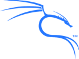

## Linux

<!--
REF:
  https://www.linuxfoundation.org/legal/trademark-usage
  https://www.linuxfoundation.org/legal/the-linux-mark
  https://www.linuxfoundation.org/legal/trademarks
-->

The registered trademark Linux® is used pursuant to a sublicense from the [Linux Foundation](https://www.linuxfoundation.org/legal/trademarks), the exclusive licensee of Linus Torvalds, owner of the mark on a worldwide basis.

## Kali & OffSec

[Kali Linux](/) and [OffSec](https://www.offsec.com/) want to promote the widespread recognition of our trademarks among the Internet community however, we also need to ensure our trademarks solely identify our company and our products. At the heart of our trademark policy is **trust** - we want to avoid the public from being confused into believing they are dealing with [Kali Linux](https://tsdr.uspto.gov/#caseNumber=87525001&caseType=SERIAL_NO&searchType=statusSearch) and/or [OffSec](https://tsdr.uspto.gov/#caseNumber=97816060&caseType=SERIAL_NO&searchType=statusSearch) when, in fact, they are not. This is of particular importance with regards to the development and distribution of trusted penetration testing distribution such as Kali Linux.

This document identifies and the describes our trademarks and provides guidance as to their fair use. We are generally quite accommodating when it comes to fair and honest use of our trademarks so if you are so inclined, feel free to contact us for further guidance.

### Some of our Trademarks

### Use in Print, Web, Media and Public Display

It is important to maintain the look and spelling of the trademarks. Please do not modify the marks. Examples of modifying the marks include abbreviating names, adding logos to the marks, or combining the marks with other words. We [recommend you use the trademarks in the exact form as we use them](https://gitlab.com/kalilinux/documentation/press-pack) ([Kali Linux](https://gitlab.com/kalilinux/documentation/press-pack/-/tree/main/Kali), [Kali NetHunter](https://gitlab.com/kalilinux/documentation/press-pack/-/tree/main/Kali_NetHunter) & [Kali NetHunter Pro](https://gitlab.com/kalilinux/documentation/press-pack/-/tree/main/Kali_NetHunter_Pro)).

The OffSec trademarks are to designate the source of our products and services. We encourage others to use the marks so long as they are used to identify the products and services of OffSec. We do not want to confuse the public into believing that they are dealing with us, when in fact, they are not.

The first mention of an OffSec trademark should be accompanied by a symbol indicating whether the mark is a registered trademark "®" or an unregistered trademark "™". Please refer to the above list for the appropriate symbol to use and if in doubt, use "™".

The use of an OffSec trademark should be set apart from surrounding text, either by capitalizing it or by italicizing, bolding or underlining it. The OffSec trademarks are to designate the source of our products and services.

When using an OffSec trademark in written materials, you should provide a statement indicating that the \[trademark\] is a trademark of OffSec. For example:

"KALI LINUX ™ is a trademark of OffSec." This statement can be provided directly in your text, or as a footnote or an endnote.

The use of OffSec trademarks in your domain names is prohibited because such use will lead to the confusion of customers. Any other use outside of the scope of the Trademark Policy is not permitted without express written permission of OffSec.

You may make t-shirts, desktop wallpaper, or other merchandise with OffSec marks on them, though only for yourself and your friends (meaning people from whom you don't receive anything of value in return). You can't put the trademarks on anything that you produce commercially (whether or not you make a profit) -- at least not without receiving written permission.

### Contact

If you have any questions or comments, or wish to report misuse of the OffSec trademarks, please [contact us](/contact/).

<!--
## Trademark
- Kali (US): https://branddb.wipo.int/en/reports/brand/US502017087525001
- Kali (WIPO): https://branddb.wipo.int/en/reports/brand/WO500000001403359
- OffSec: https://branddb.wipo.int/en/reports/brand/WO500000001527743

## Copyright:
- Kali dragon: VA0002130167: https://publicrecords.copyright.gov/detailed-record/30471023
-->
