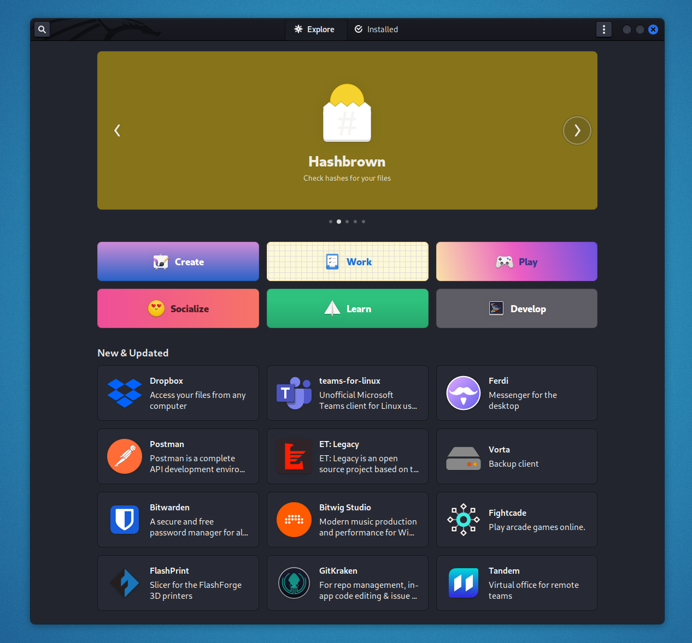

#### Install Instructions

On Kali Linux, `flatpak` can be installed through:

```console
kali@kali:~$ sudo apt update
kali@kali:~$
kali@kali:~$ sudo apt install -y flatpak
kali@kali:~$
kali@kali:~$ sudo flatpak remote-add --if-not-exists flathub https://flathub.org/repo/flathub.flatpakrepo
```

#### GUI software store

It is also a good idea to install the Flatpak plugin for GNOME Software. To do this, run:

```console
kali@kali:~$ sudo apt install gnome-software-plugin-flatpak
```

Now you can install new flatpak apps from the software center.



#### Theme support

If you want to make flatpak apps look more consistent with the system you can force them to use your local themes:

```console
kali@kali:~$ mkdir -p ~/.themes
kali@kali:~$ cp -a /usr/share/themes/* ~/.themes/
kali@kali:~$ sudo flatpak override --filesystem=~/.themes/
```

###### Reference

- [Flatpak](https://flatpak.org/)
- [Debian Quick Setup](https://flatpak.org/setup/Debian/)
