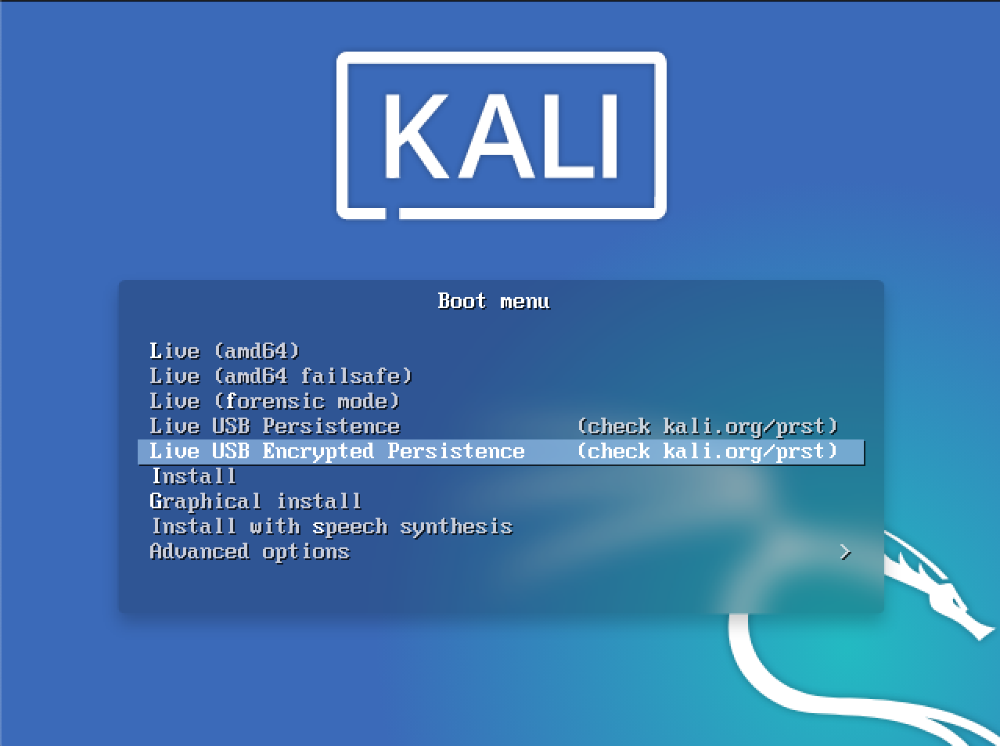

Kali Linux "Live" has two options in the default boot menu which enable persistence - the preservation of data on the "Kali Live" USB drive - across reboots of "Kali Live". This can be an extremely useful enhancement, and enables you to retain documents, collected testing results, configurations, etc., when running Kali Linux "Live" from the USB drive, even across different systems. The persistent data is stored in its own partition on the USB drive, which can also be optionally LUKS-encrypted.

To make use of the USB persistence options at boot time, you'll need to do some additional setup on your "Kali Linux Live" USB drive; this article will show you how.

This guide assumes that you have already created a Kali Linux "Live" USB drive as described in [the doc page for that subject](/docs/usb/live-usb-install-with-windows/). For the purposes of this article, we'll assume you're working on a Linux-based system.



{}
You'll need to have root privileges to do this procedure, or the ability to escalate your privileges with `sudo`.
{}

In this example, we assume:

{}
While '/dev/sdX' is used through this page, the '/dev/sdX' should be replaced with the proper device label. '/dev/sdX' will not overwrite any devices, and can safely be used in documentation to prevent accidental overwrites. Please use the correct device label.
{}

- your USB drive is `/dev/sdX` (last letter will probably be different). Check the connected usb drives with the command `lsblk` and modify the device name in the `usb` variable before running the commands)
- your USB drive has a capacity of **at least 8GB** - the Kali Linux image takes over 3GB, and for this guide, we'll be creating a new partition of about 4GB to store our persistent data in

In this example, we'll create a new partition to store our persistent data into, starting right above the second Kali Live partition, put an ext4 file system onto it, and create a `persistence.conf` file on the new partition.

1. First, begin by imaging the latest Kali Linux ISO (currently [2024.1](/get-kali/)) to your USB drive as described in [this article](/docs/usb/live-usb-install-with-windows/). We're going to assume that the two partitions created by the imaging are `/dev/sdX1` and `/dev/sdX2`. This can be verified with the command `lsblk`.

2. Create and format an additional partition on the USB drive.
First, let's create the new partition in the empty space above our Kali Live partitions. We have to do this from the command line as gparted will read the imaged ISO as a large block:

```console
kali@kali:~$ usb=/dev/sdX
kali@kali:~$
kali@kali:~$ sudo fdisk $usb <<< $(printf "n\np\n\n\n\nw")
```

When fdisk completes, the new partition should have been created at `/dev/sdX3`; again, this can be verified with the command `lsblk`.

3. Next, create an **ext4** file system in the partition and label it `persistence`:

```console
kali@kali:~$ usb=/dev/sdX
kali@kali:~$
kali@kali:~$ sudo mkfs.ext4 -L persistence ${usb}3
```

4. Create a mount point, mount the new partition there, and then create the configuration file to enable persistence. Finally, unmount the partition:

```console
kali@kali:~$ usb=/dev/sdX
kali@kali:~$
kali@kali:~$ sudo mkdir -p /mnt/my_usb
kali@kali:~$ sudo mount ${usb}3 /mnt/my_usb
kali@kali:~$ echo "/ union" | sudo tee /mnt/my_usb/persistence.conf
kali@kali:~$ sudo umount ${usb}3
```

We can now reboot into "Live USB Persistance." Keep in mind we will need to select this boot option every time we wish to have our work stored.
