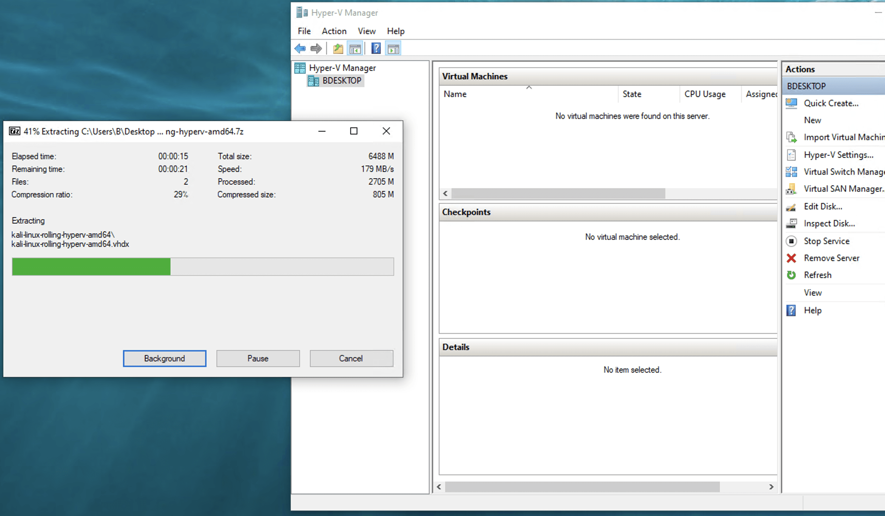
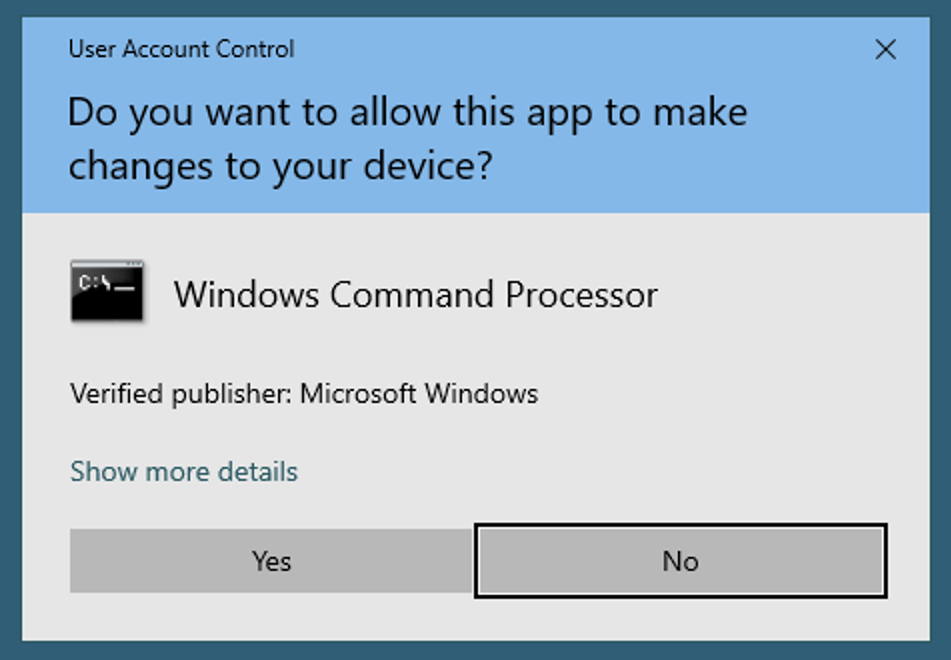
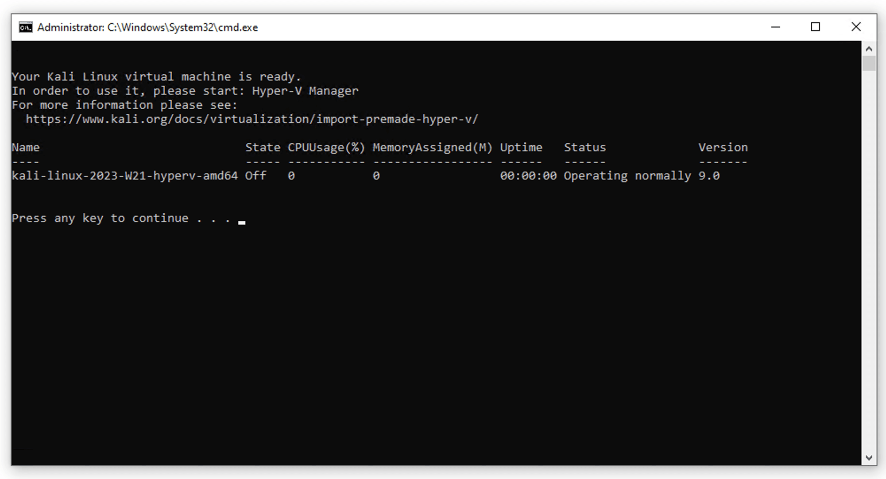
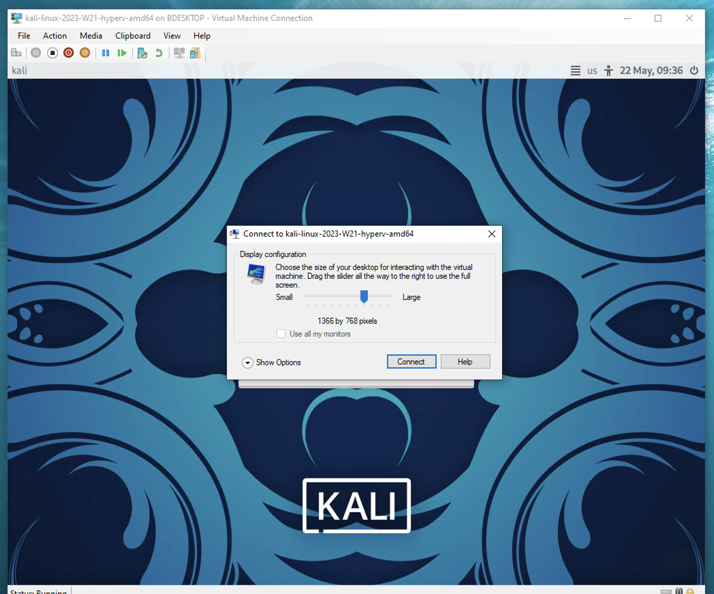
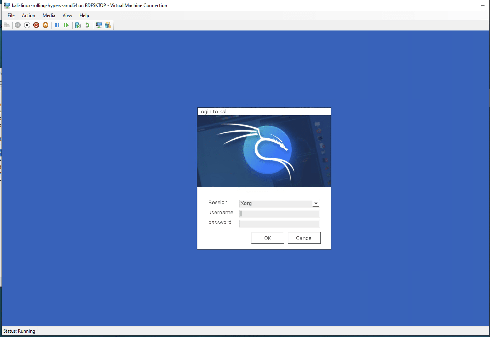
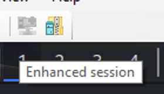

Importing the [Kali Hyper-V image](/get-kali/#kali-virtual-machines) is very easy.

We first need to extract the Hyper-V image. For that we need to use the [official 7z app](https://www.7-zip.org/). Note if we are on Windows 11 the option will be hidden behind the context menu "Show more options".



We just unzipped a directory named `kali-linux-<VERSION>-hyperv-amd64`. Then we double-click on the file `install-vm.bat` file. If we're not administrator, we will get a popup window asking for approval, we click Yes:



After approving the popup, a console appears, and the script run a series of steps in order to setup the Kali Linux Virtual Machine. If all goes well, we should see the following screen:



We then launch the Hyper-V Manager, right-click on the Kali VM, click Start, then right-click again and click Connect. We should see the usual Kali login screen, or rather, just have a glimpse of it, before a popup window appear in the foreground:



We click Connect, and a new login screen appears. The default credentials are `kali` and `kali` as usual:



That's it! We are now logged in our Kali VM!

A brief technical note: we are connected over XRDP. This is the so-called _Enhanced Session Mode_, we can see that by hovering over some buttons on top:



Copying and pasting from host to guest, and the other way round, should work out of the box. File sharing as well. However drag and drop doesn't work, as well as screen resizing. See the section below for more details.

## Troubleshooting and extra tips

**Moving the Virtual Hard Disk**

At this point, we have a Kali Linux VM up and running. However, we can't move the Virtual Hard Disk (ie. the file named `kali-linux-<VERSION>-hyperv-amd64.vhdx`) anymore, as it's linked to the Virtual Machine. Or, at least, I strongly suppose that we can't do that...

It seems that Hyper-V usually stores its Virtual Hard Disks at `C:\ProgramData\Microsoft\Windows\Virtual Hard Disks\`. So if we like to keep our computer neat and tidy, we can restart the procedure above, except that we should move the unzipped files to this location *before* running the script `install-vm.bat`.

**Changing the screen resolution**

At this point it seems that the screen resolution must be set at boot time, hence it needs to be configured in the kernel cmdine. To do so, we open a terminal, and run:

```console
kali@kali:~$ sudoedit /etc/default/grub 
```

In this file, we update the value of the `GRUB_CMDLINE_LINUX_DEFAULT` variable as below:

```console
GRUB_CMDLINE_LINUX_DEFAULT="quiet video=hyperv_fb:1920x1080"
```

Here `1920x1080` is the screen resolution of the host machine. You need to change this value as per your host machine resolution.

Finally, we rebuild the GRUB config files:

```console
kali@kali:~$ sudo update-grub
```

Then reboot the VM to test.

